# Text Processing Suite

[](https://go.dev/)
[](https://wails.io/)
[](https://react.dev/)

> A native desktop application for intelligent text transformation powered by Large Language Models.
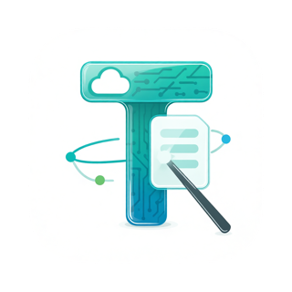

---

## Overview

**Tired of switching between multiple tools for text processing? Tired of each time create a new prompt for text processing?** Suite brings all your
AI-powered text transformation needs into one
native desktop application.

**Text Processing Suite** is a powerful desktop application that harnesses the power of Large Language Models to intelligently edit and
transform your text. Unlike simple text editors, it provides AI-powered operations like grammar correction, style adaptation, multi-language
translation, document structuring, and summarization — all directly on your desktop.

The application connects to **any OpenAI-compatible LLM provider**, giving you the freedom to choose between:

- **Local privacy-first model providers**: Ollama, LM Studio, Llama.cpp
- **Cloud services**: OpenAI, OpenRouter, or any custom OpenAI-compatible API

Built with Go for efficient backend processing and React for a modern, responsive UI, the application delivers native performance with a small
distribution footprint.

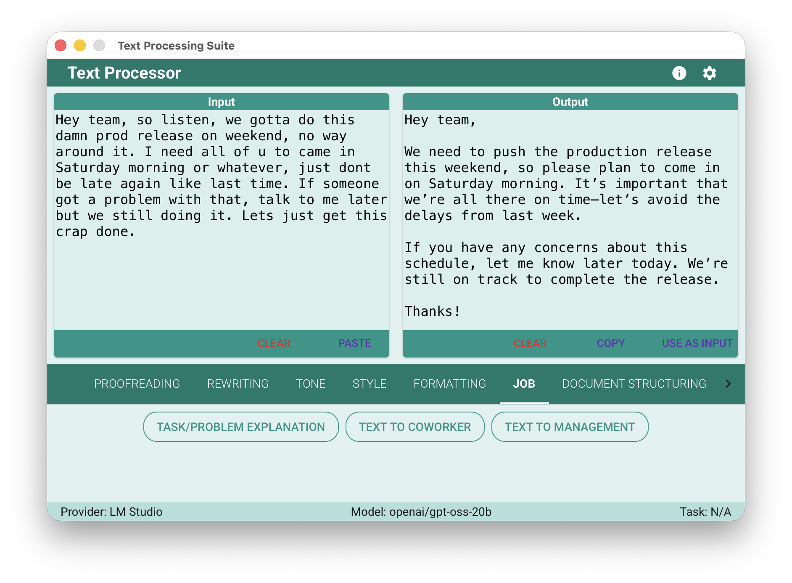

---

## Key Features

**60+ text processing actions across 10 categories**

### 📝 Proofreading & Grammar

- Basic and enhanced proofreading
- Style consistency checking
- Readability improvements
- Tone adjustments for clarity

### ✍️ Advanced Rewriting

**Tone Adaptation** – Rewrite text to match your desired tone:

- Friendly, Direct, Indirect
- Professional, Enthusiastic, Neutral
- Conflict-safe rewrites, Polite requests, Apology messages

**Style Transformation** – Adapt writing style for different contexts:

- Formal, Semi-Formal, Casual
- Academic, Technical, Journalistic
- Creative, Marketing, SEO-Optimized
- Simplified for non-native speakers or children

### 📄 Formatting & Templates

- Paragraph structuring and bullet conversion
- Email, Report, Blog, and Resume templates
- Social media post-formatting
- Headline and tagline generation

### 💼 Everyday Work

- Drafts for coworkers and management
- Task and problem explanations
- Professional communication templates

### 📁 Document Structuring

- Markdown conversion
- User story and FAQ generation
- Specification document generation
- Meeting notes formatting
- Proposal structuring

### 📊 Summarization

- Concise summaries and key points extraction
- Hashtag generation
- Simple explanations for complex topics

### 🌍 Translation

- Multi-language translation (depends on the chosen LLM)
- Dictionary-style translations with context
- Example sentence generation

### 🎨 Prompt Engineering

- Improve prompts for text LLMs
- Optimize prompts for image and video generation models
- Prompt compression and expansion

---

## Screenshots

### Main Application Interface

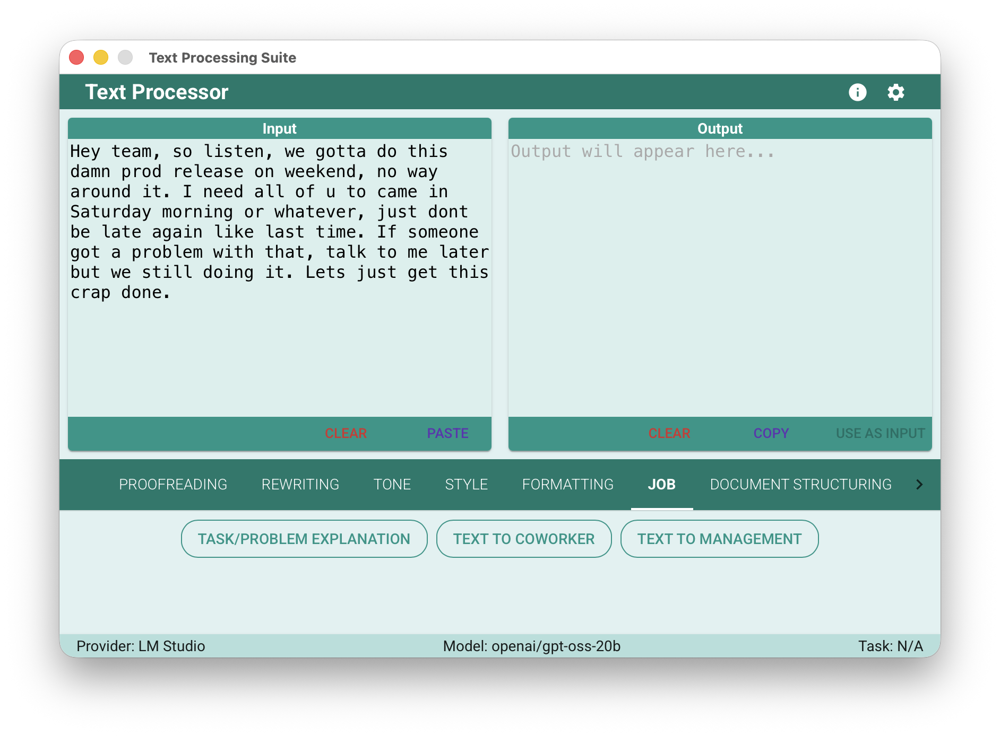
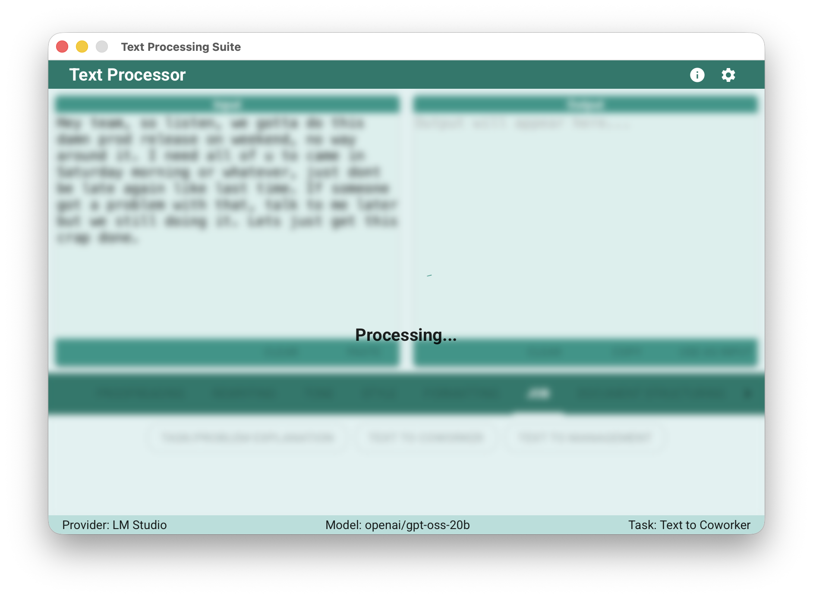

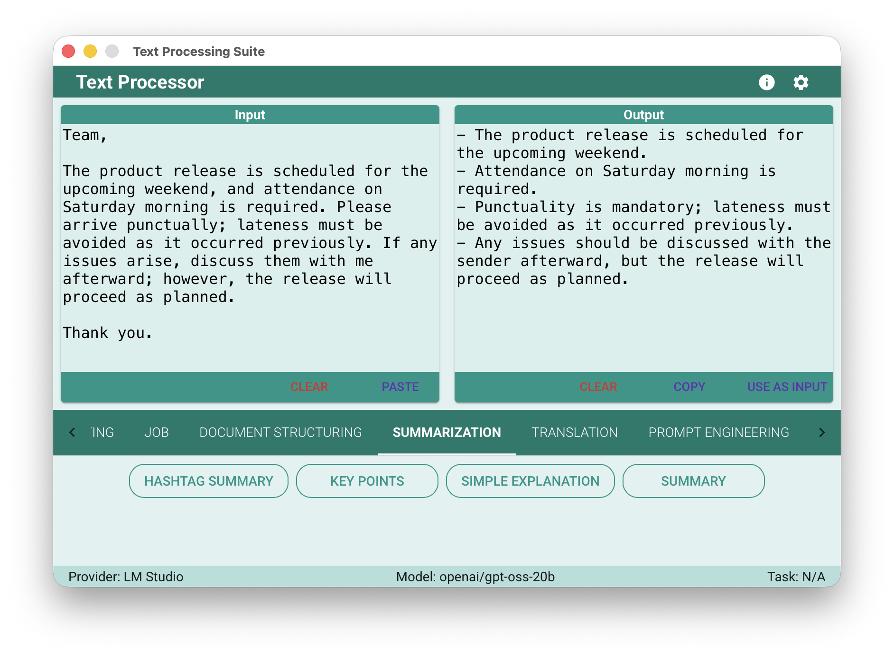

### Main Application Interface – Prompt Change and Results

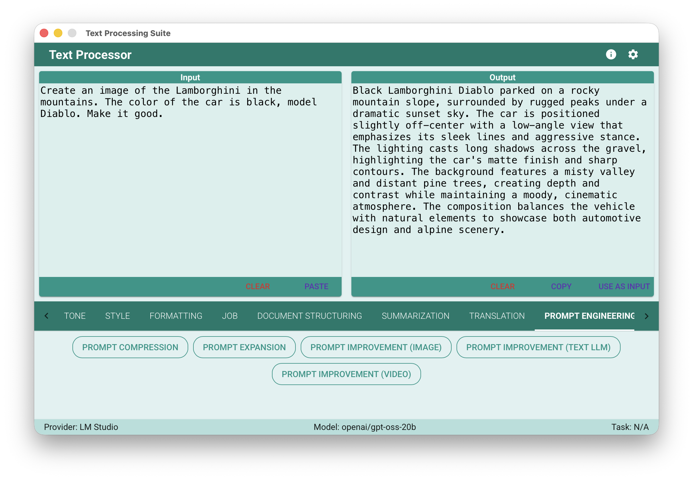

Good Example how an improved prompt can produce the great result:


### Translation Example

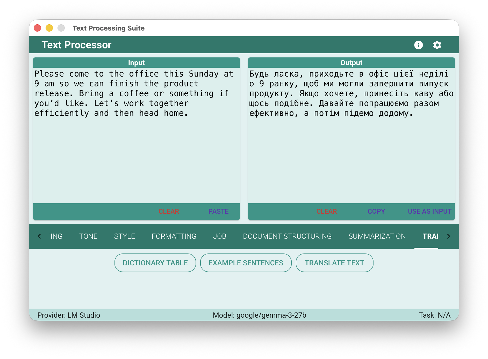

### Multi-Provider Configuration

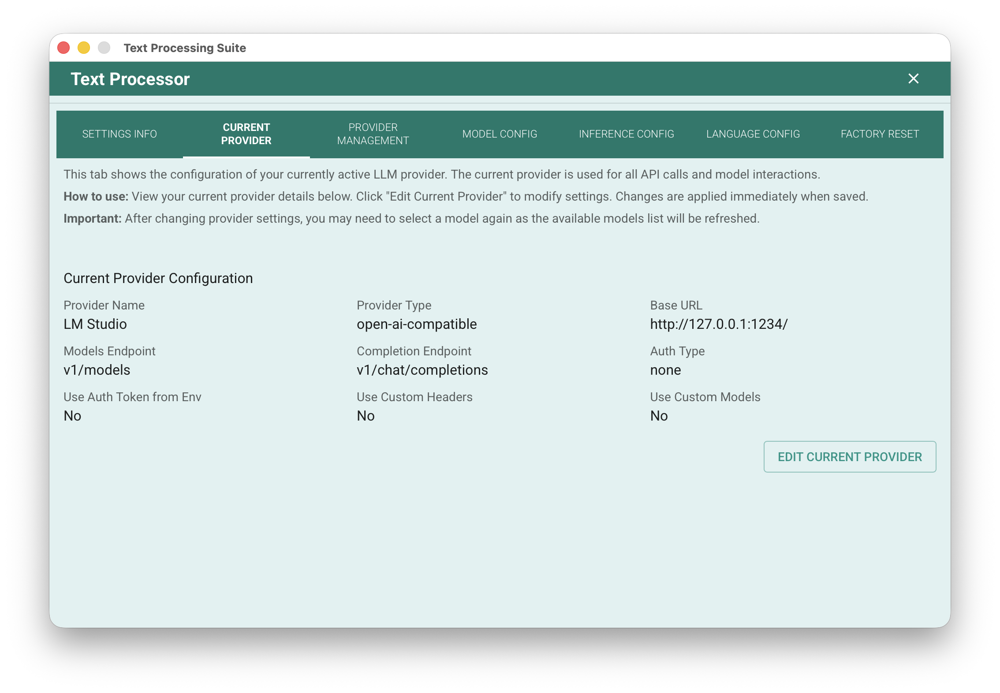
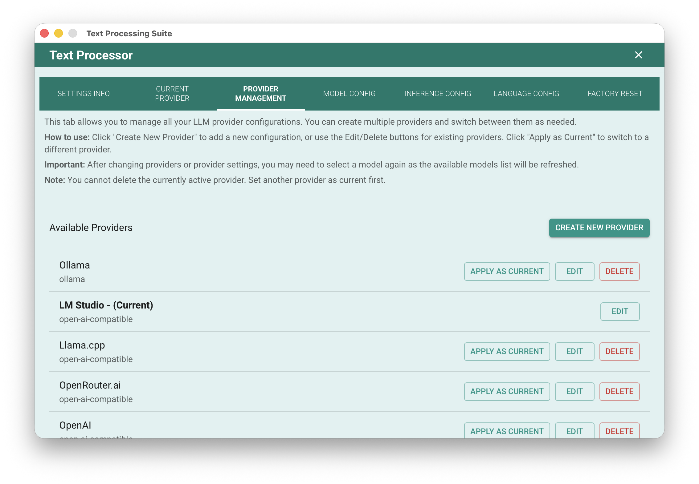
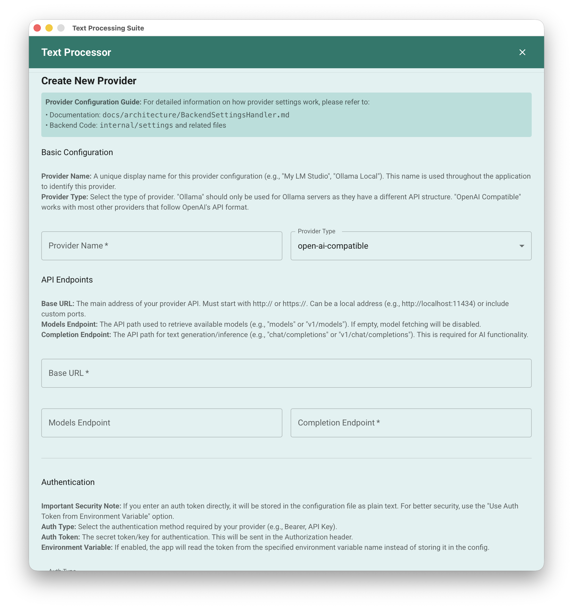
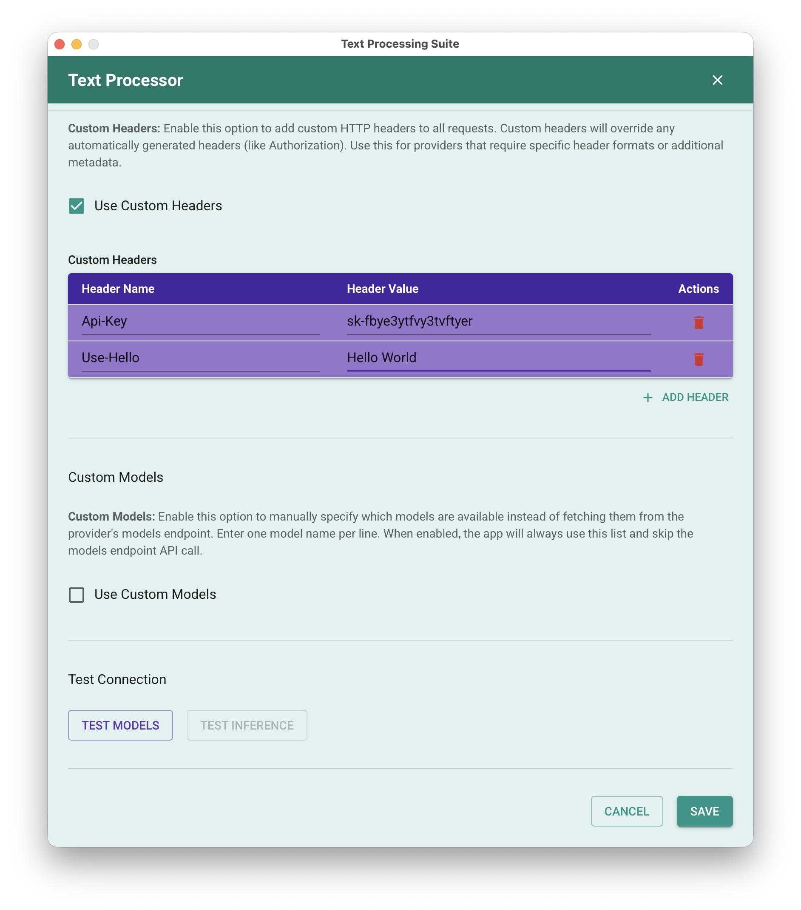

### Model Configuration

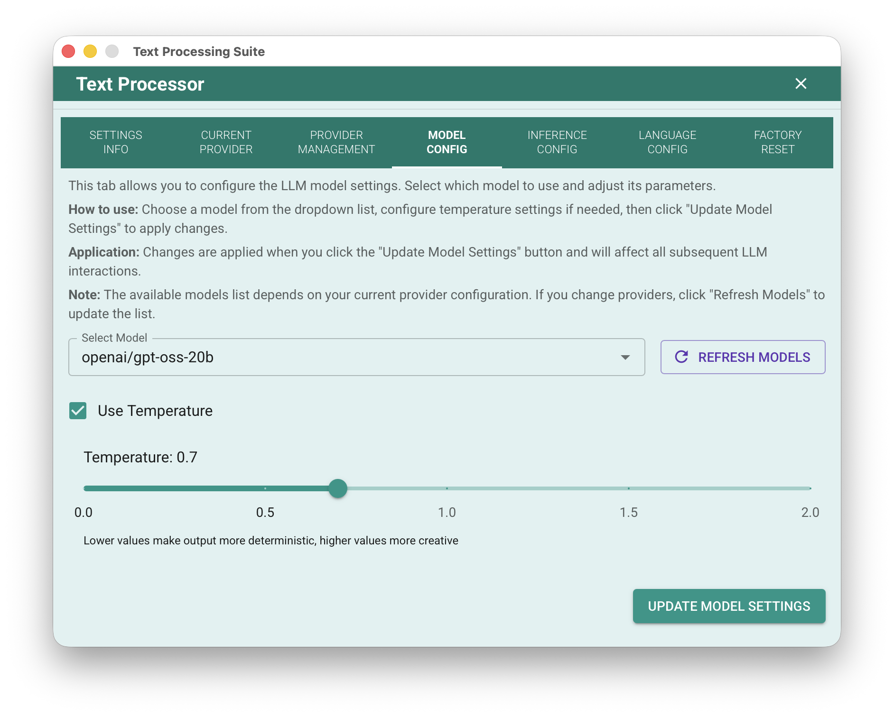

---

## System Requirements

To run Text Processing Suite, your system should meet the following requirements:

| Requirement          | Minimum Specification                     |
|----------------------|-------------------------------------------|
| **Operating System** | macOS 12+, Windows 10+, Linux (modern)    |
| **RAM**              | 2 GB (8+ GB recommended for local models) |
| **Disk Space**       | 15 MB + space for local LLM models        |
| **Network**          | Internet connection for cloud providers   |

**Basically, if you can run a web browser, you can run this app.**  
The only exception is when using a **local LLM**—in that case, you’ll need a powerful PC or laptop.

For local LLM inference, is recommended:

- **16 GB or more of system RAM**, and/or
- A **powerful GPU with ample VRAM**.

For example, **Ollama’s requirements vary by model**, but generally include:

- At least **16 GB of RAM**,
- A modern **4-core (or higher) CPU**,
- **12 GB+ of free disk space** (base installation; significantly more for larger models).

A **NVIDIA or AMD GPU with at least 6 GB of VRAM** is highly recommended for performance. While smaller models can run on CPU alone, larger models (
e.g., 13B parameter variants) typically require **12 GB or more of VRAM** for smooth operation.

The best results show models with 20b+ parameters.

---

## Security & Privacy

### Data Handling

- **Local Processing**: When using local providers, your text never leaves your computer
- **Cloud Processing**: When using cloud providers, text is sent to the provider's API
- **No Data Collection**: The application does not collect or transmit any usage data

### Privacy Features

- Environment variable support for API keys (never stored in plain text)
- Local-first design with privacy-focused providers
- Clear indication of current provider type in UI

## Performance Expectations

Performance depends on:

- Your hardware (especially for local models)
- Model size and complexity
- Input text length
- Network conditions (for cloud providers)

## Update Mechanism

Text Processing Suite follows semantic versioning and provides updates through:

- **GitHub Releases**: Download new versions from the [Releases Page](https://github.com/sanyokkua/go_text/releases)
- **Manual Updates**: Replace the application binary with the new version
- **Settings Preservation**: Your settings and configurations are preserved during updates

It is recommendedto check for updates periodically, especially when new features or bug fixes are announced.

## Installation

### Download Pre-built Binaries

Download the latest release for your platform from the [GitHub Releases Page](https://github.com/sanyokkua/go_text/releases).

| Platform                  | File                                            |
|---------------------------|-------------------------------------------------|
| **macOS** (Apple Silicon) | `TextProcessingSuite-2.0.0-linux-amd64.zip`     |
| **macOS** (Intel)         | `TextProcessingSuite-2.0.0-macos-amd64.app.zip` |
| **Windows** (64-bit)      | `TextProcessingSuite-2.0.0-windows-amd64.exe`   |
| **Linux** (64-bit)        | `TextProcessingSuite-2.0.0-linux-amd64`         |

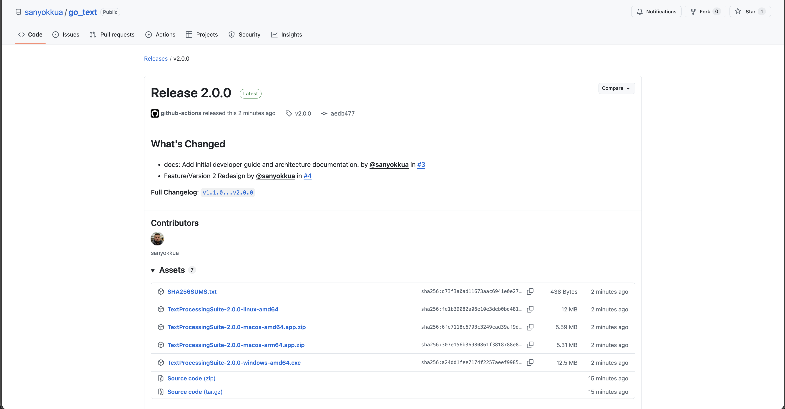

#### macOS Installation Notes

macOS may block unsigned applications.


After downloading:

1. Extract the `.zip` file
   
2. Remove the quarantine flag:
   ```bash
   xattr -rd com.apple.quarantine TextProcessingSuite.app
   ```
   
3. If still blocked, go to **System Settings → Privacy & Security** and allow the app to run

### Build from Source

**Prerequisites:**

- Go 1.25+
- Node.js 20+
- Wails CLI (`go install github.com/wailsapp/wails/v2/cmd/wails@latest`)

**Steps:**

```bash
# Clone the repository
git clone https://github.com/sanyokkua/go_text.git
cd go_text

# Install dependencies
cd frontend && npm install && cd ..
go get ./...

# Run in development mode (hot reload)
wails dev

# Build production binary
wails build
```

The executable will be in `build/bin/`.

---

## Configuration

### Multi-Provider Support

The application supports **multiple provider configurations** that you can switch between. Each provider can have:

- Custom base URL and endpoints
- Authentication headers (API keys, Bearer tokens)
- Environment variable support for secrets
- Custom model lists
- Provider-specific settings

**Built-in Provider Templates:**

- Ollama (local)
- LM Studio (local)
- Llama.cpp (local)
- OpenRouter.ai (cloud)
- OpenAI (cloud)

### Settings File Location

| Platform    | Path                                                                |
|-------------|---------------------------------------------------------------------|
| **macOS**   | `~/Library/Application Support/TextProcessingSuite/SettingsV2.json` |
| **Linux**   | `~/.config/TextProcessingSuite/SettingsV2.json`                     |
| **Windows** | `%APPDATA%\TextProcessingSuite\SettingsV2.json`                     |

### Configuration Options

- **Provider Management**: Add, edit, delete, and switch between multiple LLM providers
- **Model Selection**: Choose from available models or provide a custom list
- **Inference Settings**: Configure timeout, retries, and output format (Markdown/Plain Text)
- **Temperature Control**: Optional temperature setting with toggle
- **Language Preferences**: Default input/output languages for translation
- **Custom Languages**: Add/remove languages from the supported list

---

## Usage

1. **Select Provider**: Choose your LLM provider from the settings (Ollama, OpenAI, etc.)
2. **Choose Action**: Browse 10 categories with 60+ actions
3. **Enter Text**: Paste or type your text in the input area
4. **Process**: Click the action button and wait for the LLM response
5. **Review Output**: The transformed text appears in the output area
6. **Copy or Further Edit**: Use the output or continue processing

---

## Technology Stack

| Component             | Technology    | Version   |
|-----------------------|---------------|-----------|
| **Backend**           | Go            | 1.25.1    |
| **Frontend**          | React         | 19.2.3    |
| **Language**          | TypeScript    | 5.9.3     |
| **State Management**  | Redux Toolkit | 2.11.2    |
| **Desktop Framework** | Wails         | v2.11.0   |
| **UI Library**        | Material-UI   | 7.3.6     |
| **HTTP Client**       | Resty         | v3 (beta) |
| **Build Tool**        | Vite          | 7.3.0     |
| **Logging**           | zerolog       | 1.34.0    |

---

## Project Structure

```
go_text/
├── README.md
├── main.go                     # Application entry point
├── wails.json                  # Wails configuration
├── go.mod                      # Go dependencies
├── internal/                   # Go backend packages
│   ├── application/            # Dependency injection
│   ├── actions/                # Text processing logic
│   ├── settings/               # Configuration management
│   ├── llms/                   # LLM provider integration
│   ├── prompts/                # Prompt templates
│   ├── file/                   # File utilities
│   └── logging/                # Custom logger
├── frontend/                   # React frontend
│   ├── src/
│   │   ├── logic/              # State management & adapters
│   │   └── ui/                 # Components & views
│   ├── wailsjs/                # Auto-generated Wails bindings
│   └── package.json
├── build/                      # Build configuration
└── docs/                       # Documentation
    ├── architecture/           # Technical architecture docs
    └── guides/                 # Developer guides
```

---

## Provider Config Examples

### Ollama (Local)

```json
{
    "baseUrl": "http://127.0.0.1:11434/",
    "modelsEndpoint": "v1/models",
    "completionEndpoint": "v1/chat/completions",
    "authType": "none"
}
```

### OpenAI (Cloud)

```json
{
    "baseUrl": "https://api.openai.com/",
    "modelsEndpoint": "v1/models",
    "completionEndpoint": "v1/chat/completions",
    "authType": "bearer",
    "authToken": "sk-...",
    "useAuthTokenFromEnv": true,
    "envVarTokenName": "OPENAI_API_KEY"
}
```

### OpenRouter (Cloud)

```json
{
    "baseUrl": "https://openrouter.ai/api/",
    "modelsEndpoint": "v1/models",
    "completionEndpoint": "v1/chat/completions",
    "authType": "bearer",
    "useAuthTokenFromEnv": true,
    "envVarTokenName": "OPENROUTER_API_KEY"
}
```

---

## Documentation

- **[Architecture Documentation](docs/architecture/README.md)** - Comprehensive technical architecture
- **[Developer Guide](docs/guides/DEVELOPER_GUIDE.md)** - How to contribute and extend

---

## Known Limitations

- **Request Timeout**: LLM requests have a configurable timeout (default: 60 seconds)
- **Context Limits**: Large documents may exceed model context windows
- **Response Time**: Complex operations may take several seconds depending on model and provider
- **Model Dependency**: Translation quality and output format depend on the selected model's capabilities

---

## Acknowledgments

- Built with [Wails](https://wails.io/) – An amazing framework for building desktop apps using Go and Web technologies
- LLM provider templates inspired by the OpenAI API specification
- Predecessor project: [llmedit](https://github.com/sanyokkua/llmedit) - Python-based app with similar functionality (proof of concept)
- Some parts were generated by Mistral Vibe and Google Antigravity, which are excellent tools
- Development and testing are primarily conducted on macOS 26 with verified providers: Ollama, LM Studio, custom OpenAI/Azure, and OpenRouter

## Plans for Future

- Fix bugs that will be found
- Improve validation logic in the configuration
- Improvements to the prompts
- Potential migration to [Electrobun](https://blackboard.sh/electrobun/docs/)

---

*Version 2.0 – Complete rewrite with multi-provider support, 10 prompt categories, and 60+ text processing actions.*
