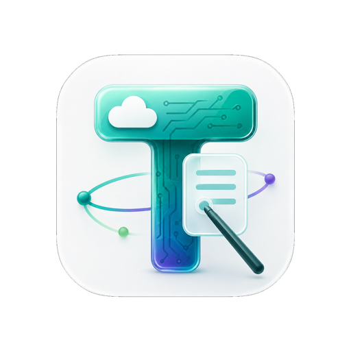

# GoText

[](https://go.dev/)
[](https://wails.io/)
[](https://react.dev/)

> A native desktop application for intelligent text transformation powered by Large Language Models.


---

## Overview

**GoText** ("GoText") is a native desktop application that harnesses the power of
Large Language Models to intelligently edit and transform text. It provides 90+ AI-powered actions
across categories like grammar correction, style adaptation, multi-language translation, document
structuring, and summarization — all directly on your desktop without browser or cloud dependency.

The application connects to **any OpenAI-compatible LLM provider**, giving you the freedom to choose:

- **Local privacy-first providers**: Ollama, LM Studio, Llama.cpp
- **Cloud services**: OpenAI, OpenRouter, or any custom OpenAI-compatible API

Built with Go for efficient backend processing and React for a responsive UI, GoText delivers native
performance with a small distribution footprint.

*(v3 screenshot pending — see [docs/screenshots](docs/screenshots/README.md))*

---

## Key Features

**90+ text processing actions across 10 categories**

### Proofreading & Grammar

- Basic and enhanced proofreading
- Style consistency checking, readability improvements, tone adjustments

### Advanced Rewriting

**Tone Adaptation** – Friendly, Direct, Indirect, Professional, Enthusiastic, Neutral, Polite,
Conflict-safe, Apology messages

**Style Transformation** – Formal, Semi-Formal, Casual, Academic, Technical, Journalistic,
Creative, Marketing, SEO-Optimized, Simplified

### Formatting & Templates

- Paragraph structuring and bullet conversion
- Email, Report, Blog, and Resume templates
- Social media post-formatting, headline and tagline generation

### Everyday Work

- Drafts for coworkers and management
- Task and problem explanations, professional communication templates

### Document Structuring

- Markdown conversion, user story and FAQ generation
- Specification document generation, meeting notes formatting, proposal structuring

### Summarization

- Concise summaries and key points extraction
- Hashtag generation, simple explanations for complex topics

### Translation

- Multi-language translation (depends on the chosen LLM)
- Dictionary-style translations with context, example sentence generation

### Prompt Engineering

- Improve prompts for text LLMs
- Optimize prompts for image and video generation models
- Prompt compression and expansion

### Stack Builder

Compose **multi-step chains** of actions that run sequentially, each step feeding its output to the
next. Save stacks for reuse and share them across sessions. Run progress is shown step-by-step via
the built-in progress indicator.

### Action History

Every completed run is logged to the **history rail** with its applied actions and output preview.
Restore any past result with a single click.

---

## Screenshots

> Screenshots below are pending capture for the v3 redesign — see
> [docs/screenshots](docs/screenshots/README.md) for the full list of shots to be added.

### Main Application Interface

- *Main Interface - Before processing clicked* — pending
- *Main Interface - Processing the action* — pending
- *Main Interface - result of the previous action* — pending
- *Main Interface - another result of the summary* — pending

### Prompt Change and Results

- *Main Interface - improving prompt for image generation* — pending

Good example — an improved prompt can produce a great result:

- *Generated Image using improved prompt* — pending

### Translation Example

- *Translation* — pending

### Multi-Provider Configuration

- *Provider Settings - Current Provider Info* — pending
- *Provider Settings - Providers List* — pending
- *Provider Settings - Creation of the New Provider* — pending
- *Provider Settings - Creation of the New Provider Extended* — pending

### Model Configuration

- *Model Settings* — pending

---

## System Requirements

| Requirement | Minimum |
|---|---|
| Operating System | macOS 12+, Windows 10+, Linux (modern) |
| RAM | 2 GB (8+ GB recommended for local models) |
| Disk Space | 15 MB + space for local LLM models |
| Network | Internet connection for cloud providers |

For local LLM inference: 16 GB+ RAM, modern 4-core CPU, and ideally a GPU with 6+ GB VRAM.
Larger models (13B+ parameters) typically need 12 GB+ VRAM for smooth operation.

---

## Security & Privacy

- **Local Processing**: When using local providers, text never leaves your computer
- **Cloud Processing**: When using cloud providers, text is sent to the provider's API
- **No Data Collection**: The application does not collect or transmit usage data
- **Env-var credentials**: API keys are stored as environment-variable **names** only — the secret
  is read with `os.Getenv` at request time and is never written to disk or logs

---

## Installation

### Download pre-built binaries

Download the latest release from the [GitHub Releases Page](https://github.com/sanyokkua/go_text/releases).

| Platform | File |
|---|---|
| macOS (Apple Silicon) | `GoText-*-macos-arm64.app.zip` |
| macOS (Intel) | `GoText-*-macos-amd64.app.zip` |
| Windows (64-bit) | `GoText-*-windows-amd64.exe` |
| Linux (64-bit) | `GoText-*-linux-amd64` |

*(Release page screenshot pending)*

#### macOS Installation Notes

macOS may block unsigned applications. After downloading:

1. Extract the `.zip` file
2. Remove the quarantine flag:
   ```bash
   xattr -rd com.apple.quarantine GoText.app
   ```
3. If still blocked, go to **System Settings → Privacy & Security** and allow the app to run

### Build from source

**Prerequisites:**

- Go 1.25+
- Node.js 20+
- Wails CLI: `go install github.com/wailsapp/wails/v2/cmd/wails@latest`
- macOS: Xcode Command Line Tools
- Linux: `sudo apt-get install build-essential libgtk-3-dev libwebkit2gtk-4.1-dev`
- Windows: C++ Build Tools + WebView2 Runtime

> No SQLite system library needed — GoText uses `modernc.org/sqlite`, a pure-Go driver with no
> CGO dependency. `wails build` cross-compiles cleanly on all platforms.

**Steps:**

```bash
# Clone the repository
git clone https://github.com/sanyokkua/go_text.git
cd go_text

# Install frontend dependencies
cd frontend && npm install && cd ..

# Run in development mode (hot reload)
wails dev

# Build production binary
wails build
# Output: build/bin/GoText
```

---

## Configuration

### Multi-Provider Support

The application supports multiple provider configurations that you can switch between. Each provider
can have a custom base URL, authentication method, environment-variable-backed API key, custom model
list, and inference settings.

**Built-in provider templates:**

- Ollama (local)
- LM Studio (local)
- Llama.cpp (local)
- OpenAI (cloud)
- OpenRouter (cloud)

### Settings and data locations

| Platform | Path |
|---|---|
| macOS | `~/Library/Application Support/GoText/` |
| Linux | `~/.config/GoText/` |
| Windows | `%APPDATA%\GoText\` |

Files inside that folder:
- `SettingsV2.json` — provider and UI preferences
- `gotext.db` — SQLite database (action history, saved stacks, provider configs)

### Configuration options

- **Provider Management**: Add, edit, delete, and switch between multiple LLM providers
- **Model Selection**: Choose from discovered models or provide a custom model list
- **Inference Settings**: Timeout, retries, and output format (Markdown / Plain Text)
- **Temperature Control**: Optional temperature setting with enable toggle
- **Language Preferences**: Default input/output languages for translation actions
- **Custom Languages**: Add/remove languages from the supported list

---

## Usage

1. **Select Provider**: Choose your LLM provider from Settings
2. **Choose Action**: Browse 10 categories with 90+ actions in the sidebar
3. **Enter Text**: Paste or type your text in the input area
4. **Process**: Click the action button and wait for the LLM response
5. **Review Output**: The transformed text appears with markdown / diff rendering
6. **Use or Stack**: Copy the output, use it as new input, or add more steps to a stack

**Command Palette (⌘K):** Quick-run any action or add it to the current stack.

---

## Technology Stack

| Component | Technology | Version |
|---|---|---|
| Backend | Go | 1.25.7 |
| Desktop framework | Wails | v2.12.0 |
| Frontend | React | 19.2.3 |
| Language | TypeScript | 5.9.3 |
| State management | Redux Toolkit | 2.11.2 |
| UI primitives | Radix Primitives (`radix-ui`) | ^1.6.0 |
| Command palette | `cmdk` | latest |
| HTTP client | Resty | v3 |
| Build tool | Vite | 7.x |
| Logging | zerolog | 1.34.0 |
| SQLite driver | modernc.org/sqlite (pure Go) | latest |
| Migrations | goose v3 | latest |

---

## Project Structure

```
go_text/
├── main.go                     # Wails entry point
├── wails.json                  # Wails configuration
├── go.mod                      # Go dependencies
├── internal/                   # Go backend packages
│   ├── application/            # DI container
│   ├── actions/                # Chain orchestration (Planner, Composer, ChainOrchestrator)
│   ├── apperr/                 # Typed errors and Result envelopes
│   ├── db/                     # SQLite + migrations + sqlc-generated store
│   ├── gate/                   # InferenceGate (single-flight)
│   ├── history/                # Action history
│   ├── llms/                   # LLM provider integration
│   ├── prompts/                # Prompt library (90+ actions)
│   ├── settings/               # Settings management
│   ├── stacks/                 # Saved stacks
│   ├── verification/           # Provider diagnostics
│   ├── file/                   # OS-specific path resolution
│   ├── logging/                # Structured logger + Wails bridge
│   └── tasklog/                # JSONL diagnostic logging
├── frontend/                   # React TypeScript SPA
│   ├── src/
│   │   ├── logic/              # Redux slices, adapters, hooks
│   │   ├── ui/                 # Components, primitives, views, CSS tokens
│   │   └── dev/                # Bridge mock for frontend-only dev
│   └── wailsjs/                # Auto-generated Wails bindings (never edit manually)
├── build/                      # Wails platform configs
└── docs/                       # Architecture docs, guides, agent rules
```

---

## Known Limitations

- **Request Timeout**: LLM requests have a configurable timeout (default: 60 seconds)
- **Context Limits**: Large documents may exceed model context windows
- **Response Time**: Complex operations may take several seconds depending on model and provider
- **Model Dependency**: Translation quality and output format depend on the selected model's capabilities
- **No streaming**: Responses appear in full on completion — intermediate output is not shown

---

## Documentation

- **[Architecture Documentation](docs/architecture/README.md)** — Technical architecture
- **[Developer Guide](docs/guides/DEVELOPER_GUIDE.md)** — How to extend the app

---

## Acknowledgments

- Built with [Wails](https://wails.io/) — Go + WebView desktop framework
- LLM provider templates inspired by the OpenAI API specification
- Predecessor project: [llmedit](https://github.com/sanyokkua/llmedit) — Python proof-of-concept
- Development and testing on macOS with verified providers: Ollama, LM Studio, OpenAI-compatible, OpenRouter

---

*Version 3.0 — Redesigned with SQLite persistence, stack builder, action history, Radix Primitives UI, and the ⌘K command palette.*
