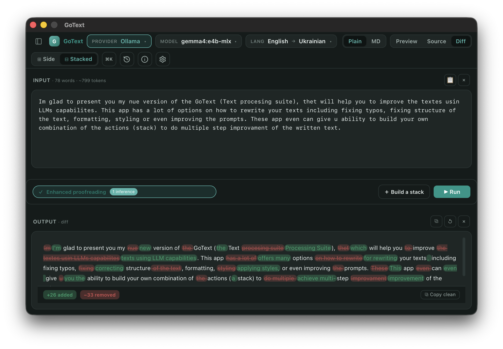
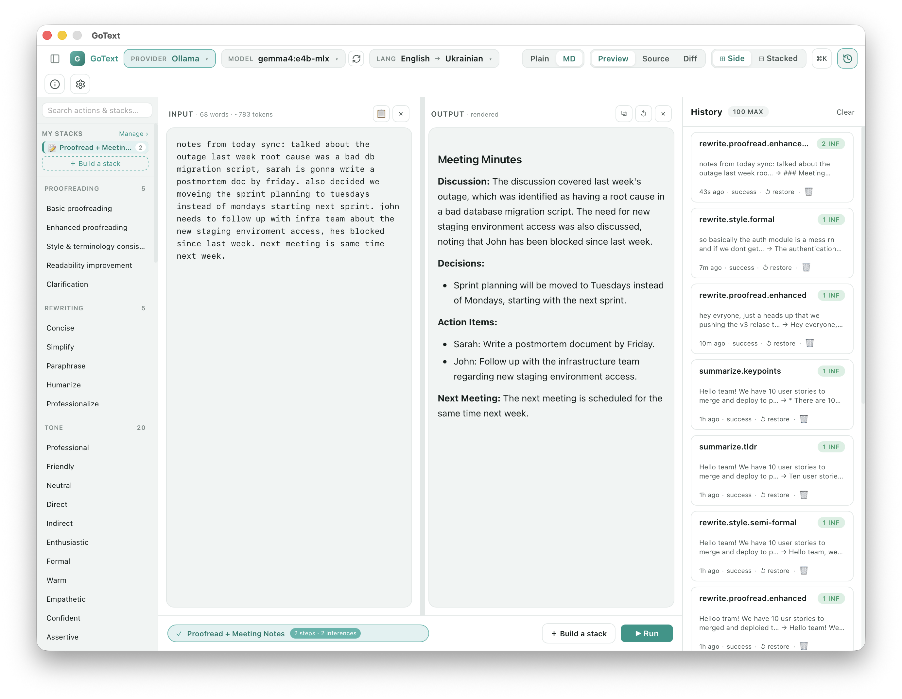
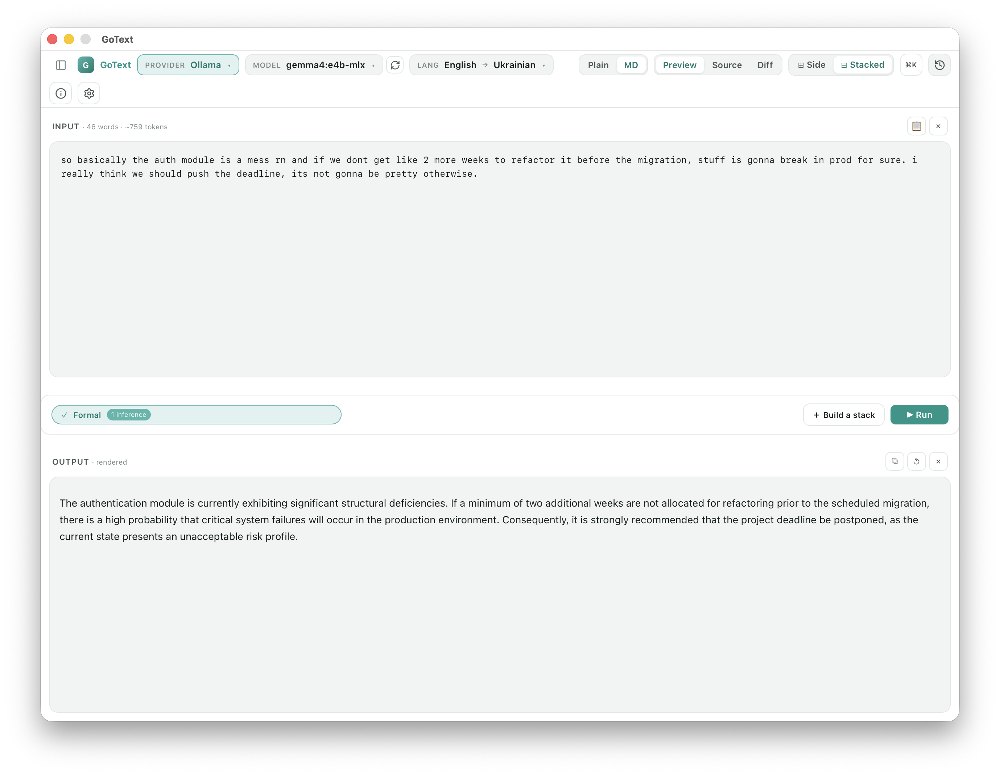
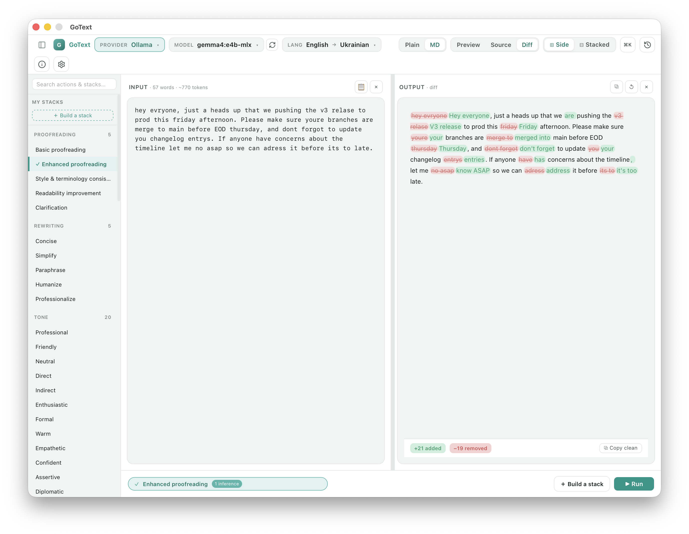
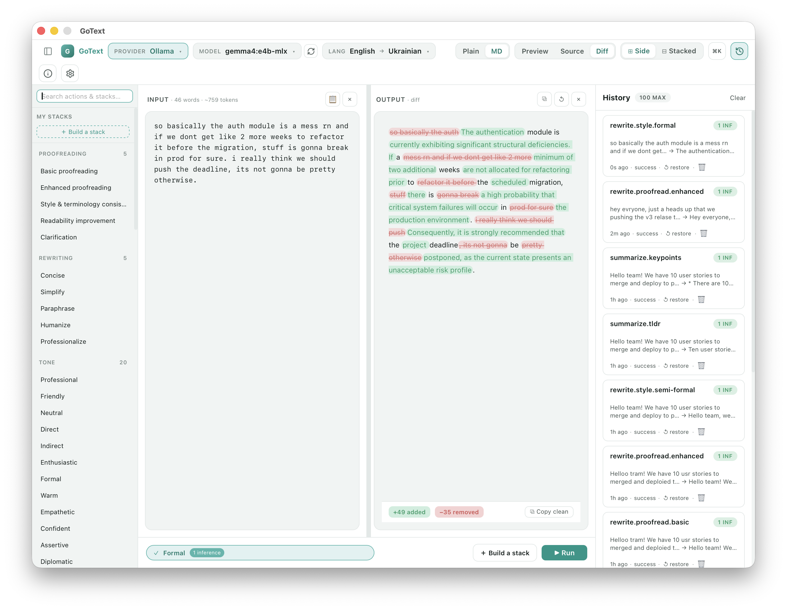
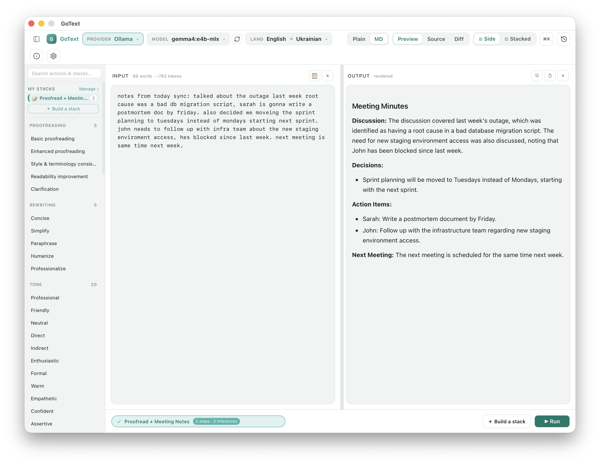
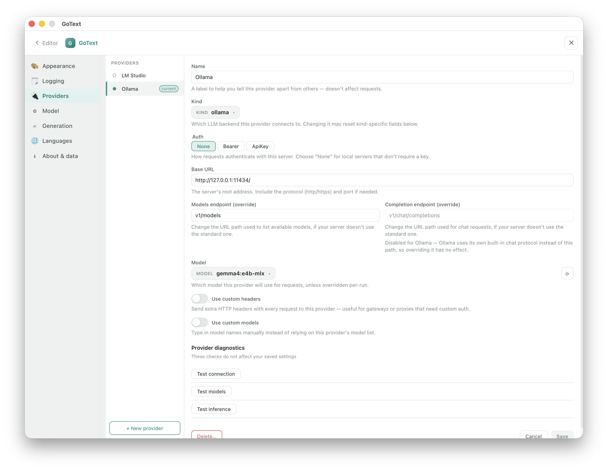

# GoText

[](https://go.dev/)
[](https://wails.io/)
[](https://react.dev/)

> A native desktop application for intelligent text transformation powered by Large Language Models.


---

## Overview

**GoText** ("GoText") is a native desktop application that harnesses the power of
Large Language Models to intelligently edit and transform text. It provides 90+ AI-powered actions
across categories like grammar correction, style adaptation, multi-language translation, document
structuring, and summarization — all directly on your desktop without browser or cloud dependency.



The application connects to **any OpenAI-compatible LLM provider**, giving you the freedom to choose:

- **Local privacy-first providers**: Ollama, LM Studio, Llama.cpp
- **Cloud services**: OpenAI, OpenRouter, or any custom OpenAI-compatible API

Built with Go for efficient backend processing and React for a responsive UI, GoText delivers native
performance with a small distribution footprint.



---

## Key Features

**90+ text processing actions across 10 categories**

### Proofreading & Grammar

- Basic and enhanced proofreading
- Style consistency checking, readability improvements, tone adjustments

### Advanced Rewriting

**Tone Adaptation** – Friendly, Direct, Indirect, Professional, Enthusiastic, Neutral, Polite,
Conflict-safe, Apology messages

**Style Transformation** – Formal, Semi-Formal, Casual, Academic, Technical, Journalistic,
Creative, Marketing, SEO-Optimized, Simplified

### Formatting & Templates

- Paragraph structuring and bullet conversion
- Email, Report, Blog, and Resume templates
- Social media post-formatting, headline and tagline generation

### Everyday Work

- Drafts for coworkers and management
- Task and problem explanations, professional communication templates

### Document Structuring

- Markdown conversion, user story and FAQ generation
- Specification document generation, meeting notes formatting, proposal structuring

### Summarization

- Concise summaries and key points extraction
- Hashtag generation, simple explanations for complex topics

### Translation

- Multi-language translation (depends on the chosen LLM)
- Dictionary-style translations with context, example sentence generation

### Prompt Engineering

- Improve prompts for text LLMs
- Optimize prompts for image and video generation models
- Prompt compression and expansion

### Stack Builder

Compose **multi-step chains** of actions that run sequentially, each step feeding its output to the
next. Save stacks for reuse and share them across sessions. Run progress is shown step-by-step via
the built-in progress indicator.

### Action History

Every completed run is logged to the **history rail** with its applied actions and output preview.
Restore any past result with a single click.

### Interface Customization

Settings → Appearance lets you hide any combination of the AppBar's Provider/Model selectors,
Language picker, Output format toggle, Output mode toggle, IO layout toggle, Command palette (⌘K)
button, History button, and Info button — decluttering the bar down to just the sidebar toggle and
Settings button if that's all you use day to day. Everything you hide stays configurable from
Settings, and the app also remembers the last action or stack you ran and re-arms it automatically
the next time you launch GoText.

> Note: The results of the processed text heavily depend on the backend LLM model chosen for the task. Small models, with sizes up to 4B parameters, can even ignore prompt instructions and hallucinate heavily. I recommend using models with 4B+ parameters for English text; for other languages, I would recommend 20B+ parameter models. The new generation of Gemma4, such as gemma4:e4b-mlx, already shows good results in most cases, while GPT-OSS 20B, Gemma4 12B/26B, and similar LLM models demonstrate the best results.
---

## Screenshots

> The full screenshot library — including bonus scenarios not shown here (translation, prompt
> engineering, provider creation, model configuration) — lives in
> [docs/screenshots](docs/screenshots/README.md).

### Main Interface

Column layout with both the Actions sidebar and History rail open — the sidebar carries a saved
stack (`Proofread + Meeting Notes`) and the History rail already has several prior runs:


Single-column stacked layout with both sidebars closed, showing a `Formal` style rewrite of an
informal message about auth-module technical debt:



### Diff and Markdown Output

`Enhanced proofreading` applied to a typo-ridden release announcement — mostly small, localized
corrections:



The same `Formal` rewrite from above in Diff view — a much heavier, sentence-level rewrite by
comparison:



The saved `Proofread + Meeting Notes` stack (`Enhanced proofreading` → `Meeting notes / minutes`)
turning rambling sync notes into a structured Markdown document with real headings and bullet
lists:



### Provider Configuration

Providers tab showing the current Ollama provider (`http://127.0.0.1:11434/`, model
`gemma4:e4b-mlx`) alongside a second configured LM Studio provider:



---

## System Requirements

| Requirement      | Minimum                                                                        |
| ---------------- | ------------------------------------------------------------------------------ |
| Operating System | macOS 12+, Windows 10+, Linux (modern)                                         |
| RAM              | 128MB (In Case of Cloud Providers usage) (16+ GB recommended for local models) |
| Disk Space       | ~30 MB + space for local LLM models                                            |
| Network          | Internet connection for cloud providers                                        |

For local LLM inference: 16 GB+ RAM, a modern CPU, and ideally a GPU with 6+ GB VRAM. Larger models (13B+ parameters) typically need 12 GB+ VRAM for smooth operation. Since Apple Silicon uses shared memory, 16 GB or more is recommended to run capable models.

---

## Security & Privacy

- **Local Processing**: When using local providers, text never leaves your computer
- **Cloud Processing**: When using cloud providers, text is sent to the provider's API
- **No Data Collection**: The application does not collect or transmit usage data
- **Env-var credentials**: API keys are stored as environment-variable **names** only — the secret
  is read with `os.Getenv` at request time and is never written to disk or logs. See
  [Setting Provider API Keys as Persistent Environment Variables](#setting-provider-api-keys-as-persistent-environment-variables)
  for how to make that variable visible to the app on each OS

---

## Installation

### Download pre-built binaries

Download the latest release from the [GitHub Releases Page](https://github.com/sanyokkua/go_text/releases).

| Platform              | File                           |
| --------------------- | ------------------------------ |
| macOS (Apple Silicon) | `GoText-*-macos-arm64.app.zip` |
| macOS (Intel)         | `GoText-*-macos-amd64.app.zip` |
| Windows (64-bit)      | `GoText-*-windows-amd64.exe`   |
| Linux (64-bit)        | `GoText-*-linux-amd64`         |

*(Release page screenshot pending)*

#### macOS Installation Notes

macOS may block unsigned applications. After downloading:

1. Extract the `.zip` file
2. Remove the quarantine flag:
   ```bash
   xattr -rd com.apple.quarantine GoText.app
   ```
3. If still blocked, go to **System Settings → Privacy & Security** and allow the app to run

### Build from source

**Prerequisites:**

- Go 1.25+
- Node.js 20+
- Wails CLI: `go install github.com/wailsapp/wails/v2/cmd/wails@latest`
- macOS: Xcode Command Line Tools
- Linux: `sudo apt-get install build-essential libgtk-3-dev libwebkit2gtk-4.1-dev`
- Windows: C++ Build Tools + WebView2 Runtime

> No SQLite system library needed — GoText uses `modernc.org/sqlite`, a pure-Go driver with no
> CGO dependency. `wails build` cross-compiles cleanly on all platforms.

**Steps:**

```bash
# Clone the repository
git clone https://github.com/sanyokkua/go_text.git
cd go_text

# Install frontend dependencies
cd frontend && npm install && cd ..

# Run in development mode (hot reload)
wails dev

# Build production binary
wails build
# Output: build/bin/GoText
```

---

## Configuration

### Multi-Provider Support

The application supports multiple provider configurations that you can switch between. Each provider
can have a custom base URL, authentication method, environment-variable-backed API key, custom model
list, and inference settings.

**Built-in provider templates:**

- Ollama (local)
- LM Studio (local)
- Llama.cpp (local)
- OpenAI (cloud)
- OpenRouter (cloud)

### Setting Provider API Keys as Persistent Environment Variables

When a provider needs a secret (OpenAI, OpenRouter, or any custom cloud provider), GoText asks for
the **name** of an environment variable in Settings, not the key itself — the key is read from that
variable at request time. This means the variable has to exist somewhere the *app process* can see
it.

> **Important:** `export OPENROUTER_API_KEY=sk-or-...` typed into a terminal — or added to
> `~/.zshrc`, `~/.bashrc`, or `~/.bash_profile` — only makes the variable visible to that terminal
> session and to programs launched *from* it. GoText is normally launched as a GUI app (Dock, Start
> Menu, Finder/Explorer, a desktop icon) — a separate process tree that never reads your shell
> profile. To make a key visible to the app, set it as a **persistent, OS-global** environment
> variable, not a shell-session one.

#### macOS

Quick, current-session only:

```bash
launchctl setenv OPENROUTER_API_KEY sk-or-your-key-value
```

Then fully quit and relaunch GoText. This lasts until you log out or reboot — after that it's gone
unless you persist it with one of the options below.

To persist across restarts, pick one:

- **Simplest — re-run it at every login shell.** Add the same line to `~/.zprofile`:
  ```bash
  echo 'launchctl setenv OPENROUTER_API_KEY sk-or-your-key-value' >> ~/.zprofile
  ```
  `~/.zprofile` runs once whenever a login shell starts (e.g. opening Terminal), which re-registers
  the variable with `launchd` for your whole session — including GUI apps launched afterward. The
  catch: it only fires if you open a terminal at least once after logging in, before launching GoText.

- **More reliable — a LaunchAgent that runs at login regardless of whether you ever open a
  terminal.** Create `~/Library/LaunchAgents/com.gotext.envvars.plist`:
  ```xml
  <?xml version="1.0" encoding="UTF-8"?>
  <!DOCTYPE plist PUBLIC "-//Apple//DTD PLIST 1.0//EN"
    "http://www.apple.com/DTDs/PropertyList-1.0.dtd">
  <plist version="1.0">
  <dict>
    <key>Label</key>
    <string>com.gotext.envvars</string>
    <key>ProgramArguments</key>
    <array>
      <string>launchctl</string>
      <string>setenv</string>
      <string>OPENROUTER_API_KEY</string>
      <string>sk-or-your-key-value</string>
    </array>
    <key>RunAtLoad</key>
    <true/>
  </dict>
  </plist>
  ```
  Then load it once:
  ```bash
  launchctl load ~/Library/LaunchAgents/com.gotext.envvars.plist
  ```

#### Windows

The Environment Variables editor (**System Properties → Advanced → Environment Variables** → add
under "User variables") is the GUI way most users already know. The PowerShell equivalent:

```powershell
[Environment]::SetEnvironmentVariable("OPENROUTER_API_KEY", "sk-or-your-key-value", "User")
```

This writes to `HKCU\Environment` in the registry — the same place the GUI editor writes to. It is
**not** a per-terminal-session setting: unlike `$env:OPENROUTER_API_KEY = "sk-or-..."` (PowerShell)
or `set OPENROUTER_API_KEY=sk-or-...` (cmd), which both vanish the moment that shell window closes
and are never visible outside it, `SetEnvironmentVariable(..., "User")` persists across reboots and
is picked up by every *new* process for that user account from then on. Already-running processes
(an open File Explorer, a running GoText instance, an open terminal) won't see it until they're
restarted, or until you log off and back on. `setx OPENROUTER_API_KEY "sk-or-your-key-value"` from
`cmd.exe` is the command-line equivalent of the same "User" scope.

#### Linux

There is no single mechanism that works identically across every distro and desktop environment —
pick based on your setup:

- **Per-user, modern desktops (systemd + logind — most current GNOME/KDE distributions):** create
  `~/.config/environment.d/gotext.conf` with:
  ```
  OPENROUTER_API_KEY=sk-or-your-key-value
  ```
  Log out and back in. This is picked up by the whole graphical session, not just shells started
  afterward.

- **System-wide, all users:** add the same `KEY=value` line (no `export`, no shell syntax) to
  `/etc/environment`, then log out and back in.

`export OPENROUTER_API_KEY=...` in `.bashrc`/`.profile`/`.bash_profile` does **not** reach an app
launched from a desktop icon or application menu on most distributions/display managers — those
files are only sourced by interactive shells, not by the graphical session itself.

### Settings and data locations

| Platform | Path                                       |
| -------- | ------------------------------------------ |
| macOS    | `~/Library/Application Support/GoTextApp/` |
| Linux    | `~/.config/GoTextApp/`                     |
| Windows  | `%APPDATA%\GoTextApp\`                     |

Files inside that folder:
- `gotext.db` — SQLite database holding all persisted app state: providers, current-provider
  selection, settings (app behavior, inference, UI preferences), languages, saved stacks, and
  action history

### Configuration options

- **Provider Management**: Add, edit, delete, and switch between multiple LLM providers
- **Model Selection**: Choose from discovered models or provide a custom model list
- **Inference Settings**: Timeout, retries, and output format (Markdown / Plain Text)
- **Temperature Control**: Optional temperature setting with enable toggle
- **Language Preferences**: Default input/output languages for translation actions
- **Custom Languages**: Add/remove languages from the supported list

---

## Usage

1. **Select Provider**: Choose your LLM provider from Settings
2. **Choose Action**: Browse 10 categories with 90+ actions in the sidebar
3. **Enter Text**: Paste or type your text in the input area
4. **Process**: Click the action button and wait for the LLM response
5. **Review Output**: The transformed text appears with markdown / diff rendering
6. **Use or Stack**: Copy the output, use it as new input, or add more steps to a stack

**Command Palette (⌘K):** Quick-run any action or add it to the current stack.

---

## Technology Stack

| Component         | Technology                    | Version |
| ----------------- | ----------------------------- | ------- |
| Backend           | Go                            | 1.25.7  |
| Desktop framework | Wails                         | v2.12.0 |
| Frontend          | React                         | 19.2.3  |
| Language          | TypeScript                    | 5.9.3   |
| State management  | Redux Toolkit                 | 2.11.2  |
| UI primitives     | Radix Primitives (`radix-ui`) | ^1.6.0  |
| Command palette   | `cmdk`                        | latest  |
| HTTP client       | Resty                         | v3      |
| Build tool        | Vite                          | 7.x     |
| Logging           | zerolog                       | 1.34.0  |
| SQLite driver     | modernc.org/sqlite (pure Go)  | latest  |
| Migrations        | goose v3                      | latest  |

---

## Project Structure

```
go_text/
├── main.go                     # Wails entry point
├── wails.json                  # Wails configuration
├── go.mod                      # Go dependencies
├── internal/                   # Go backend packages
│   ├── application/            # DI container
│   ├── actions/                # Chain orchestration (Planner, Composer, ChainOrchestrator)
│   ├── apperr/                 # Typed errors and Result envelopes
│   ├── db/                     # SQLite + migrations + sqlc-generated store
│   ├── gate/                   # InferenceGate (single-flight)
│   ├── history/                # Action history
│   ├── llms/                   # LLM provider integration
│   ├── prompts/                # Prompt library (90+ actions)
│   ├── settings/               # Settings management
│   ├── stacks/                 # Saved stacks
│   ├── verification/           # Provider diagnostics
│   ├── file/                   # OS-specific path resolution
│   ├── logging/                # Structured logger + Wails bridge
│   └── tasklog/                # JSONL diagnostic logging
├── frontend/                   # React TypeScript SPA
│   ├── src/
│   │   ├── logic/              # Redux slices, adapters, hooks
│   │   ├── ui/                 # Components, primitives, views, CSS tokens
│   │   └── dev/                # Bridge mock for frontend-only dev
│   └── wailsjs/                # Auto-generated Wails bindings (never edit manually)
├── build/                      # Wails platform configs
└── docs/                       # Architecture docs, guides, agent rules
```

---

## Known Limitations

- **Request Timeout**: LLM requests have a configurable timeout (default: 60 seconds)
- **Context Limits**: Large documents may exceed model context windows
- **Response Time**: Complex operations may take several seconds depending on model and provider
- **Model Dependency**: Translation quality and output format depend on the selected model's capabilities
- **No streaming**: Responses appear in full on completion — intermediate output is not shown

---

## Documentation

- **[docs/index.md](docs/index.md)** — canonical service overview for AI agents and contributors:
  identity, entry/exit points, data contracts, and configuration; the top-level entry point that
  complements the deeper docs below
- **[Architecture Documentation](docs/architecture/README.md)** — Technical architecture
- **[Developer Guide](docs/guides/DEVELOPER_GUIDE.md)** — How to extend the app

---

## Acknowledgments

- Built with [Wails](https://wails.io/) — Go + WebView desktop framework
- LLM provider templates inspired by the OpenAI API specification
- Predecessor project: [llmedit](https://github.com/sanyokkua/llmedit) — Python proof-of-concept
- Development and testing on macOS with verified providers: Ollama, LM Studio, OpenAI-compatible, OpenRouter

---

## Contributing

No formal `CONTRIBUTING.md` exists yet in this repository. Contributions should follow the code
standards already established in the project's [`CLAUDE.md`](CLAUDE.md) and the detailed rule
sets under [`docs/ai_agent_rules/`](docs/ai_agent_rules/) (clean code, Go logging, Go/TypeScript
testing, Redux, error-envelope conventions, SQLite/goose/sqlc, and Radix UI/CSS rules).

## License

No LICENSE file is currently present in this repository — licensing terms are not yet established.

---

*Version 3.0 — Redesigned with SQLite persistence, stack builder, action history, Radix Primitives UI, and the ⌘K command palette.*
