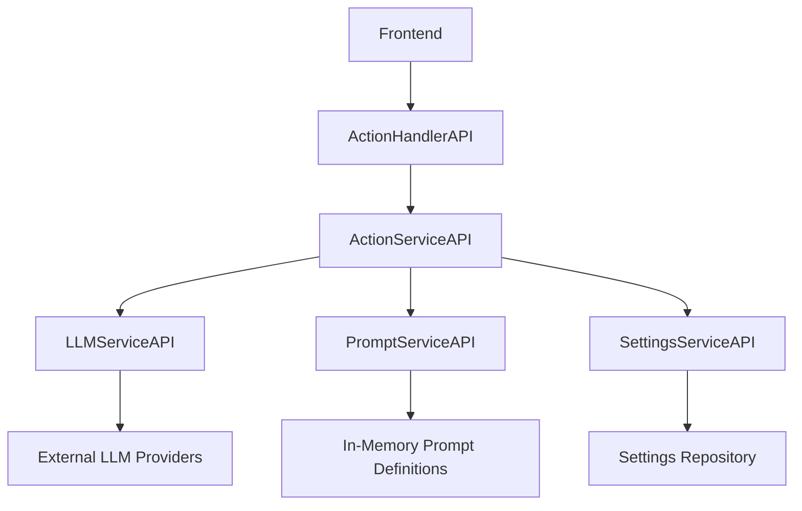
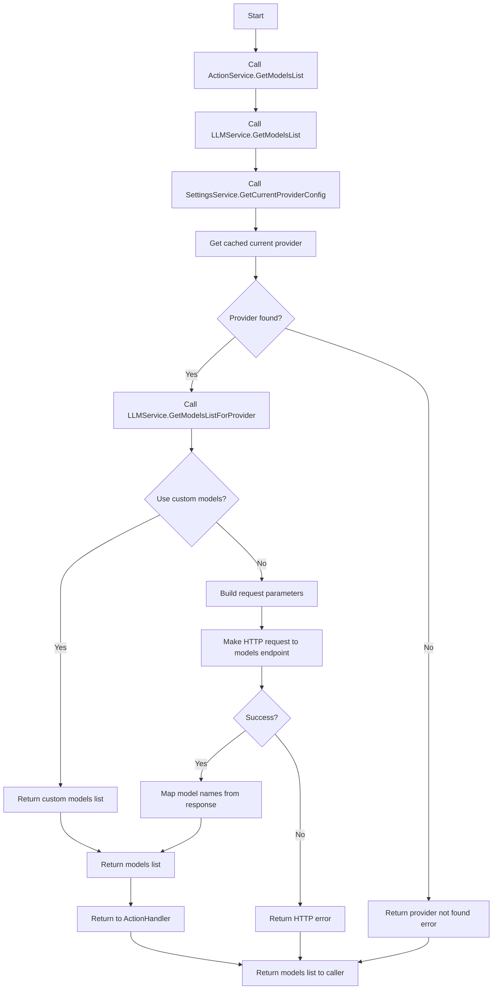
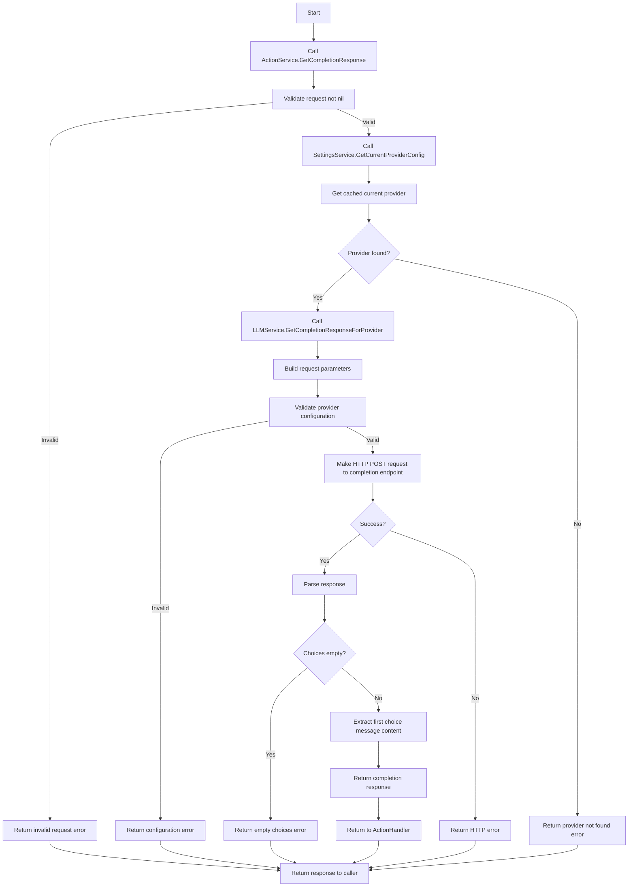
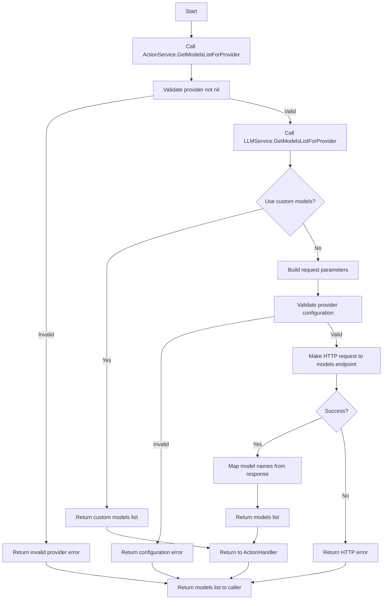
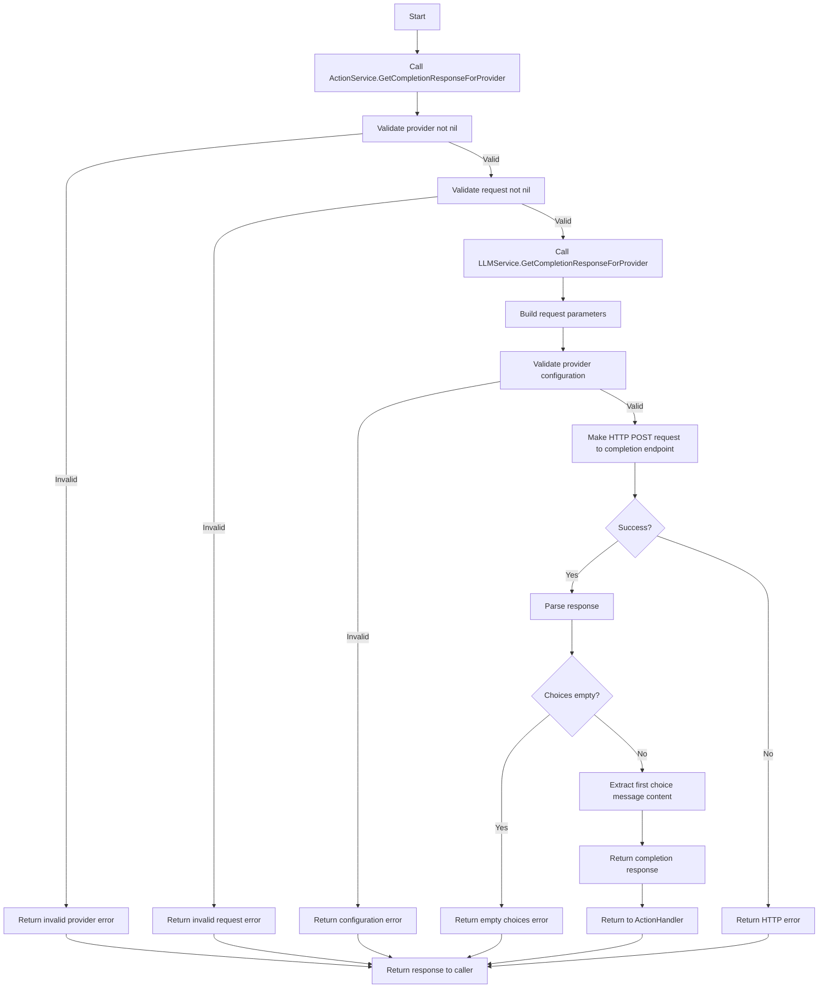
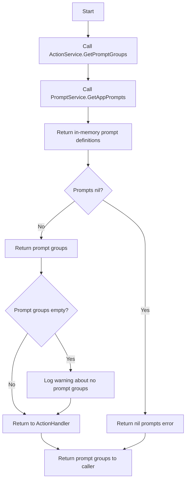
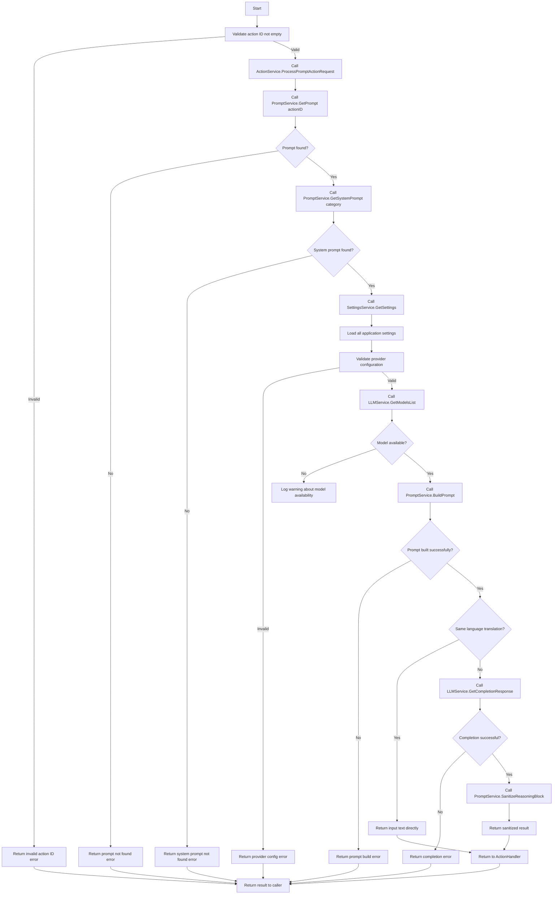

# ActionHandlerAPI Documentation

This document provides comprehensive documentation for the ActionHandlerAPI, which serves as the main interface for handling various actions in the
application backend.

## Table of Contents

1. [Overview](#overview)
2. [Method Documentation](#method-documentation)
    - [GetModelsList()](#1-getmodelslist)
    - [GetCompletionResponse()](#2-getcompletionresponse)
    - [GetModelsListForProvider()](#3-getmodelslistforprovider)
    - [GetCompletionResponseForProvider()](#4-getcompletionresponseforprovider)
    - [GetPromptGroups()](#5-getpromptgroups)
    - [ProcessPrompt()](#6-processprompt)
3. [Summary](#summary)

## Overview

The `ActionHandlerAPI` is implemented by `ActionHandler` struct and provides methods for:

- Retrieving available LLM models
- Getting completion responses from LLM providers
- Managing prompt groups and processing prompts
- Handling provider-specific operations

The ActionHandler acts as a facade that:

- Provides a clean, simple interface to frontend components
- Delegates complex operations to specialized services
- Maintains separation of concerns

## Architecture



**Key Components:**

- **ActionHandlerAPI**: Main interface documented here
- **ActionServiceAPI**: Business logic layer
- **LLMServiceAPI**: Handles LLM provider communication
- **PromptServiceAPI**: Manages prompt templates and processing
- **SettingsServiceAPI**: Provides application configuration

## Method Documentation

### 1. GetModelsList()

**Signature:**

```go
GetModelsList() ([]string, error)
```

**Purpose:**
Retrieves a list of available LLM models from the current provider configuration.

**Flow Diagram:**



**Method Behavior:**

1. **Delegation:** Delegates the actual work to `actionService.GetModelsList()`
2. **Return:** Returns the list of model names or an error

**Validation:**

- No direct validation in this method
- Validation happens in the underlying services

**Dependencies:**

- `actionService.GetModelsList()` → `llmService.GetModelsList()` → `settingsService.GetCurrentProviderConfig()`

**Error Handling:**

- Returns any error from the underlying `actionService.GetModelsList()` call
- Errors can include:
    - Settings retrieval failures
    - Provider configuration issues
    - HTTP request failures to the LLM provider

**State Changes:**

- No state changes - this is a read-only operation
- Does not modify any files, caches, or application state

**Performance:**

- Performance depends on the underlying LLM provider API response time
- May involve HTTP requests to external services

**Example Usage:**

```go
models, err := actionHandler.GetModelsList()
if err != nil {
// Handle error
}
// Use models list
```

**Response Example:**

```json
[
    "gpt-3.5-turbo",
    "gpt-4",
    "llama2:7b",
    "mistral:7b-instruct"
]
```

**Related Methods:**

- `GetModelsListForProvider()` - Provider-specific version
- `GetCompletionResponse()` - Uses models from this list

### 2. GetCompletionResponse()

**Signature:**

```go
GetCompletionResponse(request *llms.ChatCompletionRequest) (string, error)
```

**Purpose:**
Sends a completion request to the current LLM provider and returns the response.

**Flow Diagram:**



**Method Behavior:**

1. **Delegation:** Delegates to `actionService.GetCompletionResponse(request)`
2. **Return:** Returns the completion response string or an error

**Validation:**

- No direct validation in this method
- Validation happens in underlying services:
    - Request validation (nil check)
    - Provider configuration validation
    - Settings validation

**Dependencies:**

- `actionService.GetCompletionResponse()` → `llmService.GetCompletionResponse()` → `settingsService.GetCurrentProviderConfig()`

**Error Handling:**

- Returns any error from the underlying service call
- Errors can include:
    - Invalid request parameters
    - Provider configuration issues
    - HTTP request failures
    - Empty or invalid responses from LLM provider

**State Changes:**

- No state changes - this is a read-only operation
- Does not modify any application state or files

**Performance:**

- Performance depends on:
    - LLM provider response time
    - Model complexity and size
    - Network conditions
    - Request payload size

**Example Usage:**

```go
request := &llms.ChatCompletionRequest{
Model: "gpt-3.5-turbo",
Messages: []llms.CompletionRequestMessage{
{Role: "user", Content: "Hello, how are you?"},
},
}

response, err := actionHandler.GetCompletionResponse(request)
if err != nil {
// Handle error
}
// Use response
```

**Response Example:**

```json
"Hello! I'm doing well, thank you for asking. How can I assist you today?"
```

**Related Methods:**

- `GetCompletionResponseForProvider()` - Provider-specific version
- `GetModelsList()` - Gets available models for completion

### 3. GetModelsListForProvider()

**Signature:**

```go
GetModelsListForProvider(provider *settings.ProviderConfig) ([]string, error)
```

**Purpose:**
Retrieves a list of available LLM models for a specific provider configuration.

**Flow Diagram:**



**Method Behavior:**

1. **Delegation:** Delegates to `actionService.GetModelsListForProvider(provider)`
2. **Return:** Returns the list of model names for the specified provider or an error

**Validation:**

- No direct validation in this method
- Validation happens in underlying services:
    - Provider configuration validation (nil check, URL validation, etc.)
    - Settings validation

**Dependencies:**

- `actionService.GetModelsListForProvider()` → `llmService.GetModelsListForProvider()`

**Error Handling:**

- Returns any error from the underlying service call
- Errors can include:
    - Invalid provider configuration
    - HTTP request failures to the specific provider
    - Empty or invalid responses from the provider

**State Changes:**

- No state changes - this is a read-only operation
- Does not modify any application state or files

**Performance:**

- Performance depends on the specific provider's API response time
- May involve HTTP requests to external services
- Can be faster if provider uses custom models (no HTTP request needed)

**Example Usage:**

```go
provider := &settings.ProviderConfig{
ProviderName: "MyCustomProvider",
BaseUrl: "https://api.example.com/v1",
// ... other provider configuration
}

models, err := actionHandler.GetModelsListForProvider(provider)
if err != nil {
// Handle error
}
// Use models list for specific provider
```

**Response Example:**

```json
[
    "custom-model-v1",
    "custom-model-v2",
    "custom-fast-model"
]
```

**Related Methods:**

- `GetModelsList()` - Uses current provider instead of specific provider
- `GetCompletionResponseForProvider()` - Provider-specific completion request

### 4. GetCompletionResponseForProvider()

**Signature:**

```go
GetCompletionResponseForProvider(provider *settings.ProviderConfig, request *llms.ChatCompletionRequest) (string, error)
```

**Purpose:**
Sends a completion request to a specific LLM provider and returns the response.

**Flow Diagram:**



**Method Behavior:**

1. **Delegation:** Delegates to `actionService.GetCompletionResponseForProvider(provider, request)`
2. **Return:** Returns the completion response string or an error

**Validation:**

- No direct validation in this method
- Validation happens in underlying services:
    - Provider configuration validation (nil check, URL validation, etc.)
    - Request validation (nil check)
    - Settings validation

**Dependencies:**

- `actionService.GetCompletionResponseForProvider()` → `llmService.GetCompletionResponseForProvider()`

**Error Handling:**

- Returns any error from the underlying service call
- Errors can include:
    - Invalid provider configuration
    - Invalid request parameters
    - HTTP request failures to the specific provider
    - Empty or invalid responses from the provider

**State Changes:**

- No state changes - this is a read-only operation
- Does not modify any application state or files

**Performance:**

- Performance depends on:
    - Specific provider's API response time
    - Model complexity and size
    - Network conditions
    - Request payload size

**Example Usage:**

```go
provider := &settings.ProviderConfig{
ProviderName: "MyCustomProvider",
BaseUrl: "https://api.example.com/v1",
// ... other provider configuration
}

request := &llms.ChatCompletionRequest{
Model: "custom-model",
Messages: []llms.CompletionRequestMessage{
{Role: "user", Content: "Hello, how are you?"},
},
}

response, err := actionHandler.GetCompletionResponseForProvider(provider, request)
if err != nil {
// Handle error
}
// Use response from specific provider
```

**Response Example:**

```json
"Hi there! I'm a custom model responding to your greeting. How can I help you?"
```

**Related Methods:**

- `GetCompletionResponse()` - Uses current provider instead of specific provider
- `GetModelsListForProvider()` - Gets models for specific provider

### 5. GetPromptGroups()

**Signature:**

```go
GetPromptGroups() (*prompts.Prompts, error)
```

**Purpose:**
Retrieves all available prompt groups and their associated prompts from the application.

**Flow Diagram:**



**Method Behavior:**

1. **Delegation:** Calls `actionService.GetPromptGroups()`
2. **Error Handling:** If error occurs, wraps it with context
3. **Validation:** Checks if returned prompts are nil and handles accordingly
4. **Warning Handling:** Handles case when no prompt groups are found
5. **Return:** Returns the prompt groups or an error

**Validation:**

- Validates that the returned `appPrompts` is not nil
- Validates that the `PromptGroups` slice is not empty (with warning)

**Dependencies:**

- `actionService.GetPromptGroups()` → `promptService.GetAppPrompts()`

**Error Handling:**

- Returns wrapped errors with context
- Handles nil prompt groups with specific error message
- Handles all errors appropriately

**State Changes:**

- No state changes - this is a read-only operation
- Does not modify any application state or files

**Performance:**

- Very fast - retrieves in-memory prompt definitions
- No external API calls or file I/O operations

**Example Usage:**

```go
promptGroups, err := actionHandler.GetPromptGroups()
if err != nil {
// Handle error
}
// Use prompt groups for UI display or processing
for category, group := range promptGroups.PromptGroups {
fmt.Printf("Category: %s\n", category)
for promptID, prompt := range group.Prompts {
fmt.Printf("  - %s: %s\n", promptID, prompt.Description)
}
}
```

**Response Example:**

```json
{
    "promptGroups": {
        "translation": {
            "groupId": "translation",
            "groupName": "Translation",
            "systemPrompt": {
                "id": "translation_system",
                "name": "Translation System Prompt",
                "type": "system",
                "category": "translation",
                "value": "You are a professional translator..."
            },
            "prompts": {
                "translate_text": {
                    "id": "translate_text",
                    "name": "Translate Text",
                    "type": "user",
                    "category": "translation",
                    "value": "Translate the following text from {inputLanguage} to {outputLanguage}: {text}"
                }
            }
        },
        "summarization": {
            "groupId": "summarization",
            "groupName": "Summarization",
            "systemPrompt": {
                "id": "summarization_system",
                "name": "Summarization System Prompt",
                "type": "system",
                "category": "summarization",
                "value": "You are an expert summarizer..."
            },
            "prompts": {
                "summarize_text": {
                    "id": "summarize_text",
                    "name": "Summarize Text",
                    "type": "user",
                    "category": "summarization",
                    "value": "Summarize the following text in {format} format: {text}"
                }
            }
        }
    }
}
```

**Related Methods:**

- `ProcessPrompt()` - Uses prompts from these groups for processing

### 6. ProcessPrompt()

**Signature:**

```go
ProcessPrompt(actionReq prompts.PromptActionRequest) (string, error)
```

**Purpose:**
Processes a prompt action request by fetching the appropriate prompt, building the user prompt, sending it to the LLM, and returning the processed
result.

**Flow Diagram:**



**Method Behavior:**

1. **Validation:** Validates that the action ID is not empty
2. **Delegation:** Calls `actionService.ProcessPromptActionRequest(&actionReq)`
3. **Error Handling:** If error occurs, wraps it with context
4. **Return:** Returns the processed result or an error

**Validation:**

- Validates that `actionReq.ID` is not empty or whitespace
- Additional validation happens in the underlying service

**Dependencies:**

- `actionService.ProcessPromptActionRequest()` → Complex flow involving:
    - `promptService.GetPrompt()` - Get prompt definition
    - `promptService.GetSystemPrompt()` - Get system instructions
    - `settingsService.GetSettings()` - Get current settings
    - `llmService.GetModelsList()` - Validate model availability
    - `promptService.BuildPrompt()` - Build user prompt
    - `llmService.GetCompletionResponse()` - Send to LLM
    - `promptService.SanitizeReasoningBlock()` - Clean response

**Error Handling:**

- Returns wrapped errors with context including action ID
- Handles all errors from the complex underlying process
- Provides detailed error information for debugging

**State Changes:**

- No direct state changes in this method
- Underlying services may update internal state
- No file modifications or persistent state changes

**Performance:**

- Complex operation with multiple steps
- Performance depends on:
    - LLM provider response time (main bottleneck)
    - Prompt complexity and size
    - Network conditions
    - Number of validation steps

**Detailed Underlying Flow:**

The `ProcessPromptActionRequest` method performs these steps:

1. **Fetch Prompt Definition:** Gets the prompt template and metadata
2. **Fetch System Instructions:** Gets system prompt for the category
3. **Load Settings:** Loads all application settings at once
4. **Validate Configuration:** Validates provider configuration
5. **Validate Model Availability:** Checks if configured model is available
6. **Build User Prompt:** Constructs the final user prompt with template replacement
7. **Same-Language Optimization:** For translations, returns input if languages match
8. **LLM Completion:** Sends request to LLM provider
9. **Response Sanitization:** Cleans up reasoning blocks from response

**Example Usage:**

```go
request := prompts.PromptActionRequest{
ID: "translate_text",
InputText: "Hello, how are you?",
InputLanguageID: "en",
OutputLanguageID: "es",
// ... other fields as needed
}

result, err := actionHandler.ProcessPrompt(request)
if err != nil {
// Handle error
}
// Use the processed result
fmt.Println("Translation:", result)
```

**Response Example:**

```json
"¡Hola! ¿Cómo estás?"
```

**Related Methods:**

- `GetPromptGroups()` - Provides available prompts for processing
- `GetCompletionResponse()` - Used internally for LLM communication
- `GetModelsList()` - Used internally for model validation

**Special Cases:**

- **Same-Language Translation:** If input and output languages are the same, returns the input text directly without LLM call
- **Empty Results:** Handles empty responses from LLM with appropriate warnings
- **Validation Failures:** Provides detailed error messages for each validation step

## Summary

### Method Comparison Table

| Method                               | Purpose                               | Complexity | Performance             | State Changes |
|--------------------------------------|---------------------------------------|------------|-------------------------|---------------|
| `GetModelsList()`                    | Get available models                  | Low        | Medium (HTTP)           | None          |
| `GetCompletionResponse()`            | Get LLM completion                    | Medium     | High (HTTP)             | None          |
| `GetModelsListForProvider()`         | Get models for specific provider      | Low        | Medium (HTTP)           | None          |
| `GetCompletionResponseForProvider()` | Get completion from specific provider | Medium     | High (HTTP)             | None          |
| `GetPromptGroups()`                  | Get prompt definitions                | Very Low   | Very High               | None          |
| `ProcessPrompt()`                    | Process complete prompt workflow      | Very High  | Low (HTTP + processing) | None          |

### Error Handling Patterns

All methods follow consistent error handling:

1. **Error Wrapping:** Errors are wrapped with context including method name
2. **Validation:** Input validation with meaningful error messages
3. **Graceful Degradation:** Methods handle edge cases appropriately

### Performance Considerations

- **HTTP Operations:** Methods involving LLM providers (`GetModelsList`, `GetCompletionResponse`, etc.) are network-bound
- **In-Memory Operations:** `GetPromptGroups()` is very fast as it works with in-memory data
- **Complex Workflows:** `ProcessPrompt()` has the most overhead due to multiple service calls

### Best Practices for Usage

1. **Error Handling:** Always check for errors and handle them appropriately
2. **Caching:** Consider caching results from `GetModelsList()` to avoid repeated HTTP calls
3. **Validation:** Validate inputs before calling methods to get better error messages
4. **Error Handling:** Methods provide detailed error information for debugging
5. **Concurrency:** Methods are thread-safe and can be called concurrently

### Future Enhancements

Potential areas for improvement:

- **Caching:** Add caching layer for model lists and frequent prompts
- **Batching:** Support batch processing of multiple prompts
- **Streaming:** Add streaming support for completion responses
- **Retry Logic:** Enhance retry logic for transient failures
- **Metrics:** Add performance metrics and monitoring

## Appendix

### Data Structures

**Key Data Structures Used:**

- `llms.ChatCompletionRequest` - Request structure for LLM completions
- `settings.ProviderConfig` - Provider configuration
- `prompts.PromptActionRequest` - Prompt processing request
- `prompts.Prompts` - Collection of prompt groups and definitions

### Dependencies

**External Dependencies:**

- LLM Provider APIs (OpenAI-compatible, Ollama, etc.)
- REST client for HTTP communication
- Error handling framework

**Internal Dependencies:**

- Settings service for configuration
- Prompt service for template management
- LLM service for provider communication
