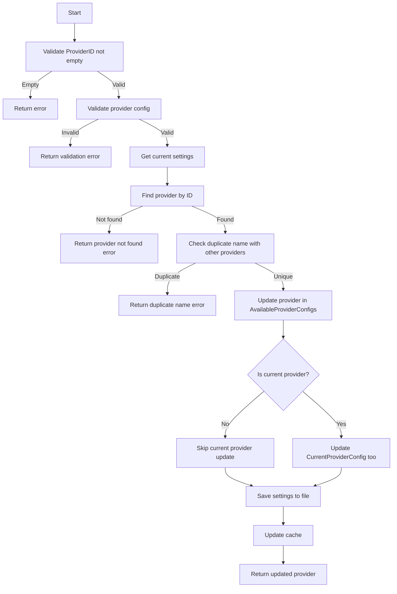

# SettingsHandlerAPI Documentation

This document provides comprehensive technical documentation for the SettingsHandlerAPI, focusing on business logic, validation rules, state
management, and detailed execution flows.

## Table of Contents

1. [Architecture Overview](#architecture-overview)
2. [Method Documentation](#method-documentation)
    - [GetAppSettingsMetadata()](#1-getappsettingsmetadata)
    - [GetSettings()](#2-getsettings)
    - [ResetSettingsToDefault()](#3-resetsettingstodefault)
    - [GetAllProviderConfigs()](#4-getallproviderconfigs)
    - [GetCurrentProviderConfig()](#5-getcurrentproviderconfig)
    - [GetProviderConfig(providerId string)](#6-getproviderconfigproviderid-string)
    - [CreateProviderConfig(cfg ProviderConfig)](#7-createproviderconfigcfg-providerconfig)
    - [UpdateProviderConfig(cfg ProviderConfig)](#8-updateproviderconfigcfg-providerconfig)
    - [DeleteProviderConfig(providerId string)](#9-deleteproviderconfigproviderid-string)
    - [SetAsCurrentProviderConfig(providerId string)](#10-setascurrentproviderconfigproviderid-string)
    - [GetInferenceBaseConfig()](#11-getinferencebaseconfig)
    - [UpdateInferenceBaseConfig(cfg InferenceBaseConfig)](#12-updateinferencebaseconfigcfg-inferencebaseconfig)
    - [GetModelConfig()](#13-getmodelconfig)
    - [UpdateModelConfig(cfg ModelConfig)](#14-updatemodelconfigcfg-modelconfig)
    - [GetLanguageConfig()](#15-getlanguageconfig)
    - [SetDefaultInputLanguage(language string)](#16-setdefaultinputlanguagelanguage-string)
    - [SetDefaultOutputLanguage(language string)](#17-setdefaultoutputlanguagelanguage-string)
    - [AddLanguage(language string)](#18-addlanguagelanguage-string)
    - [RemoveLanguage(language string)](#19-removelanguagelanguage-string)

## Architecture Overview


The SettingsHandlerAPI follows a layered architecture with clear separation of concerns:

- **Handler Layer**: API interface, input validation, error handling
- **Service Layer**: Business logic, comprehensive validation, state management
- **Repository Layer**: Data persistence, caching, file I/O
- **File Utilities**: File system operations abstraction

## Method Documentation

### 1. GetAppSettingsMetadata()

**Signature:**

```go
GetAppSettingsMetadata() (AppSettingsMetadata, error)
```

**Business Logic Flow:**


**Validation Rules:**

- ✅ No input validation (no parameters)
- ✅ Validates returned metadata is not nil
- ✅ Validates file path resolution succeeds

**State Changes:**

- **No persistent state changes**
- **No cache changes**
- **Read-only operation**

**Return Value:**

```go
AppSettingsMetadata{
AuthTypes:      []AuthType{AuthTypeNone, AuthTypeApiKey, AuthTypeBearer},
ProviderTypes:  []ProviderType{ProviderTypeOpenAICompatible, ProviderTypeOllama},
SettingsFolder: string, // Absolute path to settings directory
SettingsFile:   string, // Absolute path to settings.json file
}
```

**Error Conditions:**

- `FileUtils.GetAppSettingsFolderPath()` failure
- `FileUtils.GetAppSettingsFilePath()` failure
- Returned metadata is nil

**Usage:** Initial UI setup, static configuration display

### 2. GetSettings()

**Signature:**

```go
GetSettings() (Settings, error)
```

**Business Logic Flow:**


**Validation Rules:**

- ✅ No input validation (no parameters)
- ✅ Validates settings are not nil after retrieval
- ✅ JSON parsing validation handled by repository

**State Changes:**

- **No persistent state changes**
- **Cache population**: Settings cached in memory after first load
- **File system**: No file modifications

**Return Value:**

```go
Settings{
AvailableProviderConfigs: []ProviderConfig{...},
CurrentProviderConfig:    ProviderConfig{...},
InferenceBaseConfig:      InferenceBaseConfig{...},
ModelConfig:              ModelConfig{...},
LanguageConfig:           LanguageConfig{...},
}
```

**Error Conditions:**

- Settings file not found (after default initialization)
- JSON parsing failure
- Settings validation failure
- Returned settings are nil

**Performance:**

- First call: File I/O + JSON parsing (~10-50ms)
- Subsequent calls: Cache lookup (~0.1ms)
- Cache lifetime: Application session

**Usage:** Initial settings load, settings view refresh

### 3. ResetSettingsToDefault()

**Signature:**

```go
ResetSettingsToDefault() (Settings, error)
```

**Business Logic Flow:**


**Validation Rules:**

- ✅ No input validation (no parameters)
- ✅ Validates default settings structure
- ✅ Validates file write operation success
- ✅ Validates returned settings not nil

**State Changes:**

- **Persistent state changes**: Overwrites settings.json with defaults
- **Cache changes**: Updates in-memory cache with default settings
- **Data loss**: All user customizations are permanently removed

**Default Values Applied:**

```go
// Provider configurations
AvailableProviderConfigs: [OllamaConfig, LMStudioConfig, LlamaCppConfig, OpenrouterConfig, OpenAIConfig]
CurrentProviderConfig:    OllamaConfig

// Inference settings
InferenceBaseConfig: {Timeout: 60, MaxRetries: 3, UseMarkdownForOutput: false}

// Model settings
ModelConfig: {Name: "", UseTemperature: true, Temperature: 0.5}

// Language settings
LanguageConfig: {DefaultInputLanguage: "English", DefaultOutputLanguage: "Ukrainian", Languages: [15 predefined languages]}
```

**Error Conditions:**

- JSON marshaling failure
- File write permission denied
- File system errors
- Returned settings are nil

**Security Considerations:**

- ⚠️ **Destructive operation** - cannot be undone
- ⚠️ **Data loss** - all user configurations removed
- ✅ **User confirmation** should be required in UI

**Usage:** Factory reset, troubleshooting, initial setup

### 4. GetAllProviderConfigs()

**Signature:**

```go
GetAllProviderConfigs() ([]ProviderConfig, error)
```

**Business Logic Flow:**


**Validation Rules:**

- ✅ No input validation
- ✅ Handles nil provider configs gracefully

**State Changes:**

- **No state changes**
- **Read-only operation**

**Return Value:** Array of all available provider configurations

**Error Conditions:** Settings retrieval failure

### 5. GetCurrentProviderConfig()

**Signature:**

```go
GetCurrentProviderConfig() (ProviderConfig, error)
```

**Business Logic Flow:**


**Validation Rules:**

- ✅ Validates current provider config is not nil

**State Changes:**

- **No state changes**

### 6. GetProviderConfig(providerId string)

**Signature:**

```go
GetProviderConfig(providerId string) (ProviderConfig, error)
```

**Business Logic Flow:**


**Validation Rules:**

- ✅ `providerId` cannot be empty
- ✅ Provider must exist in available configs
- ✅ Returned config must not be nil

**State Changes:**

- **No state changes**

**Error Conditions:**

- Empty providerId
- Provider not found
- Config is nil

### 7. CreateProviderConfig(cfg ProviderConfig)

**Signature:**

```go
CreateProviderConfig(cfg ProviderConfig) (ProviderConfig, error)
```

**Business Logic Flow:**


**Validation Rules:**

- ✅ Complete provider config validation (see `ValidateProviderConfig`)
- ✅ Provider name must be unique
- ✅ All required fields must be present
- ✅ URL formats must be valid

**State Changes:**

- **Persistent state changes**: New provider added to settings
- **Cache updated**: In-memory cache reflects new provider
- **ProviderID generated**: New UUID assigned

**Validation Function Details:**

```go
ValidateProviderConfig(cfg *ProviderConfig) error
// Validates:
// - ProviderName not empty
// - ProviderType is valid enum
// - BaseUrl format and trailing slash
// - CompletionEndpoint format
// - AuthType is valid enum
// - Auth token requirements based on auth type
// - Custom models requirements
```

### 8. UpdateProviderConfig(cfg ProviderConfig)

**Signature:**

```go
UpdateProviderConfig(cfg ProviderConfig) (ProviderConfig, error)
```

**Business Logic Flow:**



**Validation Rules:**

- ✅ ProviderID must not be empty
- ✅ Complete provider config validation
- ✅ Provider must exist
- ✅ Provider name must be unique among other providers

**State Changes:**

- **Persistent state changes**: Provider configuration updated
- **Cache updated**: In-memory cache reflects changes
- **Current provider sync**: If updating current provider, both arrays updated

### 9. DeleteProviderConfig(providerId string)

**Signature:**

```go
DeleteProviderConfig(providerId string) error
```

**Business Logic Flow:**


**Validation Rules:**

- ✅ providerId must not be empty
- ✅ Cannot delete current provider
- ✅ Provider must exist

**State Changes:**

- **Persistent state changes**: Provider removed from settings
- **Cache updated**: In-memory cache reflects removal

**Error Conditions:**

- Empty providerId
- Attempt to delete current provider
- Provider not found
- Settings save failure

### 10. SetAsCurrentProviderConfig(providerId string)

**Signature:**

```go
SetAsCurrentProviderConfig(providerId string) (ProviderConfig, error)
```

**Business Logic Flow:**


**Validation Rules:**

- ✅ providerId must not be empty
- ✅ Provider must exist
- ✅ Provider config must be valid

**State Changes:**

- **Persistent state changes**: Current provider updated
- **Cache updated**: In-memory cache reflects new current provider

### 11. GetInferenceBaseConfig()

**Signature:**

```go
GetInferenceBaseConfig() (InferenceBaseConfig, error)
```

**Business Logic Flow:**


**Validation Rules:**

- ✅ Config must not be nil

**State Changes:**

- **No state changes**

### 12. UpdateInferenceBaseConfig(cfg InferenceBaseConfig)

**Signature:**

```go
UpdateInferenceBaseConfig(cfg InferenceBaseConfig) (InferenceBaseConfig, error)
```

**Business Logic Flow:**


**Validation Rules:**

- ✅ Timeout must be between 1-600 seconds
- ✅ MaxRetries must be between 0-10

**State Changes:**

- **Persistent state changes**: Inference config updated

### 13. GetModelConfig()

**Signature:**

```go
GetModelConfig() (ModelConfig, error)
```

**Business Logic Flow:**


**Validation Rules:**

- ✅ Config must not be nil

**State Changes:**

- **No state changes**

### 14. UpdateModelConfig(cfg ModelConfig)

**Signature:**

```go
UpdateModelConfig(cfg ModelConfig) (ModelConfig, error)
```

**Business Logic Flow:**


**Validation Rules:**

- ✅ Temperature must be 0-2 when UseTemperature is true
- ✅ Model name can be empty (user may not have selected)

**State Changes:**

- **Persistent state changes**: Model config updated

### 15. GetLanguageConfig()

**Signature:**

```go
GetLanguageConfig() (LanguageConfig, error)
```

**Business Logic Flow:**


**Validation Rules:**

- ✅ Config must not be nil

**State Changes:**

- **No state changes**

### 16. SetDefaultInputLanguage(language string)

**Signature:**

```go
SetDefaultInputLanguage(language string) error
```

**Business Logic Flow:**


**Validation Rules:**

- ✅ Language cannot be empty (after trim)
- ✅ Language must exist in supported languages list (case-insensitive)

**State Changes:**

- **Persistent state changes**: Default input language updated

### 17. SetDefaultOutputLanguage(language string)

**Signature:**

```go
SetDefaultOutputLanguage(language string) error
```

**Business Logic Flow:**


**Validation Rules:**

- ✅ Language cannot be empty (after trim)
- ✅ Language must exist in supported languages list (case-insensitive)

**State Changes:**

- **Persistent state changes**: Default output language updated

### 18. AddLanguage(language string)

**Signature:**

```go
AddLanguage(language string) ([]string, error)
```

**Business Logic Flow:**


**Validation Rules:**

- ✅ Language cannot be empty (after trim)
- ✅ Case-insensitive duplicate check

**State Changes:**

- **Persistent state changes**: New language added to supported list
- **Returns**: Updated languages array

### 19. RemoveLanguage(language string)

**Signature:**

```go
RemoveLanguage(language string) ([]string, error)
```

**Business Logic Flow:**


**Validation Rules:**

- ✅ Language cannot be empty (after trim)
- ✅ Cannot remove default input language
- ✅ Cannot remove default output language
- ✅ Case-insensitive language matching

**State Changes:**

- **Persistent state changes**: Language removed from supported list
- **Returns**: Updated languages array

## Summary

### Key Characteristics

1. **Validation Depth**: Multiple validation layers ensure data integrity
2. **State Management**: Clear distinction between read-only and state-changing operations
3. **Error Handling**: Comprehensive error conditions documented for each method
4. **Performance**: Caching strategy optimizes frequent read operations
5. **Security**: Input validation and file permission management

### Method Categories Summary

| Category                | Methods | State Changes |
|-------------------------|---------|---------------|
| **Metadata**            | 2       | Read-only     |
| **Full Settings**       | 2       | Read/write    |
| **Provider Management** | 7       | Read/write    |
| **Inference/Model**     | 4       | Read/write    |
| **Language Management** | 5       | Read/write    |

### Best Practices

1. **Error Handling**: Always check return errors and handle gracefully
2. **Validation**: Validate inputs before calling methods when possible
3. **Performance**: Leverage caching for frequent settings access
4. **User Experience**: Provide clear feedback for state-changing operations
5. **Security**: Be cautious with destructive operations like reset

This documentation provides a complete technical reference for the SettingsHandlerAPI, focusing on the core business logic, validation rules, and
state management behavior of each method.