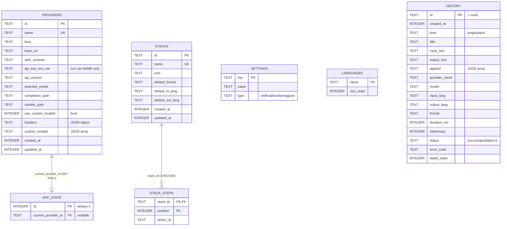

# GoText — Data Model & Database Specification (06)

> **Document:** 06 — Data Model & Database
> **Application:** GoText ("GoText") — a native desktop LLM text-processing application.
> **Stack:** Go + [Wails v2] backend; persistence via embedded SQLite.
> **Module name:** `go_text`.
> **Status:** Specification (confirmed requirements only).

This document defines the persistence layer of GoText: the relational data model (entities,
relationships, constraints, indexes), the key–value settings catalog, and the database mechanics
(driver, pragmas, code generation, migrations, seeding, rollback, and repository design).

Related specification documents are cross-referenced by filename:

- `02-functional-requirements.md` — functional requirements that the persisted data supports.
- `03-architecture.md` — the layered backend (Handler → Service → Repository) and DI wiring.
- `04-providers-inference.md` — the provider/model/inference configuration this schema persists.
- `05-stacks-actions-engine.md` — stacks and the chain orchestrator (the `stacks` /
  `stack_steps` / `history` writers).
- `07-error-handling-logging.md` — the `apperr` error taxonomy and Result envelope used to map
  database failures.
- `02-functional-requirements.md` — the action-history feature backed by the `history` table.
- `07-error-handling-logging.md` — logging, lifecycle, crash resilience.

---

## 0. Locked decisions

The persistence layer is built on a small set of fixed decisions:

- **Storage engine:** a single embedded **SQLite** database file, `gotext.db`, in the application
  configuration folder (`<app config dir>/gotext.db`).
- **Driver:** `modernc.org/sqlite` — a **pure-Go** driver (no CGO). The `database/sql` driver name is
  `"sqlite"`. This lets `wails build` cross-compile for macOS, Windows, and Linux with no C toolchain.
- **Schema shape:** a **hybrid** model — normalized tables for entities (`providers`, `languages`,
  `stacks`, `stack_steps`, `app_state`, `history`) plus a **key–value `settings`** table for scalar
  configuration and feature flags.
- **Data access:** type-safe Go generated from SQL by **sqlc**. No runtime ORM; generated code uses
  only `database/sql`.
- **Migrations:** **versioned, embedded** SQL migrations run by `pressly/goose` (library mode +
  `//go:embed`), applied on startup. sqlc reads the same migration files as its schema source.
- **Seeding:** default providers, languages, and settings are inserted **only when the database is
  empty**. The same seeder powers **factory reset** (wipe + reseed).
- **No secrets in the database.** For credentialed providers the database stores **only the name of an
  environment variable** (`providers.api_key_env_var`) from which the runtime reads the secret. The
  secret value itself is never persisted.
- **No model-cache table.** Model discovery is performed live at runtime (see `04-providers-inference.md`);
  the database persists only user-provided custom models.
- **Provider-agnostic.** No provider brand or vendor name is hard-coded into the schema semantics;
  provider behavior is driven by the generic `kind` and `auth_scheme` columns.
- **Destructive reset is acceptable.** There is **no migration of legacy JSON settings**. A first run on
  the new schema starts from a clean, seeded database.

---

## A. Data Model

### A.1 Entities overview

| Entity | Table | Cardinality | Purpose |
|---|---|---|---|
| Setting | `settings` | many (one row per key) | Scalar configuration and feature flags (key–value). |
| Provider | `providers` | many | Configured LLM endpoints (connection, auth-by-env-var, model selection). |
| App state | `app_state` | exactly one (`id = 1`) | Singleton runtime state, notably the currently selected provider. |
| Language | `languages` | many | The user's language list (for input/output language selection). |
| Stack | `stacks` | many | Saved action chains ("My Stacks"). |
| Stack step | `stack_steps` | many (children of a stack) | Ordered actions within a stack. |
| History entry | `history` | many (ring-buffer) | One record per completed run (single action or stack). |

> **Seed inventory (fresh DB).** On an empty database the seeder populates `settings` (the key catalog,
> §A.6), `providers` + the `app_state` singleton, `languages`, and a small set of planner-valid starter
> `stacks` / `stack_steps` (§B.5, §B.5.1). `history` starts empty.

### A.2 Relationships

- **`app_state` → `providers`** (many-to-one, nullable): `app_state.current_provider_id` references
  `providers.id` with `ON DELETE SET NULL`. When the current provider is deleted, the foreign key is
  cleared and the application repoints to a remaining provider (or none).
- **`stacks` → `stack_steps`** (one-to-many): `stack_steps.stack_id` references `stacks.id` with
  `ON DELETE CASCADE`. Deleting a stack deletes its steps.
- **`stack_steps.action_id`** has **no foreign key**: actions/prompts are compiled into the application
  binary, not stored in the database. Unknown `action_id`s are validated against the compiled action
  catalog at load time.
- **`history`** is intentionally **self-contained**: it stores snapshots of provider name, model,
  languages, and applied-action labels rather than foreign keys, so an entry remains readable even after
  the referenced provider, stack, or action is edited or removed.
- **`settings`** and **`languages`** are standalone reference data with no foreign keys.

### A.3 Entity–relationship diagram



### A.4 Table definitions

The authoritative DDL appears in §B.4 (the goose migration SQL). The tables below summarize each
column, its constraints, and its meaning.

#### A.4.1 `settings` — key–value scalar configuration

| Column | Type | Constraints | Description |
|---|---|---|---|
| `key` | TEXT | PRIMARY KEY | Dotted configuration key (see §A.5 catalog). |
| `value` | TEXT | NOT NULL | Serialized scalar value (parsed per `type`). |
| `type` | TEXT | NOT NULL, CHECK in (`int`,`float`,`bool`,`string`,`json`) | Declared value type; the repository parses `value` accordingly. |

Each row stores one scalar. The repository assembles typed configuration structs from groups of keys
and writes them back per key (upsert).

#### A.4.2 `providers` — configured LLM endpoints

| Column | Type | Constraints | Description |
|---|---|---|---|
| `id` | TEXT | PRIMARY KEY | Stable identifier (UUID). |
| `name` | TEXT | NOT NULL, **UNIQUE** | User-facing provider name. |
| `kind` | TEXT | NOT NULL, CHECK (enum) | Generic provider family driving derived endpoints/behavior. |
| `base_url` | TEXT | NOT NULL | Base endpoint URL (typically trailing `/`). |
| `auth_scheme` | TEXT | NOT NULL DEFAULT `'none'`, CHECK in (`none`,`bearer`,`apiKey`) | Authentication scheme. |
| `api_key_env_var` | TEXT | NOT NULL DEFAULT `''` | **Name of an environment variable** holding the credential — never the secret itself. |
| `api_version` | TEXT | NOT NULL DEFAULT `''` | Optional API version string (used by versioned endpoints). |
| `selected_model` | TEXT | NOT NULL DEFAULT `''` | Currently selected model / deployment id. |
| `completion_path` | TEXT | NOT NULL DEFAULT `''` | Completion endpoint path override; if empty, derived from `kind`. |
| `models_path` | TEXT | NOT NULL DEFAULT `''` | Model-listing endpoint path override; if empty, derived from `kind`. |
| `use_custom_models` | INTEGER | NOT NULL DEFAULT `0` | Boolean: use `custom_models` instead of live discovery. |
| `headers` | TEXT | NOT NULL DEFAULT `'{}'` | JSON object of extra request headers. |
| `custom_models` | TEXT | NOT NULL DEFAULT `'[]'` | JSON array of user-provided model ids. |
| `created_at` | INTEGER | NOT NULL | Unix timestamp (seconds) of creation. |
| `updated_at` | INTEGER | NOT NULL | Unix timestamp (seconds) of last update. |

> **No secrets:** `api_key_env_var` is the only credential-related column and it stores an environment
> variable **name**. The runtime resolves the secret from the process environment at request time.

The generic `kind` enum (`ollama`, `lmstudio`, `llamacpp`, `openai`, `azure`) names provider families
abstractly; combined with the optional `*_path`, `api_version`, and `headers` overrides it expresses any
OpenAI-compatible or vendor-specific endpoint without hard-coding a brand into the schema.

#### A.4.3 `app_state` — singleton runtime state

| Column | Type | Constraints | Description |
|---|---|---|---|
| `id` | INTEGER | PRIMARY KEY, **CHECK (`id = 1`)** | Enforces a single row. |
| `current_provider_id` | TEXT | FK → `providers(id)` **ON DELETE SET NULL** | The currently selected provider, or NULL. |

#### A.4.4 `languages` — user language list

| Column | Type | Constraints | Description |
|---|---|---|---|
| `name` | TEXT | PRIMARY KEY | Language name (also the display value). |
| `sort_order` | INTEGER | NOT NULL DEFAULT `0` | Ordering hint; ties broken by `name`. |

#### A.4.5 `stacks` — saved action chains

| Column | Type | Constraints | Description |
|---|---|---|---|
| `id` | TEXT | PRIMARY KEY | Stable identifier (UUID). |
| `name` | TEXT | NOT NULL, **UNIQUE** | User-facing stack name. |
| `icon` | TEXT | NOT NULL DEFAULT `''` | Optional icon identifier. |
| `default_format` | TEXT | NOT NULL DEFAULT `''` | Default output format (`plain` / `markdown` / empty). |
| `default_in_lang` | TEXT | NOT NULL DEFAULT `''` | Default input language for the stack. |
| `default_out_lang` | TEXT | NOT NULL DEFAULT `''` | Default output language for the stack. |
| `created_at` | INTEGER | NOT NULL | Unix timestamp (seconds). |
| `updated_at` | INTEGER | NOT NULL | Unix timestamp (seconds). |

#### A.4.6 `stack_steps` — ordered actions within a stack

| Column | Type | Constraints | Description |
|---|---|---|---|
| `stack_id` | TEXT | NOT NULL, FK → `stacks(id)` **ON DELETE CASCADE** | Owning stack. |
| `position` | INTEGER | NOT NULL | Zero-based ordinal of the step within the stack. |
| `action_id` | TEXT | NOT NULL | Compiled action / prompt identifier (no FK). |
| — | — | **PRIMARY KEY (`stack_id`, `position`)** | Composite key guarantees one action per position. |

#### A.4.7 `history` — per-run action history

| Column | Type | Constraints | Description |
|---|---|---|---|
| `id` | TEXT | PRIMARY KEY | The run identifier (`runId`, UUID). |
| `created_at` | INTEGER | NOT NULL | Unix timestamp (seconds). |
| `kind` | TEXT | NOT NULL, CHECK in (`single`,`stack`) | Single action or stack run. |
| `title` | TEXT | NOT NULL | Action name / stack name (snapshot). |
| `input_text` | TEXT | NOT NULL | Original input text. |
| `output_text` | TEXT | NOT NULL | Final output (partial output on partial/error). |
| `applied` | TEXT | NOT NULL DEFAULT `'[]'` | JSON array `[{id,name,category}]` of applied actions (snapshot). |
| `provider_name` | TEXT | NOT NULL DEFAULT `''` | Provider name at run time. |
| `model` | TEXT | NOT NULL DEFAULT `''` | Model at run time. |
| `input_lang` | TEXT | NOT NULL DEFAULT `''` | Input language. |
| `output_lang` | TEXT | NOT NULL DEFAULT `''` | Output language. |
| `format` | TEXT | NOT NULL DEFAULT `''` | Output format (`plain` / `markdown`). |
| `duration_ms` | INTEGER | NOT NULL DEFAULT `0` | Run duration in milliseconds. |
| `inferences` | INTEGER | NOT NULL DEFAULT `1` | Number of inference calls in the run. |
| `status` | TEXT | NOT NULL, CHECK in (`success`,`partial`,`error`) | Outcome. |
| `error_code` | TEXT | NOT NULL DEFAULT `''` | `apperr` code on partial/error (see `07-error-handling-logging.md`). |
| `failed_index` | INTEGER | NOT NULL DEFAULT `-1` | Index of the failed step (`-1` when none). |

History is a **count-based ring buffer**: on insert it is pruned to the newest `history.maxEntries`
rows. It stores applied-action **labels** and the final input/output, not prompts (full prompts remain
in the diagnostic task log; see `02-functional-requirements.md`).

### A.5 Constraints and indexes summary

**Primary keys:** `settings(key)`, `providers(id)`, `app_state(id)`, `languages(name)`, `stacks(id)`,
`stack_steps(stack_id, position)`, `history(id)`.

**Unique constraints:** `providers.name`, `stacks.name`. (Language names and setting keys are unique by
virtue of being primary keys.)

**CHECK constraints:**

- `settings.type` ∈ (`int`,`float`,`bool`,`string`,`json`)
- `providers.kind` ∈ (`ollama`,`lmstudio`,`llamacpp`,`openai`,`azure`)
- `providers.auth_scheme` ∈ (`none`,`bearer`,`apiKey`)
- `app_state.id = 1` (singleton)
- `history.kind` ∈ (`single`,`stack`)
- `history.status` ∈ (`success`,`partial`,`error`)

**Foreign keys** (enforced with `PRAGMA foreign_keys = ON`):

- `app_state.current_provider_id` → `providers(id)` `ON DELETE SET NULL`
- `stack_steps.stack_id` → `stacks(id)` `ON DELETE CASCADE`

**Indexes:**

- `idx_stack_steps_stack` on `stack_steps(stack_id)` — fast step lookup per stack.
- `idx_history_created` on `history(created_at DESC)` — newest-first listing and prune ordering.

### A.6 Settings key catalog (`settings` table)

The repository assembles typed configuration structs from these keys, and `Update*` operations write
them back via upsert. Keys are namespaced by dotted prefixes.

| Key | type | Default | Bounds / notes | Maps to |
|---|---|---|---|---|
| `inference.timeout` | int | `60` | seconds | `InferenceBaseConfig.Timeout` |
| `inference.maxRetries` | int | `3` | — | `InferenceBaseConfig.MaxRetries` |
| `inference.useMarkdownForOutput` | bool | `false` | — | `InferenceBaseConfig.UseMarkdownForOutput` |
| `model.name` | string | `''` | — | `ModelConfig.Name` |
| `model.useTemperature` | bool | `true` | — | `ModelConfig.UseTemperature` |
| `model.temperature` | float | `0.5` | 0.0–2.0 | `ModelConfig.Temperature` |
| `model.useContextWindow` | bool | `false` | — | `ModelConfig.UseContextWindow` |
| `model.contextWindow` | int | `4096` | 1024–200000 | `ModelConfig.ContextWindow` |
| `model.useLegacyMaxTokens` | bool | `false` | true = `max_tokens`, false = `max_completion_tokens` | `ModelConfig.UseLegacyMaxTokens` |
| `app.enableTaskLogging` | bool | `false` | per-step diagnostic task log; independent of `log.*` | `AppBehaviorConfig.EnableTaskLogging` |
| `lang.defaultInput` | string | `English` | must exist in `languages` | `LanguageConfig.DefaultInputLanguage` |
| `lang.defaultOutput` | string | `Ukrainian` | must exist in `languages` | `LanguageConfig.DefaultOutputLanguage` |
| `ui.theme` | string | `''` | UI preference | new UI prefs |
| `ui.layout` | string | `''` | UI preference | new UI prefs |
| `ui.viewMode` | string | `''` | UI preference | new UI prefs |
| `log.fileEnabled` | bool | `false` | app-logger file sink on/off | `LoggingConfig.LogFileEnabled` |
| `log.level` | string | `info` | one of `trace`,`debug`,`info`,`warn`,`error`,`fatal` | `LoggingConfig.LogLevel` |
| `log.directory` | string | `''` | `''` = OS default logs dir (shared with tasklog) | `LoggingConfig.LogDirectory` |
| `log.maxSizeMB` | int | `10` | rotation: max file size (MB) | `LoggingConfig.LogMaxSizeMB` |
| `log.maxBackups` | int | `5` | rotation: kept backups | `LoggingConfig.LogMaxBackups` |
| `log.maxAgeDays` | int | `30` | rotation: max age (days) | `LoggingConfig.LogMaxAgeDays` |
| `log.compress` | bool | `false` | rotation: gzip rotated files | `LoggingConfig.LogCompress` |
| `history.enabled` | bool | `true` | — | `AppBehaviorConfig.HistoryEnabled` |
| `history.maxEntries` | int | `100` | 10–1000 (clamped) | `AppBehaviorConfig.HistoryMaxEntries` |
| `flags.*` | bool | — | feature flags (added freely) | feature flags |

> The core configuration groups (`inference.*`, `model.*`, `app.*`, `lang.default*`), the app-logger group
> (`log.*` → `LoggingConfig`), plus history and UI preferences are stored as individual KV rows. The
> app-logger keys (`log.*`) drive the rotating logger (`07-error-handling-logging.md` §10.5) and are read
> /written over the bridge as `LoggingConfig` (`08-api-contracts.md`); they are **separate** from the
> task-logging toggle `app.enableTaskLogging` (`07-error-handling-logging.md` §10.6). There is a single
> log-directory key, `log.directory` (no `app.logDirectory`). Adding a new scalar or flag is a matter of
> adding a key (and, if seeded by default, a seed row) — no schema change.

---

## B. Database Changes

### B.1 Dependencies

| Dependency | Role | Notes |
|---|---|---|
| `modernc.org/sqlite` | Runtime SQLite driver | Pure Go, no CGO; `database/sql` name `"sqlite"`. |
| `github.com/pressly/goose/v3` | Migration runner | Library mode; reads embedded migration files. |
| `github.com/google/uuid` | Identifier generation | Already present in the codebase. |
| **sqlc** | Code generator (dev/build tool) | A binary, **not** a `go.mod` runtime dependency; pinned via `tools.go`/CI, run with `sqlc generate`. |

The existing HTTP client used for inference is unaffected by this change.

### B.2 Connection and pragmas

The database is opened once at startup with a single, shared `*sql.DB`. Pragmas are set on the DSN:

| Pragma | Value | Rationale |
|---|---|---|
| `journal_mode` | `WAL` | Concurrent readers do not block the single writer. |
| `foreign_keys` | `ON` | Enforce FK constraints (SET NULL / CASCADE). |
| `busy_timeout` | `5000` (ms) | Wait briefly instead of failing on a transient lock. |
| `synchronous` | `NORMAL` | Safe with WAL; good durability/throughput trade-off. |

The connection pool is restricted to **one open connection** (`SetMaxOpenConns(1)`): GoText is a
single-user desktop app, so a single writer connection avoids "database is locked" errors entirely while
WAL keeps reads fast.

DSN form:

```
file:<path>/gotext.db?_pragma=busy_timeout(5000)&_pragma=journal_mode(WAL)&_pragma=foreign_keys(ON)&_pragma=synchronous(NORMAL)
```

### B.3 Data access with sqlc

Queries are written as annotated SQL; sqlc generates type-safe Go (`store.Queries`, a mockable
`store.Querier` interface, and row models) into `internal/db/store`. No runtime ORM is used.

`sqlc.yaml` (repo root):

```yaml
version: "2"
sql:
  - engine: "sqlite"
    schema: "internal/db/migrations"     # sqlc parses goose-annotated migrations as the schema
    queries: "internal/db/queries"
    gen:
      go:
        package: "store"
        out: "internal/db/store"          # generated Queries + models live here
        emit_json_tags: false
        emit_interface: true              # generates a Querier interface (mockable)
```

Representative queries (`internal/db/queries/*.sql`):

```sql
-- name: ListProviders :many
SELECT * FROM providers ORDER BY name;

-- name: GetProvider :one
SELECT * FROM providers WHERE id = ?;

-- name: CreateProvider :exec
INSERT INTO providers (id,name,kind,base_url,auth_scheme,api_key_env_var,api_version,
  selected_model,completion_path,models_path,use_custom_models,headers,custom_models,created_at,updated_at)
VALUES (?,?,?,?,?,?,?,?,?,?,?,?,?,?,?);

-- name: UpdateProvider :exec
UPDATE providers SET name=?,kind=?,base_url=?,auth_scheme=?,api_key_env_var=?,api_version=?,
  selected_model=?,completion_path=?,models_path=?,use_custom_models=?,headers=?,custom_models=?,updated_at=?
WHERE id=?;

-- name: DeleteProvider :exec
DELETE FROM providers WHERE id = ?;

-- name: GetCurrentProviderID :one
-- The repository tolerates a missing app_state row: sql.ErrNoRows is mapped to
-- an empty/NULL provider id (no current provider), NOT a typed error.
SELECT current_provider_id FROM app_state WHERE id = 1;

-- name: SetCurrentProviderID :exec
INSERT INTO app_state (id,current_provider_id) VALUES (1,?)
ON CONFLICT(id) DO UPDATE SET current_provider_id = excluded.current_provider_id;

-- name: GetSetting :one
SELECT value, type FROM settings WHERE key = ?;
-- name: ListSettings :many
SELECT key, value, type FROM settings;
-- name: UpsertSetting :exec
INSERT INTO settings (key,value,type) VALUES (?,?,?)
ON CONFLICT(key) DO UPDATE SET value = excluded.value, type = excluded.type;

-- name: ListLanguages :many
SELECT name FROM languages ORDER BY sort_order, name;
-- name: AddLanguage :exec
INSERT INTO languages (name, sort_order) VALUES (?, ?) ON CONFLICT(name) DO NOTHING;
-- name: RemoveLanguage :exec
DELETE FROM languages WHERE name = ?;

-- name: ListStacks :many
SELECT * FROM stacks ORDER BY name;
-- name: GetStackSteps :many
SELECT action_id FROM stack_steps WHERE stack_id = ? ORDER BY position;
-- name: InsertStackStep :exec
INSERT INTO stack_steps (stack_id,position,action_id) VALUES (?,?,?);
-- name: DeleteStack :exec
DELETE FROM stacks WHERE id = ?;            -- cascades stack_steps

-- name: AddHistory :exec
INSERT INTO history (id,created_at,kind,title,input_text,output_text,applied,provider_name,model,
  input_lang,output_lang,format,duration_ms,inferences,status,error_code,failed_index)
VALUES (?,?,?,?,?,?,?,?,?,?,?,?,?,?,?,?,?);
-- name: PruneHistory :exec
DELETE FROM history WHERE id NOT IN (SELECT id FROM history ORDER BY created_at DESC LIMIT ?);
-- name: ListHistory :many
SELECT * FROM history ORDER BY created_at DESC LIMIT ? OFFSET ?;
-- name: GetHistory :one
SELECT * FROM history WHERE id = ?;
-- name: DeleteHistory :exec
DELETE FROM history WHERE id = ?;
-- name: ClearHistory :exec
DELETE FROM history;
-- name: CountHistory :one
SELECT count(*) FROM history;
```

`store.Queries` exposes one method per query; `q.WithTx(tx)` runs them in a transaction. Regenerate with
`sqlc generate` (`make db-gen` / `//go:generate sqlc generate`) and commit the generated code; CI runs a
diff check to catch drift.

### B.4 Migration strategy

Migrations are **embedded** in the binary (`//go:embed migrations/*.sql`) and applied by goose on
startup, in version order. goose maintains its own `goose_db_version` bookkeeping table. The schema can
be supplied as a single `0001_init.sql` or split into `0001_init.sql` + `0002_history.sql`; the combined
SQL is shown below.

#### B.4.1 `0001_init.sql` — core schema

```sql
-- +goose Up
-- +goose StatementBegin
CREATE TABLE settings (
  key   TEXT PRIMARY KEY,
  value TEXT NOT NULL,
  type  TEXT NOT NULL CHECK (type IN ('int','float','bool','string','json'))
);

CREATE TABLE providers (
  id                TEXT PRIMARY KEY,
  name              TEXT NOT NULL UNIQUE,
  kind              TEXT NOT NULL CHECK (kind IN ('ollama','lmstudio','llamacpp','openai','azure')),
  base_url          TEXT NOT NULL,
  auth_scheme       TEXT NOT NULL DEFAULT 'none' CHECK (auth_scheme IN ('none','bearer','apiKey')),
  api_key_env_var   TEXT NOT NULL DEFAULT '',     -- NAME of the env var only; never a secret
  api_version       TEXT NOT NULL DEFAULT '',
  selected_model    TEXT NOT NULL DEFAULT '',
  completion_path   TEXT NOT NULL DEFAULT '',
  models_path       TEXT NOT NULL DEFAULT '',
  use_custom_models INTEGER NOT NULL DEFAULT 0,   -- bool
  headers           TEXT NOT NULL DEFAULT '{}',   -- JSON object
  custom_models     TEXT NOT NULL DEFAULT '[]',   -- JSON array (user-provided)
  created_at        INTEGER NOT NULL,
  updated_at        INTEGER NOT NULL
);

CREATE TABLE app_state (
  id                  INTEGER PRIMARY KEY CHECK (id = 1),
  current_provider_id TEXT REFERENCES providers(id) ON DELETE SET NULL
);

CREATE TABLE languages (
  name       TEXT PRIMARY KEY,
  sort_order INTEGER NOT NULL DEFAULT 0
);

CREATE TABLE stacks (
  id               TEXT PRIMARY KEY,
  name             TEXT NOT NULL UNIQUE,
  icon             TEXT NOT NULL DEFAULT '',
  default_format   TEXT NOT NULL DEFAULT '',   -- 'plain'|'markdown'|''
  default_in_lang  TEXT NOT NULL DEFAULT '',
  default_out_lang TEXT NOT NULL DEFAULT '',
  created_at       INTEGER NOT NULL,
  updated_at       INTEGER NOT NULL
);

CREATE TABLE stack_steps (
  stack_id  TEXT NOT NULL REFERENCES stacks(id) ON DELETE CASCADE,
  position  INTEGER NOT NULL,
  action_id TEXT NOT NULL,                     -- compiled prompt/action id (no FK)
  PRIMARY KEY (stack_id, position)
);

CREATE INDEX idx_stack_steps_stack ON stack_steps(stack_id);
-- +goose StatementEnd

-- +goose Down
-- +goose StatementBegin
DROP TABLE stack_steps;
DROP TABLE stacks;
DROP TABLE languages;
DROP TABLE app_state;
DROP TABLE providers;
DROP TABLE settings;
-- +goose StatementEnd
```

#### B.4.2 `0002_history.sql` — history table

```sql
-- +goose Up
-- +goose StatementBegin
CREATE TABLE history (
  id            TEXT PRIMARY KEY,                 -- = runId (uuid)
  created_at    INTEGER NOT NULL,
  kind          TEXT NOT NULL CHECK (kind IN ('single','stack')),
  title         TEXT NOT NULL,                    -- action name / stack name (snapshot)
  input_text    TEXT NOT NULL,
  output_text   TEXT NOT NULL,                    -- final output; partial output on partial/error
  applied       TEXT NOT NULL DEFAULT '[]',       -- JSON [{id,name,category}] applied-actions snapshot
  provider_name TEXT NOT NULL DEFAULT '',
  model         TEXT NOT NULL DEFAULT '',
  input_lang    TEXT NOT NULL DEFAULT '',
  output_lang   TEXT NOT NULL DEFAULT '',
  format        TEXT NOT NULL DEFAULT '',         -- 'plain' | 'markdown'
  duration_ms   INTEGER NOT NULL DEFAULT 0,
  inferences    INTEGER NOT NULL DEFAULT 1,
  status        TEXT NOT NULL CHECK (status IN ('success','partial','error')),
  error_code    TEXT NOT NULL DEFAULT '',         -- apperr code on partial/error
  failed_index  INTEGER NOT NULL DEFAULT -1
);
CREATE INDEX idx_history_created ON history(created_at DESC);
-- +goose StatementEnd

-- +goose Down
-- +goose StatementBegin
DROP TABLE history;
-- +goose StatementEnd
```

### B.5 Seeding (and factory reset)

Default data is inserted **only when the database is empty**, detected by `SELECT count(*) FROM
providers` returning `0`. Seeding runs in a single transaction and inserts:

1. **Default providers** — a small set of provider rows mapped to the new column model (each with a
   generated `id`, generic `kind`, base URL, derived/empty paths, `auth_scheme`, and — for credentialed
   providers — only the **environment-variable name** in `api_key_env_var`, never a secret).
2. **Default languages** — the bundled language list, with `sort_order` reflecting display order.
3. **Default settings** — the seed rows for the key catalog (§A.6): `inference.*`, `model.*`,
   `app.enableTaskLogging`, `lang.defaultInput` / `lang.defaultOutput`, `history.enabled` /
   `history.maxEntries`, the app-logger `log.*` defaults, and the `ui.*` preference rows.
4. **Current provider** — explicitly insert the singleton row
   `app_state(id = 1, current_provider_id = <default provider id>)` (via `SetCurrentProviderID`,
   which upserts `id = 1`) so a freshly seeded database has a current provider selected.
5. **Starter stacks** — a small set of planner-valid starter stacks (see §B.5.1).

> **Missing `app_state` row is tolerated.** `GetCurrentProviderID` must not error when the singleton row
> is absent (e.g. before seeding completes): it returns an empty/`NULL` provider id, not an error. The
> service treats "no current provider" as a guiding empty state (runs are blocked until a provider is
> added), never as a failure.

The **same seeder powers factory reset** ("Reset to defaults"): reset wipes the entity and settings
tables and re-runs the seeder in one transaction. This is destructive by design and acceptable per the
locked decisions.

#### B.5.1 Starter stacks (seeded)

On a fresh (empty) database the seeder also inserts a small set of **starter stacks** — the recipes
documented in `09-prompts.md` §4 — into `stacks` (with a generated `id`, unique `name`, and `icon`) and
their ordered `stack_steps` (`position`, `action_id`). The insert runs inside the same seeding transaction
(stack row + its steps together).

Every seeded starter stack is **planner-valid** by construction: ≤ 5 steps, ≤ 3 inference groups after
same-family merge, and at most one action per exclusivity group (the caps enforced by the chain Planner,
`05-stacks-actions-engine.md`). Composite "message-to-X" recipes are seeded as starter **stacks**, not as
catalog actions or a family. Factory reset re-seeds the same starter stacks. As with any saved stack, on
load any unknown/removed `action_id` is dropped with a warning so a starter stack remains usable.

### B.6 Rollback strategy

Every migration ships matching goose `Down` statements (§B.4). `goose.Down` reverses the most recent
migration; the suite round-trips cleanly (`Up` then `Down`) on a temporary database, which is part of
the migration test. Rollback is a development/recovery affordance; normal application startup only
applies pending `Up` migrations.

### B.7 Data compatibility

There is **no migration from the prior JSON settings file**. The first run on this schema creates and
seeds a fresh `gotext.db`; legacy settings are not read or imported. This is the destructive-reset
policy fixed in the locked decisions, chosen for simplicity since all defaults are reproducible from the
seeder.

---

## C. Implementation Surface

### C.1 New package `internal/db`

A new package owns the database lifecycle:

- **Open** — resolve the database file path, open `*sql.DB` with the pragmas (§B.2), set
  `SetMaxOpenConns(1)`, run embedded goose migrations, then seed if empty. Any failure aborts startup so
  the application never runs half-initialized.
- **Migrate** — embed `migrations/*.sql`, set the goose dialect, and apply `Up`.
- **Seed / SeedIfEmpty** — the transactional seeder of §B.5, reused by factory reset.
- **Close** — close the connection on shutdown.

It exposes a small holder type carrying the `*sql.DB` and the generated `*store.Queries` for the
repositories to consume.

### C.2 File-path helper (`internal/file`)

`internal/file` gains the database file path so the rest of the app never hard-codes it:

- A new constant `DatabaseFileName = "gotext.db"`.
- A new method `GetAppDatabaseFilePath() (string, error)` that joins the existing app config folder with
  `DatabaseFileName`, reusing the existing folder-ensuring logic (`<app config dir>/gotext.db`, under
  `GoTextApp`).

The previous settings-file path helpers (`SettingsFileName` / `GetAppSettingsFilePath`) are no longer
used for reading settings (the JSON file is retired); they may be removed (destructive OK) or retained
only to display the configuration-folder path in settings metadata.

### C.3 Repository rewrite

The repository layer is swapped from JSON to SQLite while preserving the service/handler/frontend
contract (per the layered architecture in `03-architecture.md`):

- **`SqliteSettingsRepository`** replaces the JSON `SettingsRepository` behind the same (extended)
  `SettingsRepositoryAPI`. It wraps `*store.Queries` and maps domain structs to/from rows: `headers` and
  `custom_models` marshal to/from JSON; the typed configuration groups are assembled from `settings` KV
  keys and written back per key via upsert. `DeleteProvider` runs in a transaction and repoints
  `app_state.current_provider_id` (to the first remaining provider, or NULL) when the deleted provider
  was current. `ResetSettingsToDefault` performs the wipe-and-reseed of §B.5. The old whole-blob
  `SaveSettings` and the `InitDefaultSettingsIfAbsent` initializer are removed from the repository —
  seeding now lives in `internal/db` and runs at startup.
- **`StackRepository`** (new) backs the stacks feature (`05-stacks-actions-engine.md`): list/get,
  create and update (insert/replace `stack_steps` ordered by `position` in a transaction), delete
  (cascading steps), and duplicate.
- **`HistoryRepository`** (new) backs the history feature (`02-functional-requirements.md`): `Add`
  inserts then prunes to `history.maxEntries` in one transaction; plus `List(limit, offset)`, `Get`,
  `Delete`, `Clear`, and `Count`. The chain orchestrator records one entry per run; recording errors are
  logged and swallowed so history can never break a run.

### C.4 Consistency, errors, and concurrency

- **Transactions** wrap every compound operation: create/update stack + steps, delete provider + repoint
  current, reset-to-defaults, seed, and history add + prune.
- **Integrity** is enforced by UNIQUE (`providers.name`, `stacks.name`), the singleton `app_state` CHECK,
  FK CASCADE (`stacks` → `stack_steps`), and FK SET NULL (`app_state.current_provider_id`).
- **Error mapping** (see `07-error-handling-logging.md`): `sql.ErrNoRows` maps to a typed
  not-found; a UNIQUE violation maps to a validation/conflict error (for example, "a provider with that
  name already exists"); an open/migrate failure maps to an internal storage error. Repositories return
  typed application errors so the boundary and UI receive clean messages.
- **Concurrency** is handled by the single writer connection plus WAL: writes never contend, and reads
  (including live model discovery) do not block them at this scale.
