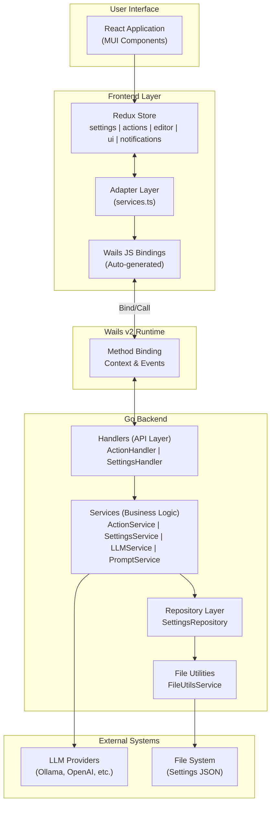

# System Overview

> **Text Processing Suite** - A native desktop application for AI-powered text processing, built with Wails v2.

---

## Table of Contents

- [High-Level Summary](#high-level-summary)
- [Tech Stack](#tech-stack)
- [Project Structure](#project-structure)
- [Architecture Diagram](#architecture-diagram)
- [Design Philosophy](#design-philosophy)

---

## High-Level Summary

**Text Processing Suite** is a Wails v2 desktop application that leverages Large Language Models (LLMs) for intelligent text manipulation. The
application provides a suite of text processing capabilities including:

- **Proofreading & Grammar Correction** - Fix spelling, grammar, and punctuation
- **Tone/Style Rewriting** - Adapt text for different audiences and contexts
- **Summarization** - Generate concise summaries and key points
- **Translation** - Multi-language text translation with language learning aids
- **Document Formatting** - Convert and structure documents (Markdown, bullets, templates)
- **Prompt Engineering** - Improve prompts for text, image, and video AI models

The application supports multiple LLM providers including:

- **Local inference**: Ollama, LM Studio, Llama.cpp
- **Cloud providers**: OpenAI, OpenRouter.ai
- **Any OpenAI-compatible API**

---

## Tech Stack

| Layer           | Technology        | Version   | Purpose                                   |
|-----------------|-------------------|-----------|-------------------------------------------|
| **Runtime**     | Wails             | v2.11.0   | Desktop app framework bridging Go + Web   |
| **Backend**     | Go                | 1.25.1    | Business logic, LLM integration, settings |
| **Frontend**    | React             | 19.2.3    | UI framework                              |
| **State**       | Redux Toolkit     | 2.11.2    | Centralized state management              |
| **UI Library**  | Material-UI (MUI) | 7.3.6     | Component library                         |
| **HTTP Client** | Resty             | v3 (beta) | REST API calls to LLM providers           |
| **Logging**     | zerolog           | 1.34.0    | Structured backend logging                |
| **Build Tool**  | Vite              | 7.3.0     | Frontend bundling                         |
| **Language**    | TypeScript        | 5.9.3     | Frontend type safety                      |
| **Testing**     | Jest + Testify    | -         | Unit and integration testing              |

---

## Project Structure

```
go_text/
├── main.go                      # Application entry point
├── wails.json                   # Wails configuration
├── go.mod                       # Go dependencies
│
├── internal/                    # Go backend packages
│   ├── application/             # App context holder & DI
│   ├── actions/                 # Text processing handlers & services
│   ├── settings/                # Configuration management
│   ├── llms/                    # LLM provider integration
│   ├── prompts/                 # Prompt templates & service
│   │   └── categories/          # Categorized prompt definitions
│   ├── file/                    # File system utilities
│   └── logging/                 # Custom logger implementation
│
├── frontend/                    # React frontend application
│   ├── src/
│   │   ├── main.tsx             # React entry point
│   │   ├── logic/               # Business logic layer
│   │   │   ├── adapter/         # Backend API adapters
│   │   │   ├── store/           # Redux state management
│   │   │   └── utils/           # Utility functions
│   │   └── ui/                  # Presentation layer
│   │       ├── AppLayout.tsx    # Root layout component
│   │       ├── theme.ts         # Material-UI theme
│   │       ├── components/      # Reusable UI components
│   │       ├── styles/          # CSS and constants
│   │       └── widgets/         # Feature-specific widgets
│   │           ├── base/        # Core widgets (AppBar, StatusBar)
│   │           └── views/       # View components
│   ├── wailsjs/                 # Auto-generated Wails bindings
│   │   └── go/                  # TypeScript bindings to Go
│   └── package.json             # Node dependencies
│
├── build/                       # Build configuration
│   ├── darwin/                  # macOS build files
│   └── windows/                 # Windows build files
│
└── docs/                        # Documentation
    ├── architecture/            # Architecture documentation
    ├── guides/                  # Usage guides
    └── rules/                   # Development rules
```

---

## Architecture Diagram



---

## Design Philosophy

### Layered Architecture

The application follows a clean layered architecture pattern:

1. **Handler Layer** - External API surface exposed to the frontend via Wails bindings
2. **Service Layer** - Core business logic, orchestration, validation
3. **Repository Layer** - Data persistence abstraction
4. **Utility Layer** - Cross-cutting concerns (file I/O, logging)

### Key Design Decisions

| Decision                              | Rationale                                                                                                                             |
|---------------------------------------|---------------------------------------------------------------------------------------------------------------------------------------|
| **Interface-based design**            | All major components define interfaces (e.g., `ActionHandlerAPI`, `SettingsServiceAPI`) enabling testability and dependency injection |
| **Redux Toolkit for state**           | Provides predictable state management with TypeScript integration, async thunks, and devtools support                                 |
| **Adapter pattern for backend calls** | Abstracts Wails bindings behind clean service interfaces, enabling mock testing                                                       |
| **Categorized prompts**               | Prompts organized by category (proofreading, rewriting, translation) with separate system and user prompts                            |
| **Multiple provider support**         | Configurable LLM providers with unified OpenAI-compatible API abstraction                                                             |
| **Local-first**                       | Supports local inference options (Ollama, LM Studio) for privacy and offline use                                                      |

### Error Handling Strategy

- **Backend**: Errors are wrapped with operation context using `fmt.Errorf("%s: %w", op, err)` pattern
- **Frontend**: Errors are parsed via `parseError()` utility and surfaced through the notification system
- **Logging**: All operations are logged with timing information and structured context

---

*Next: [Backend Architecture](./02-backend-architecture.md)*
