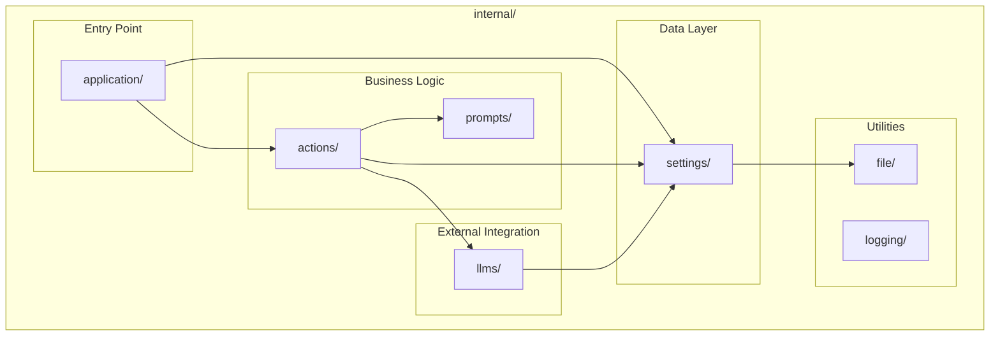
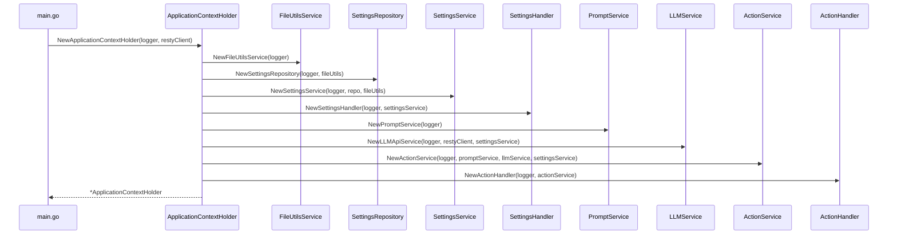
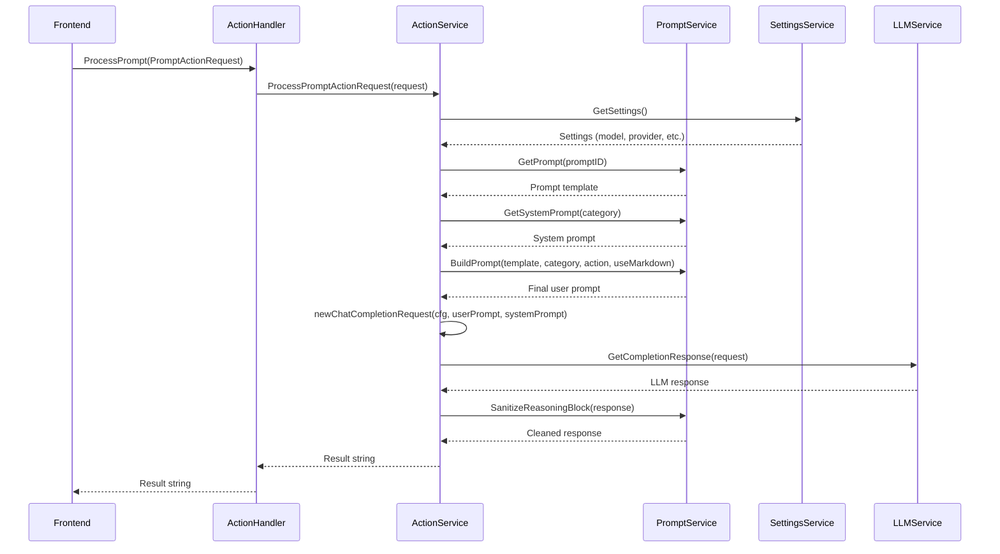
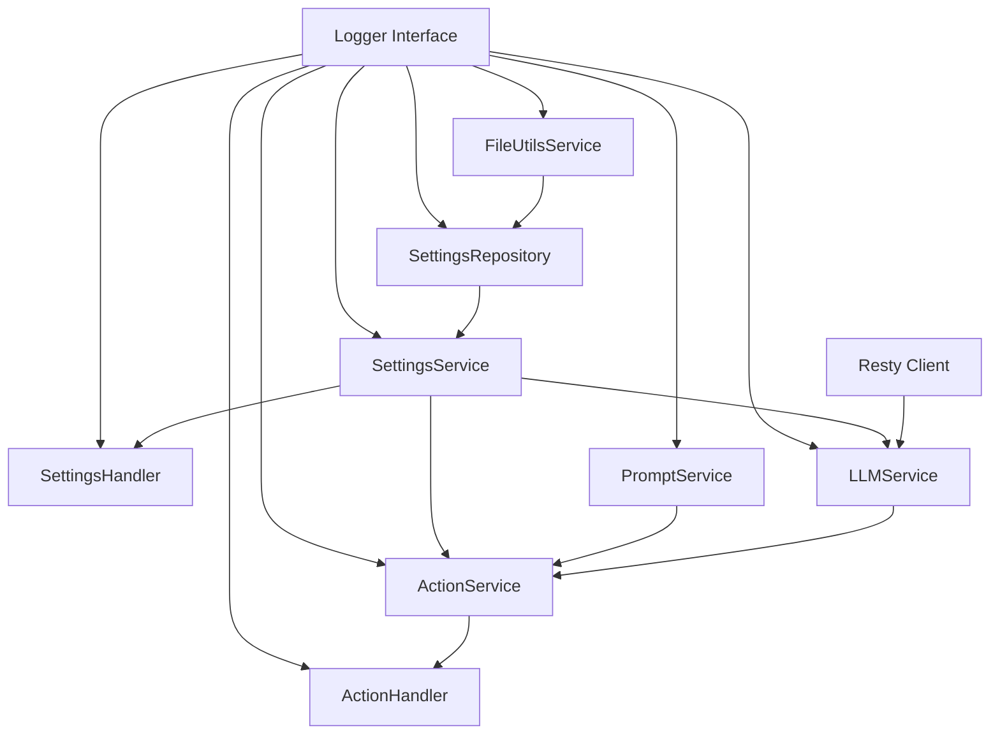

# Backend Architecture

> Deep dive into the Go backend structure, packages, interfaces, and design patterns.

---

## Table of Contents

- [Package Overview](#package-overview)
- [Core Packages Breakdown](#core-packages-breakdown)
    - [application](#application-package)
    - [actions](#actions-package)
    - [settings](#settings-package)
    - [llms](#llms-package)
    - [prompts](#prompts-package)
    - [file](#file-package)
    - [logging](#logging-package)
- [Dependency Injection](#dependency-injection)
- [Key Interfaces](#key-interfaces)
- [Data Models](#data-models)
- [Error Handling Pattern](#error-handling-pattern)

---

## Package Overview



---

## Core Packages Breakdown

### application Package

**Location**: `internal/application/`

**Purpose**: Central dependency injection container that initializes and wires all services together. Acts as the "root" of the application's
dependency graph.

#### Key Structure: `ApplicationContextHolder`

```go
type ApplicationContextHolder struct {
ctx             context.Context // Wails runtime context
SettingsHandler settings.SettingsHandlerAPI
SettingsService settings.SettingsServiceAPI
ActionHandler   actions.ActionHandlerAPI
RestyClient     *resty.Client
}
```

#### Initialization Flow



#### Wails Binding

The `ApplicationContextHolder` and its handlers are bound to the Wails runtime in `main.go`:

```go
Bind: []interface{}{
app, app.ActionHandler, app.SettingsHandler,
},
```

This exposes the handler methods to the frontend via JavaScript.

---

### actions Package

**Location**: `internal/actions/`

**Purpose**: Orchestrates text processing operations. This is the primary package for handling user-initiated actions like proofreading, translation,
and rewriting.

#### Architecture

| File                          | Purpose                                          |
|-------------------------------|--------------------------------------------------|
| `handler.go`                  | API layer exposed to frontend via Wails bindings |
| `service.go`                  | Business logic for action processing             |
| `constants.go`                | Package-level constants                          |
| `handler_integration_test.go` | Integration tests                                |

#### `ActionHandlerAPI` Interface

**Exposed to Frontend** - These methods are callable from React:

```go
type ActionHandlerAPI interface {
// Get list of available models from current provider
GetModelsList() ([]string, error)

// Send completion request to current provider
GetCompletionResponse(request *llms.ChatCompletionRequest) (string, error)

// Get models from a specific provider (for settings validation)
GetModelsListForProvider(provider *settings.ProviderConfig) ([]string, error)

// Send completion to a specific provider
GetCompletionResponseForProvider(provider *settings.ProviderConfig, request *llms.ChatCompletionRequest) (string, error)

// Get all available prompt groups
GetPromptGroups() (*prompts.Prompts, error)

// Process a text action (proofreading, translation, etc.)
ProcessPrompt(actionReq prompts.PromptActionRequest) (string, error)
}
```

#### `ActionServiceAPI` Interface

**Internal Business Logic**:

```go
type ActionServiceAPI interface {
GetModelsList() ([]string, error)
GetCompletionResponse(request *llms.ChatCompletionRequest) (string, error)
GetModelsListForProvider(provider *settings.ProviderConfig) ([]string, error)
GetCompletionResponseForProvider(provider *settings.ProviderConfig, request *llms.ChatCompletionRequest) (string, error)
GetPromptGroups() (*prompts.Prompts, error)
ProcessPromptActionRequest(actionReq *prompts.PromptActionRequest) (string, error)
}
```

#### Request Processing Flow



---

### settings Package

**Location**: `internal/settings/`

**Purpose**: Comprehensive configuration management including provider configuration, model settings, language preferences, and inference parameters.

#### Architecture (3-Tier)

| File            | Layer          | Purpose                     |
|-----------------|----------------|-----------------------------|
| `handler.go`    | **API**        | Frontend-facing methods     |
| `service.go`    | **Service**    | Business logic & validation |
| `repository.go` | **Repository** | Data persistence            |
| `settings.go`   | **Models**     | Data structures             |
| `constants.go`  | **Constants**  | Defaults & enums            |

#### `SettingsHandlerAPI` Interface (21 Methods)

```go
type SettingsHandlerAPI interface {
// Metadata & General
GetAppSettingsMetadata() (AppSettingsMetadata, error)
GetSettings() (Settings, error)
ResetSettingsToDefault() (Settings, error)

// Provider Configuration CRUD
GetAllProviderConfigs() ([]ProviderConfig, error)
GetCurrentProviderConfig() (ProviderConfig, error)
GetProviderConfig(providerId string) (ProviderConfig, error)
CreateProviderConfig(cfg ProviderConfig) (ProviderConfig, error)
UpdateProviderConfig(cfg ProviderConfig) (ProviderConfig, error)
DeleteProviderConfig(providerId string) error
SetAsCurrentProviderConfig(providerId string) (ProviderConfig, error)

// Inference Configuration
GetInferenceBaseConfig() (InferenceBaseConfig, error)
UpdateInferenceBaseConfig(cfg InferenceBaseConfig) (InferenceBaseConfig, error)

// Model Configuration
GetModelConfig() (ModelConfig, error)
UpdateModelConfig(cfg ModelConfig) (ModelConfig, error)

// Language Configuration
GetLanguageConfig() (LanguageConfig, error)
SetDefaultInputLanguage(language string) error
SetDefaultOutputLanguage(language string) error
AddLanguage(language string) ([]string, error)
RemoveLanguage(language string) ([]string, error)
}
```

#### `SettingsRepositoryAPI` Interface

```go
type SettingsRepositoryAPI interface {
InitDefaultSettingsIfAbsent() error
GetSettings() (*Settings, error)
SaveSettings(settings *Settings) (*Settings, error)
GetAvailableProviderConfigs() ([]ProviderConfig, error)
GetCurrentProviderConfig() (*ProviderConfig, error)
GetInferenceBaseConfig() (*InferenceBaseConfig, error)
GetModelConfig() (*ModelConfig, error)
GetLanguageConfig() (*LanguageConfig, error)
}
```

#### Validation Functions

The service layer includes comprehensive validation:

- `ValidateBaseURL(baseURL string)` - HTTP(S) scheme, trailing slash, format
- `ValidateEndpoint(endpoint string)` - Relative path format
- `ValidateProviderConfig(cfg *ProviderConfig)` - Complete provider validation
- `ValidateSettings(s Settings)` - Holistic settings validation

---

### llms Package

**Location**: `internal/llms/`

**Purpose**: HTTP-based LLM provider integration supporting OpenAI-compatible APIs and Ollama.

#### Architecture

| File                          | Purpose                         |
|-------------------------------|---------------------------------|
| `llms.go`                     | Request/response data models    |
| `service.go`                  | LLM API client implementation   |
| `service_integration_test.go` | Integration tests with httptest |

#### `LLMServiceAPI` Interface

```go
type LLMServiceAPI interface {
// Models for current provider
GetModelsList() ([]string, error)

// Completion for current provider
GetCompletionResponse(request *ChatCompletionRequest) (string, error)

// Models for specific provider (validation/settings)
GetModelsListForProvider(provider *settings.ProviderConfig) ([]string, error)

// Completion for specific provider
GetCompletionResponseForProvider(provider *settings.ProviderConfig, request *ChatCompletionRequest) (string, error)
}
```

#### Request/Response Models

```go
// Request structure
type ChatCompletionRequest struct {
Model       string                     `json:"model"`
Messages    []CompletionRequestMessage `json:"messages"`
Temperature *float64                   `json:"temperature,omitempty"`
Options     *Options                   `json:"options,omitempty"` // Ollama-specific
Stream      bool                       `json:"stream"`
N           int                        `json:"n,omitempty"`
}

type CompletionRequestMessage struct {
Role    string `json:"role"` // "system" | "user" | "assistant"
Content string `json:"content"`
}

// Response structure
type ChatCompletionResponse struct {
ID      string   `json:"id"`
Model   string   `json:"model"`
Choices []Choice `json:"choices"`
Usage   Usage    `json:"usage"`
}
```

#### Provider Types & Authentication

```go
const (
ProviderTypeOpenAICompatible ProviderType = "open-ai-compatible"
ProviderTypeOllama           ProviderType = "ollama"
)

const (
AuthTypeNone   AuthType = "none"
AuthTypeApiKey AuthType = "api-key"
AuthTypeBearer AuthType = "bearer"
)
```

#### HTTP Client Configuration

The LLM service uses Resty with:

- Configurable timeout (default: 2 minutes)
- Configurable max retries (default: 3)
- Support for Bearer tokens or API keys
- Custom headers for provider-specific needs
- Environment variable support for secrets

---

### prompts Package

**Location**: `internal/prompts/`

**Purpose**: Prompt template management, text replacement, and LLM response sanitization.

#### Architecture

| File/Dir       | Purpose                                    |
|----------------|--------------------------------------------|
| `prompts.go`   | Data models (Prompt, PromptGroup, Prompts) |
| `constants.go` | ApplicationPrompts registry                |
| `service.go`   | Prompt manipulation service                |
| `categories/`  | Categorized prompt definitions             |

#### `PromptServiceAPI` Interface

```go
type PromptServiceAPI interface {
// Template parameter replacement
ReplaceTemplateParameter(token, replacementValue, sourceTemplate string) (string, error)

// Remove <think>...</think> reasoning blocks from LLM output
SanitizeReasoningBlock(llmResponse string) (string, error)

// Access prompt definitions
GetAppPrompts() *Prompts
GetSystemPromptByCategory(category string) (Prompt, error)
GetUserPromptById(id string) (Prompt, error)
GetPrompt(promptID string) (Prompt, error)
GetSystemPrompt(category string) (string, error)

// Build final prompt from template
BuildPrompt(template, category string, action *PromptActionRequest, useMarkdown bool) (string, error)
}
```

#### Prompt Categories (10 Groups)

| Category               | Description           | Example Actions                          |
|------------------------|-----------------------|------------------------------------------|
| `Proofreading`         | Grammar & spelling    | Basic/Enhanced proofreading, Readability |
| `Rewriting`            | Text modification     | Concise, Expanded rewrites               |
| `Rewriting (Tone)`     | Emotional tone        | Friendly, Professional, Neutral          |
| `Rewriting (Style)`    | Writing style         | Formal, Academic, Technical, Marketing   |
| `Formatting`           | Structure changes     | Bullets, Lists, Headlines, Templates     |
| `Everyday Work`        | Business use          | Coworker/Management communication        |
| `Document Structuring` | Document conversion   | Markdown, User Stories, FAQs             |
| `Summarization`        | Content condensing    | Summary, Key Points, Simple Explanation  |
| `Translation`          | Language translation  | Translate, Dictionary, Examples          |
| `Prompt Engineering`   | AI prompt improvement | Text/Image/Video prompt enhancement      |

#### Template Parameters

```go
const (
TemplateParamText = "{{user_text}}"
TemplateParamFormat = "{{user_format}}"
TemplateParamInputLanguage  = "{{input_language}}"
TemplateParamOutputLanguage = "{{output_language}}"
OutputFormatPlainText = "PlainText"
OutputFormatMarkdown = "Markdown"
)
```

---

### file Package

**Location**: `internal/file/`

**Purpose**: File system utilities for settings persistence location management.

#### `FileUtilsServiceAPI` Interface

```go
type FileUtilsServiceAPI interface {
GetAppSettingsFolderPath() (string, error)
GetAppSettingsFilePath() (string, error)
}
```

#### Settings Storage Location

- **macOS**: `~/Library/Application Support/TextProcessingSuite/settings.json`
- **Windows**: `%APPDATA%/TextProcessingSuite/settings.json`
- **Linux**: `~/.config/TextProcessingSuite/settings.json`

The service automatically creates the directory if it doesn't exist (with `0700` permissions).

---

### logging Package

**Location**: `internal/logging/`

**Purpose**: Custom logger implementation using zerolog, satisfying the Wails logger interface.

#### `AppStructLogger` Implementation

```go
type AppStructLogger struct{}

func (a *AppStructLogger) Print(message string)   { log.Print(message) }
func (a *AppStructLogger) Trace(message string)   { log.Trace().Msg(message) }
func (a *AppStructLogger) Debug(message string)   { log.Debug().Msg(message) }
func (a *AppStructLogger) Info(message string)    { log.Info().Msg(message) }
func (a *AppStructLogger) Warning(message string) { log.Warn().Msg(message) }
func (a *AppStructLogger) Error(message string)   { log.Error().Msg(message) }
func (a *AppStructLogger) Fatal(message string)   { log.Fatal().Msg(message) }
```

This implements the `github.com/wailsapp/wails/v2/pkg/logger.Logger` interface, allowing zerolog to be used throughout the application.

---

## Dependency Injection

The application uses **constructor injection** with interfaces:

```go
// main.go - Entry point
loggerApi := logging.NewAppStructLogger()
restyClient := NewRestyClient()
app := application.NewApplicationContextHolder(loggerApi, restyClient)

// application.go - DI container
func NewApplicationContextHolder(logger logger.Logger, restyClient *resty.Client) *ApplicationContextHolder {
fileUtilsService := file.NewFileUtilsService(logger)
settingsRepo := settings.NewSettingsRepository(logger, fileUtilsService)
settingsService := settings.NewSettingsService(logger, settingsRepo, fileUtilsService)
settingsHandler := settings.NewSettingsHandler(logger, settingsService)

promptService := prompts.NewPromptService(logger)
llmService := llms.NewLLMApiService(logger, restyClient, settingsService)
actionService := actions.NewActionService(logger, promptService, llmService, settingsService)
actionHandler := actions.NewActionHandler(logger, actionService)
// ...
}
```

### Dependency Graph



---

## Key Interfaces

| Interface               | Package  | Purpose                          |
|-------------------------|----------|----------------------------------|
| `ActionHandlerAPI`      | actions  | Frontend-facing action methods   |
| `ActionServiceAPI`      | actions  | Action business logic            |
| `SettingsHandlerAPI`    | settings | Frontend-facing settings methods |
| `SettingsServiceAPI`    | settings | Settings business logic          |
| `SettingsRepositoryAPI` | settings | Settings persistence             |
| `LLMServiceAPI`         | llms     | LLM provider communication       |
| `PromptServiceAPI`      | prompts  | Prompt management                |
| `FileUtilsServiceAPI`   | file     | File system operations           |

---

## Data Models

### Settings Structure

```go
type Settings struct {
AvailableProviderConfigs []ProviderConfig    `json:"availableProviderConfigs"`
CurrentProviderConfig    ProviderConfig      `json:"currentProviderConfig"`
InferenceBaseConfig      InferenceBaseConfig `json:"inferenceBaseConfig"`
ModelConfig              ModelConfig         `json:"modelConfig"`
LanguageConfig           LanguageConfig      `json:"languageConfig"`
}

type ProviderConfig struct {
ProviderID          string            `json:"providerId"`
ProviderName        string            `json:"providerName"`
ProviderType        ProviderType      `json:"providerType"`
BaseUrl             string            `json:"baseUrl"`
ModelsEndpoint      string            `json:"modelsEndpoint"`
CompletionEndpoint  string            `json:"completionEndpoint"`
AuthType            AuthType          `json:"authType"`
AuthToken           string            `json:"authToken"`
UseAuthTokenFromEnv bool              `json:"useAuthTokenFromEnv"`
EnvVarTokenName     string            `json:"envVarTokenName"`
UseCustomHeaders    bool              `json:"useCustomHeaders"`
Headers             map[string]string `json:"headers"`
UseCustomModels     bool              `json:"useCustomModels"`
CustomModels        []string          `json:"customModels"`
}
```

### Prompt Structure

```go
type Prompt struct {
ID          string `json:"id"`
Name        string `json:"name"`
Type        string `json:"type"` // "System Prompt" | "User Prompt"
Category    string `json:"category"`
Value       string `json:"value"` // Template text
Description string `json:"description"`
}

type PromptGroup struct {
GroupID      string            `json:"groupId"`
GroupName    string            `json:"groupName"`
SystemPrompt Prompt            `json:"systemPrompt"`
Prompts      map[string]Prompt `json:"prompts"`
}
```

---

## Error Handling Pattern

All operations follow a consistent error handling pattern:

```go
func (s *SomeService) SomeOperation(input string) (Result, error) {
const op = "SomeService.SomeOperation"
startTime := time.Now()

s.logger.Info(fmt.Sprintf("%s: starting operation, input_length=%d", op, len(input)))

// Validation
if strings.TrimSpace(input) == "" {
err := fmt.Errorf("input cannot be empty")
s.logger.Error(fmt.Sprintf("%s: validation failed: %v", op, err))
return Result{}, fmt.Errorf("%s: %w", op, err)
}

// Business logic
result, err := s.someOtherService.DoSomething(input)
if err != nil {
s.logger.Error(fmt.Sprintf("%s: operation failed: %v", op, err))
return Result{}, fmt.Errorf("%s: failed to do something: %w", op, err)
}

// Success logging
s.logger.Info(fmt.Sprintf("%s: completed in %dms", op, time.Since(startTime).Milliseconds()))

return result, nil
}
```

### Error Pattern Features

- **Operation tagging**: Every function defines `const op = "Package.Function"` for tracing
- **Error wrapping**: Errors wrapped with context using `fmt.Errorf("%s: %w", op, err)`
- **Timing logs**: Start time recorded, duration logged on completion
- **Structured logging**: Context included in all log messages

---

*Previous: [System Overview](./01-system-overview.md) | Next: [Frontend Architecture](./03-frontend-architecture.md)*
