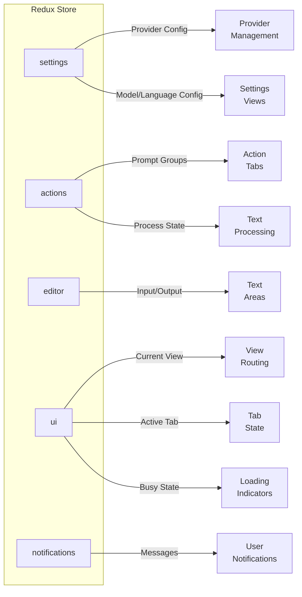
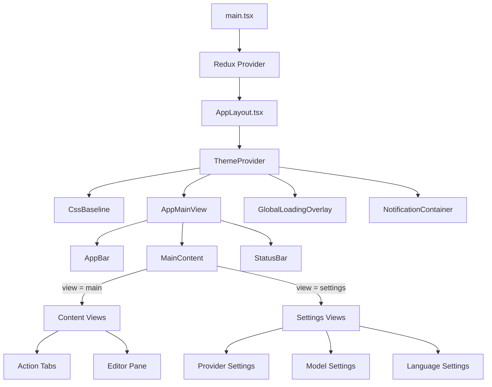

# Frontend Architecture

> Deep dive into the React/TypeScript frontend structure, state management, component organization, and Wails integration.

---

## Table of Contents

- [Framework Setup](#framework-setup)
- [Project Structure](#project-structure)
- [State Management (Redux)](#state-management-redux)
- [Component Hierarchy](#component-hierarchy)
- [Adapter Layer](#adapter-layer)
- [Wails Integration](#wails-integration)
- [Theming & Styling](#theming--styling)

---

## Framework Setup

### Technology Choices

| Technology        | Version | Purpose                 |
|-------------------|---------|-------------------------|
| **React**         | 19.2.3  | UI library              |
| **TypeScript**    | 5.9.3   | Type safety             |
| **Redux Toolkit** | 2.11.2  | State management        |
| **Material-UI**   | 7.3.6   | Component library       |
| **Vite**          | 7.3.0   | Build tool & dev server |
| **Emotion**       | 11.14.x | CSS-in-JS (MUI styling) |
| **Jest**          | 30.2.0  | Testing framework       |

### Entry Point

```tsx
// frontend/src/main.tsx
import React from 'react';
import {createRoot} from 'react-dom/client';
import {Provider} from 'react-redux';
import store from './logic/store';
import AppLayout from './ui/AppLayout';

const container = document.getElementById('root');
const root = createRoot(container!);

root.render(
    <React.StrictMode>
        <Provider store={store}>
            <AppLayout/>
        </Provider>
    </React.StrictMode>,
);
```

---

## Project Structure

```
frontend/src/
├── main.tsx                    # React entry point
├── vite-env.d.ts               # Vite type declarations
│
├── logic/                      # Business logic layer
│   ├── adapter/                # Backend integration
│   │   ├── index.ts            # Public exports
│   │   ├── interfaces.ts       # Service interfaces (ILoggerService, etc.)
│   │   ├── models.ts           # Frontend data models
│   │   └── services.ts         # Wails binding wrappers
│   │
│   ├── store/                  # Redux state management
│   │   ├── index.ts            # Store configuration & exports
│   │   ├── actions/            # Actions slice (prompts)
│   │   ├── editor/             # Editor slice (input/output text)
│   │   ├── settings/           # Settings slice
│   │   ├── ui/                 # UI state slice
│   │   └── notifications/      # Notification system
│   │
│   └── utils/                  # Utility functions
│       └── error_utils.ts      # Error parsing helpers
│
└── ui/                         # Presentation layer
    ├── AppLayout.tsx           # Root layout component
    ├── theme.ts                # Material-UI theme configuration
    │
    ├── components/             # Reusable components
    │   └── FlexContainer.tsx   # Layout utility component
    │
    ├── styles/                 # Styling utilities
    │   └── constants.ts        # UI dimension constants
    │
    └── widgets/                # Feature-specific widgets
        ├── base/               # Core widgets
        │   ├── AppBar.tsx      # Top navigation
        │   ├── StatusBar.tsx   # Bottom status bar
        │   ├── GlobalLoadingOverlay.tsx
        │   └── NotificationContainer.tsx
        │
        └── views/              # View components
            ├── AppMainView.tsx # Main app orchestrator
            ├── MainContent.tsx # Content router
            ├── content/        # Content views
            ├── info/           # Info panels
            └── settings/       # Settings views
```

---

## State Management (Redux)

### Store Configuration

```typescript
// frontend/src/logic/store/index.ts
import {configureStore} from '@reduxjs/toolkit';
import settingsReducer from './settings/slice';
import actionsReducer from './actions/slice';
import editorReducer from './editor/slice';
import uiReducer from './ui/slice';
import notificationsReducer from './notifications/slice';

export const store = configureStore({
    reducer: {
        settings: settingsReducer,
        actions: actionsReducer,
        editor: editorReducer,
        ui: uiReducer,
        notifications: notificationsReducer,
    },
});

// Typed hooks
export type RootState = ReturnType<typeof store.getState>;
export type AppDispatch = typeof store.dispatch;
export const useAppDispatch = useDispatch.withTypes<AppDispatch>();
export const useAppSelector = useSelector.withTypes<RootState>();
```

### Store Slices Overview



### Slice Structure Pattern

Each slice follows this organization:

```
store/[sliceName]/
├── index.ts      # Public exports
├── slice.ts      # Redux slice definition (reducers + actions)
├── selectors.ts  # Memoized selectors
├── thunks.ts     # Async thunks (API calls)
└── types.ts      # TypeScript interfaces
```

---

### Settings Slice

**Purpose**: Manages LLM provider configuration, model settings, and language preferences.

#### State Shape

```typescript
interface SettingsState {
    settings: Settings | null;           // Full settings object
    metadata: AppSettingsMetadata | null; // Auth types, provider types
    isLoading: boolean;
    error: string | null;
}
```

#### Key Thunks

| Thunk                            | Purpose                                 |
|----------------------------------|-----------------------------------------|
| `initializeSettingsState`        | Load settings and metadata on app start |
| `fetchSettings`                  | Reload settings from backend            |
| `updateProviderConfig`           | Update a provider configuration         |
| `createProviderConfig`           | Add a new provider                      |
| `deleteProviderConfig`           | Remove a provider                       |
| `setAsCurrentProvider`           | Switch active provider                  |
| `updateModelConfig`              | Update model name/temperature           |
| `updateInferenceConfig`          | Update timeout/retries/markdown         |
| `addLanguage` / `removeLanguage` | Manage language list                    |

---

### Actions Slice

**Purpose**: Manages prompt groups, action processing, and LLM completion state.

#### State Shape

```typescript
interface ActionsState {
    promptGroups: Prompts | null;  // All available prompt groups
    isLoading: boolean;
    error: string | null;
}
```

#### Key Thunks

| Thunk                 | Purpose                              |
|-----------------------|--------------------------------------|
| `getPromptGroups`     | Fetch all prompt groups from backend |
| `processPromptAction` | Execute a text processing action     |

---

### Editor Slice

**Purpose**: Manages the text input/output state for the main editor.

#### State Shape

```typescript
interface EditorState {
    inputText: string;    // User's input text
    outputText: string;   // LLM-generated output
    isProcessing: boolean;
}
```

#### Key Actions

- `setInputText` - Update input text
- `setOutputText` - Update output text
- `clearEditor` - Reset both fields
- `copyOutputToInput` - Transfer output to input

---

### UI Slice

**Purpose**: Manages UI state like current view, active tabs, and busy indicators.

#### State Shape

```typescript
interface UIState {
    currentView: 'main' | 'settings';
    activeActionsTab: string | null;  // Current prompt group ID
    isBusy: boolean;                  // Global loading state
}
```

#### Key Actions

- `setCurrentView` - Switch between main/settings views
- `setActiveActionsTab` - Select prompt group tab
- `setBusy` - Toggle global loading overlay

---

### Notifications Slice

**Purpose**: Manages user notifications (snackbars/toasts).

#### State Shape

```typescript
interface NotificationsState {
    messages: NotificationMessage[];
}

interface NotificationMessage {
    id: string;
    text: string;
    severity: 'success' | 'error' | 'warning' | 'info';
    duration?: number;
}
```

#### Key Actions

- `addNotification` - Show a notification
- `removeNotification` - Dismiss a notification

---

## Component Hierarchy



### Key Components

| Component               | Location                                    | Purpose                         |
|-------------------------|---------------------------------------------|---------------------------------|
| `AppLayout`             | `ui/AppLayout.tsx`                          | Root layout with theme provider |
| `AppMainView`           | `ui/widgets/views/AppMainView.tsx`          | Main layout orchestrator        |
| `MainContent`           | `ui/widgets/views/MainContent.tsx`          | Content routing                 |
| `AppBar`                | `ui/widgets/base/AppBar.tsx`                | Top navigation                  |
| `StatusBar`             | `ui/widgets/base/StatusBar.tsx`             | Bottom status bar               |
| `GlobalLoadingOverlay`  | `ui/widgets/base/GlobalLoadingOverlay.tsx`  | Busy indicator                  |
| `NotificationContainer` | `ui/widgets/base/NotificationContainer.tsx` | Toast notifications             |

---

## Adapter Layer

**Location**: `frontend/src/logic/adapter/`

The adapter layer provides a clean abstraction over the Wails-generated bindings. This enables:

- **Testability**: Services can be mocked for unit testing
- **Type safety**: Custom TypeScript types independent of Wails generation
- **Error handling**: Consistent error handling and logging
- **Decoupling**: UI code doesn't directly depend on Wails

### Service Interfaces

```typescript
// interfaces.ts
export interface ILoggerService {
    logDebug(message: string): void;

    logError(message: string): void;

    logFatal(message: string): void;

    logInfo(message: string): void;

    logPrint(message: string): void;

    logTrace(message: string): void;

    logWarning(message: string): void;
}

export interface IActionHandler {
    getCompletionResponseForProvider(
        providerConfig: ProviderConfig,
        chatCompletionRequest: ChatCompletionRequest
    ): Promise<string>;

    getModelsList(): Promise<Array<string>>;

    getModelsListForProvider(providerConfig: ProviderConfig): Promise<Array<string>>;

    getPromptGroups(): Promise<Prompts>;

    processPrompt(promptActionRequest: PromptActionRequest): Promise<string>;
}

export interface ISettingsHandler {
    getAppSettingsMetadata(): Promise<AppSettingsMetadata>;

    getSettings(): Promise<Settings>;

    resetSettingsToDefault(): Promise<Settings>;

    // ... 15+ more methods for CRUD operations
}
```

### Service Implementations

```typescript
// services.ts
export class LoggerService implements ILoggerService {
    constructor(private readonly loggerServiceName?: string) {
    }

    static getLogger(serviceName?: string): LoggerService {
        return new LoggerService(serviceName);
    }

    logDebug(message: string): void {
        logMessage(message, LogDebug, this.loggerServiceName);
    }

    // ... other methods
}

export class ActionHandler implements IActionHandler {
    constructor(private readonly logger: ILoggerService) {
    }

    static getInstance(): ActionHandler {
        return new ActionHandler(LoggerService.getLogger('ActionHandler'));
    }

    async getModelsList(): Promise<Array<string>> {
        this.logger.logDebug('Fetching models list');
        try {
            return await GetModelsList();  // Wails binding
        } catch (error) {
            this.logger.logError(`Failed to get models list: ${error}`);
            throw error;
        }
    }

    // ... other methods
}
```

### Frontend Data Models

```typescript
// models.ts - Mirrors Go types for TypeScript usage

export interface Settings {
    availableProviderConfigs: ProviderConfig[];
    currentProviderConfig: ProviderConfig;
    inferenceBaseConfig: InferenceBaseConfig;
    modelConfig: ModelConfig;
    languageConfig: LanguageConfig;
}

export interface ProviderConfig {
    providerId: string;
    providerName: string;
    providerType: string;
    baseUrl: string;
    modelsEndpoint: string;
    completionEndpoint: string;
    authType: string;
    authToken: string;
    useAuthTokenFromEnv: boolean;
    envVarTokenName: string;
    useCustomHeaders: boolean;
    headers: Record<string, string>;
    useCustomModels: boolean;
    customModels: string[];
}

// ... other interfaces
```

---

## Wails Integration

### Auto-Generated Bindings

Wails automatically generates TypeScript bindings from Go structs and methods:

```
frontend/wailsjs/go/
├── models.ts                    # Go struct → TypeScript class mappings
├── actions/
│   ├── ActionHandler.js         # JS implementation
│   └── ActionHandler.d.ts       # TypeScript declarations
├── settings/
│   ├── SettingsHandler.js
│   └── SettingsHandler.d.ts
└── application/                 # (if methods exposed on App)
```

### Generated Type Declarations

```typescript
// wailsjs/go/actions/ActionHandler.d.ts
import {llms} from '../models';
import {settings} from '../models';
import {prompts} from '../models';

export function GetCompletionResponse(arg1: llms.ChatCompletionRequest): Promise<string>;

export function GetCompletionResponseForProvider(arg1: settings.ProviderConfig, arg2: llms.ChatCompletionRequest): Promise<string>;

export function GetModelsList(): Promise<Array<string>>;

export function GetModelsListForProvider(arg1: settings.ProviderConfig): Promise<Array<string>>;

export function GetPromptGroups(): Promise<prompts.Prompts>;

export function ProcessPrompt(arg1: prompts.PromptActionRequest): Promise<string>;
```

### Generated Model Classes

```typescript
// wailsjs/go/models.ts (excerpt)
export namespace settings {
    export class ProviderConfig {
        providerId: string;
        providerName: string;

        // ...

        static createFrom(source: any = {}) {
            return new ProviderConfig(source);
        }

        constructor(source: any = {}) {
            if ('string' === typeof source) source = JSON.parse(source);
            this.providerId = source["providerId"];
            // ...
        }
    }
}
```

### Usage Pattern

```typescript
// In adapter/services.ts
import {GetModelsList, ProcessPrompt} from '../../wailsjs/go/actions/ActionHandler';
import {prompts, settings as wailsSettings} from '../../wailsjs/go/models';

// Convert frontend model to Wails model if needed
const wailsRequest = new prompts.PromptActionRequest({
    id: request.id,
    inputText: request.inputText,
    inputLanguageId: request.inputLanguageId,
    outputLanguageId: request.outputLanguageId,
});

// Call the binding
const result = await ProcessPrompt(wailsRequest);
```

### Wails Runtime API

The frontend also has access to Wails runtime functions:

```typescript
import {LogDebug, LogError, LogInfo} from '../wailsjs/runtime/runtime';

// Logging to the Go backend
LogInfo("User clicked save button");
LogError("Failed to process action");
```

---

## Theming & Styling

### Material-UI Theme

```typescript
// ui/theme.ts
import {createTheme} from '@mui/material/styles';

const theme = createTheme({
    palette: {
        mode: 'dark',  // or 'light'
        primary: {
            main: '#90caf9',
        },
        secondary: {
            main: '#f48fb1',
        },
        background: {
            default: '#1b2638',
            paper: '#1e2a3d',
        },
    },
    typography: {
        fontFamily: '"Roboto", "Helvetica", "Arial", sans-serif',
    },
    components: {
        // Component overrides
    },
});

export default theme;
```

### UI Constants

```typescript
// ui/styles/constants.ts
export const UI_HEIGHTS = {
    APP_BAR: 48,
    STATUS_BAR: 24,
    TAB_BAR: 48,
    // ...
};
```

### Font Loading

```typescript
// main.tsx
import '@fontsource/roboto/300.css';
import '@fontsource/roboto/400.css';
import '@fontsource/roboto/500.css';
import '@fontsource/roboto/700.css';
```

---

*Previous: [Backend Architecture](./02-backend-architecture.md) | Next: [Data Flow & Communication](./04-data-flow-and-communication.md)*
