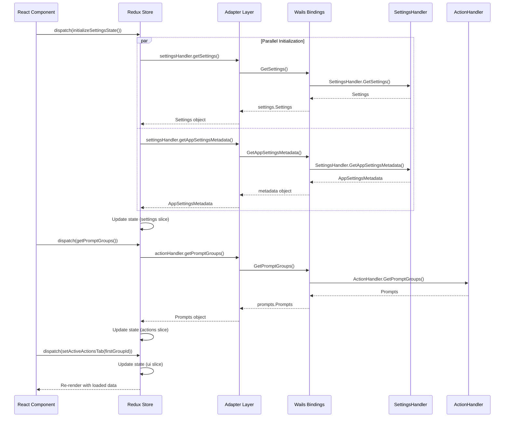
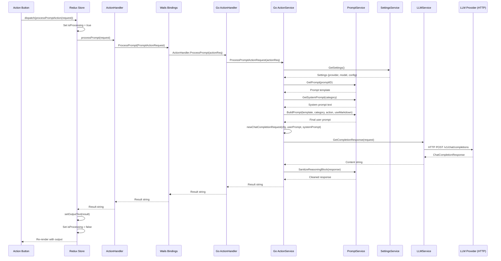
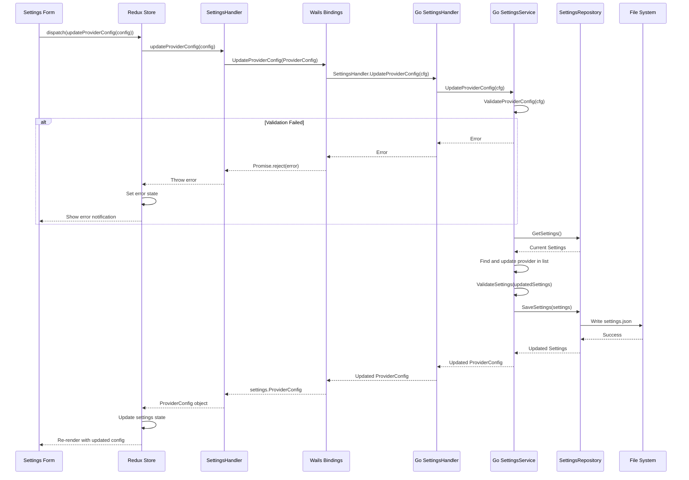
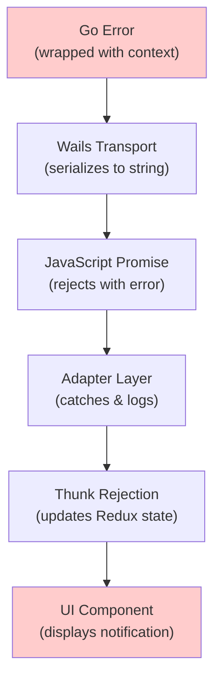

# Data Flow & Communication

> How data flows between React and Go, request lifecycle, error handling, and event patterns.

---

## Table of Contents

- [Communication Mechanisms](#communication-mechanisms)
- [Request Lifecycle Examples](#request-lifecycle-examples)
    - [Example 1: Initializing the Application](#example-1-initializing-the-application)
    - [Example 2: Processing a Text Action](#example-2-processing-a-text-action)
    - [Example 3: Updating Provider Settings](#example-3-updating-provider-settings)
- [Error Handling](#error-handling)
- [Type Mapping](#type-mapping)
- [Context & Events](#context--events)

---

## Communication Mechanisms

The Wails framework provides several mechanisms for React ↔ Go communication:

### 1. Method Binding (Primary)

Go methods are exposed to JavaScript through the `Bind` array in `main.go`:

```go
// main.go
Bind: []interface{}{
app, app.ActionHandler, app.SettingsHandler,
},
```

This exposes all public methods of `ActionHandler` and `SettingsHandler` to the frontend. Wails generates TypeScript declarations in `wailsjs/go/`.

**Usage:**

```typescript
// Frontend calls Go method
import {GetModelsList} from '../wailsjs/go/actions/ActionHandler';

const models = await GetModelsList();  // Returns Promise<string[]>
```

### 2. Runtime Logging

Wails provides logging functions that bridge to the Go logger:

```typescript
import {LogDebug, LogError, LogInfo, LogWarning} from '../wailsjs/runtime/runtime';

LogInfo("User action completed");
LogError("Operation failed: " + error.message);
```

### 3. Context Propagation

The Wails context is set during `OnStartup`:

```go
// main.go
OnStartup: func (ctx context.Context) {
app.SetContext(ctx)
err := app.SettingsService.InitDefaultSettingsIfAbsent()
if err != nil {
return // Ignoring error
}
},
```

This context is available for Wails runtime operations but is not typically needed by handlers.

---

## Request Lifecycle Examples

### Example 1: Initializing the Application

**Trigger**: App mounts in React
**Goal**: Load settings and prompt groups in parallel



**Frontend Code (AppMainView.tsx):**

```typescript
useEffect(() => {
    const initializeApp = async () => {
        try {
            logger.logInfo('Initializing app state');

            // Initialize settings state (fetches settings + metadata)
            await dispatch(initializeSettingsState()).unwrap();

            // Fetch prompt groups
            const promptGroupsResult = await dispatch(getPromptGroups()).unwrap();

            // Set the first prompt group as active
            if (promptGroupsResult && Object.keys(promptGroupsResult.promptGroups).length > 0) {
                const firstGroupId = Object.keys(promptGroupsResult.promptGroups)[0];
                dispatch(setActiveActionsTab(firstGroupId));
            }
        } catch (error: unknown) {
            const err = parseError(error);
            logger.logError(`Failed to initialize app: ${err.message}`);
        }
    };

    initializeApp();
}, [dispatch]);
```

---

### Example 2: Processing a Text Action

**Trigger**: User clicks a prompt action button (e.g., "Basic Proofreading")
**Goal**: Send text to LLM and display result



**Request Structure:**

```typescript
// Frontend PromptActionRequest
interface PromptActionRequest {
    id: string;              // e.g., "basicProofreading"
    inputText: string;       // User's text
    outputText?: string;
    inputLanguageId?: string;   // For translation
    outputLanguageId?: string;  // For translation
}
```

**Go Processing (actions/service.go):**

```go
func (s *ActionService) processAction(action *PromptActionRequest) (string, error) {
// 1. Get current settings
setting, err := s.settingsService.GetSettings()
if err != nil {
return "", fmt.Errorf("failed to retrieve settings: %w", err)
}

// 2. Validate provider configuration
if err := s.validateProviderConfiguration(&setting.CurrentProviderConfig); err != nil {
return "", err
}

// 3. Get prompt definition
prompt, err := s.promptService.GetPrompt(action.ID)
if err != nil {
return "", fmt.Errorf("failed to retrieve prompt: %w", err)
}

// 4. Get system prompt for the category
systemPrompt, err := s.promptService.GetSystemPrompt(prompt.Category)
if err != nil {
return "", err
}

// 5. Build final user prompt with parameter replacement
userPrompt, err := s.promptService.BuildPrompt(
prompt.Value,
prompt.Category,
action,
setting.InferenceBaseConfig.UseMarkdownForOutput,
)
if err != nil {
return "", fmt.Errorf("failed to build prompt: %w", err)
}

// 6. Create LLM request
completionRequest := newChatCompletionRequest(setting, userPrompt, systemPrompt)

// 7. Send to LLM
response, err := s.llmService.GetCompletionResponse(&completionRequest)
if err != nil {
return "", fmt.Errorf("LLM completion failed: %w", err)
}

// 8. Clean the response (remove reasoning blocks)
sanitizedResponse, err := s.promptService.SanitizeReasoningBlock(response)
if err != nil {
return "", fmt.Errorf("failed to sanitize response: %w", err)
}

return sanitizedResponse, nil
}
```

---

### Example 3: Updating Provider Settings

**Trigger**: User modifies provider URL in settings
**Goal**: Validate and persist the change



---

## Error Handling

### Backend Error Pattern

Every Go function follows this pattern:

```go
func (s *SomeService) Operation(input string) (Result, error) {
const op = "SomeService.Operation" // Operation identifier

// Validation errors
if input == "" {
err := fmt.Errorf("input is required")
s.logger.Error(fmt.Sprintf("%s: validation failed: %v", op, err))
return Result{}, fmt.Errorf("%s: %w", op, err)
}

// Wrapped errors from dependencies
result, err := s.dependency.DoSomething(input)
if err != nil {
s.logger.Error(fmt.Sprintf("%s: operation failed: %v", op, err))
return Result{}, fmt.Errorf("%s: failed to do something: %w", op, err)
}

return result, nil
}
```

### Frontend Error Handling

```typescript
// utils/error_utils.ts
export interface ParsedError {
    message: string;
    originalError: unknown;
}

export function parseError(error: unknown): ParsedError {
    if (error instanceof Error) {
        return {message: error.message, originalError: error};
    }
    if (typeof error === 'string') {
        return {message: error, originalError: error};
    }
    return {message: 'An unknown error occurred', originalError: error};
}
```

### Error Flow



### Notification Integration

```typescript
// In a thunk
export const processPromptAction = createAsyncThunk(
    'actions/processPrompt',
    async (request: PromptActionRequest, {dispatch, rejectWithValue}) => {
        try {
            const handler = ActionHandler.getInstance();
            return await handler.processPrompt(request);
        } catch (error) {
            const parsed = parseError(error);
            dispatch(addNotification({
                text: `Failed to process prompt: ${parsed.message}`,
                severity: 'error',
            }));
            return rejectWithValue(parsed.message);
        }
    }
);
```

---

## Type Mapping

### Go → TypeScript Mapping

| Go Type             | TypeScript Type               | Notes                              |
|---------------------|-------------------------------|------------------------------------|
| `string`            | `string`                      | Direct mapping                     |
| `int`               | `number`                      | All numeric types → number         |
| `float64`           | `number`                      |                                    |
| `bool`              | `boolean`                     |                                    |
| `[]string`          | `string[]` or `Array<string>` |                                    |
| `map[string]string` | `Record<string, string>`      |                                    |
| `*float64`          | `number \| undefined`         | Optional/nullable                  |
| `struct`            | `class`                       | Wails generates TypeScript classes |
| `error`             | `Promise.reject`              | Errors become rejected promises    |

### Generated Class Example

```go
// Go struct
type ProviderConfig struct {
ProviderID   string            `json:"providerId"`
ProviderName string            `json:"providerName"`
Headers      map[string]string `json:"headers"`
// ...
}
```

```typescript
// Generated TypeScript class
export class ProviderConfig {
    providerId: string;
    providerName: string;
    headers: Record<string, string>;

    static createFrom(source: any = {}) {
        return new ProviderConfig(source);
    }

    constructor(source: any = {}) {
        if ('string' === typeof source) source = JSON.parse(source);
        this.providerId = source["providerId"];
        this.providerName = source["providerName"];
        this.headers = source["headers"];
    }
}
```

### Conversion in Adapter

```typescript
// Converting frontend model to Wails model
import {prompts as wailsPrompts} from '../../wailsjs/go/models';

async
processPrompt(request
:
PromptActionRequest
):
Promise < string > {
    // Convert to Wails type
    const wailsRequest = new wailsPrompts.PromptActionRequest({
        id: request.id,
        inputText: request.inputText,
        inputLanguageId: request.inputLanguageId,
        outputLanguageId: request.outputLanguageId,
    });

    return await ProcessPrompt(wailsRequest);
}
```

---

## Context & Events

### Wails Context

The Wails context is injected during `OnStartup`:

```go
// main.go
OnStartup: func (ctx context.Context) {
app.SetContext(ctx)
// Initialize settings
err := app.SettingsService.InitDefaultSettingsIfAbsent()
if err != nil {
return
}
},
```

### Wails Events (Not Currently Used)

While the application primarily uses direct method calls, Wails supports pub/sub events:

```go
// Backend: Emit an event
runtime.EventsEmit(ctx, "settings:updated", newSettings)

// Backend: Listen for events
runtime.EventsOn(ctx, "ui:refresh", func (optionalData ...interface{}) {
// Handle event
})
```

```typescript
// Frontend: Listen for events
import {EventsOn, EventsEmit} from '../wailsjs/runtime/runtime';

EventsOn("settings:updated", (data) => {
    console.log("Settings updated:", data);
});

// Frontend: Emit an event
EventsEmit("ui:refresh", {force: true});
```

### Current Architecture Decision

The application uses **request-response** pattern exclusively (method bindings) rather than pub/sub events because:

1. **Simpler mental model**: Each action has a clear request → response flow
2. **Redux integration**: Redux thunks naturally handle async operations
3. **Type safety**: Method bindings provide full TypeScript type safety
4. **Error handling**: Errors are returned directly, not lost in event handlers

Events would be beneficial for:

- Real-time streaming responses
- Background process notifications
- Cross-component communication (though Redux handles this)

---

*Previous: [Frontend Architecture](./03-frontend-architecture.md) | Next: [Build & Configuration](./05-build-and-configuration.md)*
