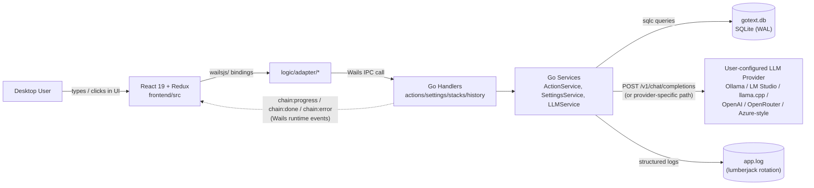

# GoText

> A native desktop app that lets a user paste or type text, apply one or more AI-driven
> transformations (proofread, rewrite, translate, summarize, restructure, etc.) via a
> locally-configured LLM provider, and get the transformed result back — with history,
> saved multi-step "stacks", and per-provider configuration, all persisted locally.

## 1. Service Identity Card

| Field | Value |
|---|---|
| **Service Name** | GoText |
| **Service ID** | go-text |
| **Purpose** | Desktop app that runs user text through one or more AI prompt "actions" (proofreading, rewriting, translation, summarization, formatting, prompt engineering) via a user-configured LLM provider, and returns the transformed text. |
| **Domain** | AI-assisted text transformation (desktop productivity) |
| **Keywords & Synonyms** | "GoText", "GoTextApp" (OS config-folder name), text transformer, prompt chain runner, AI writing assistant |
| **Owner / Team** | Oleksandr Kostenko (see `wails.json` `author`) |
| **Technology Stack** | Go 1.25, Wails v2.12 (desktop shell/IPC bridge), React 19 + TypeScript (frontend), Redux Toolkit (state), SQLite via `modernc.org/sqlite` + sqlc + goose (persistence), zerolog + lumberjack (logging), Radix Primitives (UI) |
| **Repository** | `go_text` (this repo; module name `go_text`) |

There is no separate backend network service — the "service" is the single desktop process
(Go binary + embedded React SPA) that a human runs locally. There are no other services in this
system; GoText talks only to whatever LLM provider endpoint the user configures.

---

## 2. Architecture Overview

GoText is a single OS process built with Wails v2: a Go backend and a React/TypeScript frontend
compiled into one native binary. The frontend never talks to the network directly — every action
(run a prompt chain, edit settings, manage saved stacks, read history) goes through Wails' generated
JS/TS bindings (`frontend/wailsjs/`) into Go methods bound via `wails.Run(... Bind: []any{...})` in
`main.go`. Those Go methods are thin **Handlers** that call **Services**, which call **Repositories**
(SQLite) or **Providers** (outbound HTTP to the user's chosen LLM endpoint). Long-running chain runs
report progress back to the frontend asynchronously via Wails runtime events
(`chain:progress`, `chain:done`, `chain:error`) rather than a single blocking response. All persistent
state — provider configs, language lists, saved stacks, run history, app/UI/logging preferences —
lives in one local SQLite file; there is no JSON settings file and no remote database.



For deep-dives beyond this overview, see:
- [docs/architecture/README.md](architecture/README.md) — index + architecture-at-a-glance diagram
- [docs/architecture/01-system-overview.md](architecture/01-system-overview.md)
- [docs/architecture/02-backend-architecture.md](architecture/02-backend-architecture.md)
- [docs/architecture/03-frontend-architecture.md](architecture/03-frontend-architecture.md)
- [docs/architecture/04-data-flow-and-communication.md](architecture/04-data-flow-and-communication.md)
- [docs/architecture/05-build-and-configuration.md](architecture/05-build-and-configuration.md)
- [docs/guides/DEVELOPER_GUIDE.md](guides/DEVELOPER_GUIDE.md)
- [docs/howto/verification.md](howto/verification.md)

---

## 3. Entry Points (Inputs)

All entry points are Wails-bound Go methods invoked from the embedded React frontend over the Wails
IPC bridge (in-process, not network sockets). There are no REST/gRPC/queue/cron entry points — this
is a single-user desktop app with one caller (its own UI). Methods are bound on four structs plus the
DI root itself: `app` (`*application.ApplicationContextHolder`), `app.ActionHandler`,
`app.SettingsHandler`, `app.StackHandler`, `app.HistoryHandler` (see `main.go` `Bind: []any{...}`).

### 3.1 ActionHandler (`internal/actions/handler.go`) — prompt chains & provider verification

| Method | Purpose |
|---|---|
| `PreviewPrompt(req PromptPreviewRequest)` | Returns composed system/user prompts + inference params for an action, step list, or saved stack, without calling the LLM |
| `TestConnection(cfg ProviderConfig)` | Verifies the provider endpoint is reachable and credentials are valid |
| `TestModels(cfg ProviderConfig)` | Runs model discovery against the provider and reports the model list |
| `TestInference(cfg ProviderConfig)` | Sends a tiny completion to the model to confirm end-to-end inference works |
| `GetActionCatalog()` | Returns the full v3 prompt/action catalog (91 actions) |
| `GetModels(providerID string)` | Returns the live model list for a given (or current) provider |
| `ProcessPromptChain(req ChainRequest)` | Runs a multi-step (or single-step) prompt chain sequentially against the current provider; single-flight (returns `CodeBusy` if another inference is in progress) |
| `CancelChain(runID string)` | Cancels an in-flight chain run by ID; idempotent no-op if unknown/finished |

**Contract:** `internal/apperr/results.go` (`PromptPreviewRequest`, `ChainRequest`, `ChainResultEnv`, `VerifyResult`, `CatalogResult`, `ModelsResult`).
**Trigger semantics:** user selects one or more actions (or a saved stack) in the editor and clicks Run; or opens Settings and clicks "Test connection/models/inference".
**Auth:** none (local IPC only, single OS user); the *provider's* own credentials (see §7) are resolved server-side, never passed from the frontend as secret values.

### 3.2 SettingsHandler (`internal/settings/handler.go`) — provider/inference/language/app/UI/logging config

| Method | Purpose |
|---|---|
| `GetAppSettingsMetadata()` | Returns static metadata: auth schemes, provider kinds, settings/DB/logs folder paths, app version |
| `GetSettings()` | Returns the full aggregated settings object |
| `ResetSettingsToDefault()` | Wipes and reseeds all settings/providers to defaults |
| `GetAllProviderConfigs()` / `GetCurrentProviderConfig()` / `GetProviderConfig(id)` | Read provider configs |
| `CreateProviderConfig(cfg)` / `UpdateProviderConfig(cfg)` / `DeleteProviderConfig(id)` | Provider CRUD |
| `SetAsCurrentProviderConfig(id)` | Switches the active provider |
| `GetInferenceBaseConfig()` / `UpdateInferenceBaseConfig(cfg)` | Timeout / retry / markdown-output settings |
| `GetModelConfig()` / `UpdateModelConfig(cfg)` | Per-model temperature / context-window / max-tokens settings |
| `GetLanguageConfig()` / `SetDefaultInputLanguage` / `SetDefaultOutputLanguage` / `AddLanguage` / `RemoveLanguage` | Language list + defaults |
| `GetAppBehaviorConfig()` / `UpdateAppBehaviorConfig(cfg)` | Task-logging / history-enabled / history-max-entries |
| `GetUIPreferencesConfig()` / `UpdateUIPreferencesConfig(cfg)` | Theme, layout, sidebar/history panel state |
| `GetLoggingConfig()` / `UpdateLoggingConfig(cfg)` | Log level/rotation settings; live-reconfigures the running logger |
| `ProviderPresets()` | Returns one-click provider presets (Ollama, LM Studio, llama.cpp, OpenAI, OpenRouter, Azure-style) for the New-Provider form |

**Contract:** `internal/apperr/results.go` (`Settings`, `ProviderConfig`, `InferenceBaseConfig`, `ModelConfig`, `LanguageConfig`, `AppBehaviorConfig`, `UIPreferencesConfig`, `LoggingConfig`, `AppSettingsMetadata`, `ProviderPreset`).
**Trigger semantics:** user opens the Settings view and edits provider/model/language/behavior/UI/logging configuration.

### 3.3 StackHandler (`internal/stacks/handler.go`) — saved multi-step "stacks" CRUD

| Method | Purpose |
|---|---|
| `ListStacks()` | Lists all saved stacks (unknown/stale action IDs silently dropped) |
| `SuggestedStacks()` | Returns built-in recommended stack recipes for the About/Info guide |
| `GetStack(id)` | Fetch one saved stack |
| `CreateStack(s SavedStack)` | Validates (non-empty unique name, plan validity: max 5 steps / 3 inferences) and persists a new stack |
| `UpdateStack(s SavedStack)` | Validates and replaces an existing stack's steps/metadata |
| `DeleteStack(id)` | Deletes a stack (cascades to its steps) |
| `DuplicateStack(id, newName)` | Copies an existing stack under a new name |

**Contract:** `internal/apperr/results.go` (`SavedStack`, `SuggestedStack`).
**Trigger semantics:** user builds a chain of actions in "Stack Builder" mode in the editor and saves it for reuse, or manages stacks from the "Manage Stacks" view.

### 3.4 HistoryHandler (`internal/history/handler.go`) — per-run history CRUD

| Method | Purpose |
|---|---|
| `ListHistory(limit, offset)` | Paginated history, newest first |
| `GetHistoryEntry(id)` | Fetch one history entry |
| `DeleteHistoryEntry(id)` | Delete one entry |
| `ClearHistory()` | Delete all entries |

**Contract:** `internal/apperr/results.go` (`HistoryEntry`, `AppliedAction`).
**Trigger semantics:** every completed/partial/errored chain run is recorded automatically (if history is enabled in App Behavior config); user browses/clears it from the History panel.

### 3.5 ApplicationContextHolder (`internal/application/application.go`, bound as `app`) — OS/window utilities

| Method | Purpose |
|---|---|
| `LogError(message string)` | Writes a message to the app log at Error level from the frontend |
| `ClipboardGetText()` / `ClipboardSetText(text)` | Read/write the OS clipboard |
| `BrowserOpenURL(url)` | Opens an `http(s)://` URL in the system default browser |
| `SaveWindowSize(width, height)` | Persists the current window size for restoration on next launch |
| `OpenPath(path)` | Opens a folder/file in the OS file manager (Finder/Explorer/xdg-open) |

**Trigger semantics:** miscellaneous OS-integration actions triggered from UI chrome (copy/paste buttons, "open logs folder" link, external links, window-resize persistence).

### 3.6 Async entry-adjacent channel: Wails runtime events

Not request/response — the frontend subscribes once (`EventsOn`) and receives pushes during a chain run
(`internal/actions/handler.go`, via `runtime.EventsEmit`):

| Event | Payload | Emitted when |
|---|---|---|
| `chain:progress` | `StepProgress` (`runId`, `groupIndex`, `totalGroups`, `family`, `status`: running/done/failed) | After each inference group starts/finishes within `ProcessPromptChain` |
| `chain:done` | `*ChainResult` | The full chain completes successfully |
| `chain:error` | `WireError` | The chain fails, is cancelled, or partially fails (accompanies a partial `Data` in the same `ChainResultEnv`) |

<!-- No REST, gRPC, GraphQL, queue, topic, cron, or webhook entry points exist in this app. -->

---

## 4. Exit Points (Outputs)

### 4.1 LLM provider chat completion call

| Field | Value |
|---|---|
| **Type** | Outbound synchronous HTTP call (via `resty` client) |
| **Target** | User-configured LLM provider endpoint — path and shape depend on provider kind (`internal/llms/profile.go`, `internal/llms/openai_provider.go`) |
| **Schema** | Default (OpenAI-compatible) shape: `POST {baseUrl}v1/chat/completions` with `{model, messages[], stream:false, n:1, temperature?, max_tokens? / max_completion_tokens?}` → `{choices[0].message.content, finish_reason, usage}`. Ollama additionally has a native shim at `POST {baseUrl}api/chat` (used so `num_ctx` is honored, since Ollama's OpenAI-compatible endpoint ignores it). Azure-kind uses `POST {baseUrl}openai/deployments/{deployment}/chat/completions`. |
| **Semantics** | Executes one inference "group" (one or more merged actions sharing a family) of a prompt chain |
| **Conditions** | Only when `ProcessPromptChain` or `TestInference` runs and the single-flight `InferenceGate` is free |

### 4.2 LLM provider model-discovery call

| Field | Value |
|---|---|
| **Type** | Outbound synchronous HTTP call |
| **Target** | `GET {baseUrl}v1/models` (default) or `GET {baseUrl}openai/deployments` (Azure-kind); path is overridable per `ProviderConfig.ModelsPath` |
| **Schema** | Provider's raw model-list JSON, parsed by a `DiscoveryStrategy` (`parseStandardModels` / `parseAzureDeployments`) into `[]apperr.ModelInfo` |
| **Semantics** | Populates the model picker and `TestModels` diagnostic |
| **Conditions** | On demand (settings model picker) or during `TestModels` |

### 4.3 SQLite writes — settings & providers

| Field | Value |
|---|---|
| **Type** | DB write (SQLite, single-writer, WAL mode) |
| **Target** | Tables `settings`, `providers`, `app_state`, `languages` in `gotext.db` (`internal/settings/repository_sqlite.go`) |
| **Schema** | See `internal/db/migrations/0001_init.sql`; `providers.kind` constrained to `ollama|lmstudio|llamacpp|openai|azure` |
| **Semantics** | Persists provider CRUD, current-provider selection, language list, and all typed settings groups (inference/model/app-behavior/UI/logging) |
| **Conditions** | On every settings-mutating call in §3.2, and on first run (seeding) |

### 4.4 SQLite writes — saved stacks

| Field | Value |
|---|---|
| **Type** | DB write (SQLite, transactional for compound writes) |
| **Target** | Tables `stacks`, `stack_steps` (`internal/stacks/`) |
| **Schema** | `internal/db/migrations/0001_init.sql` and `0003_remap_stack_action_ids.sql` |
| **Semantics** | Persists user-defined multi-step action chains for reuse |
| **Conditions** | On Create/Update/Delete/Duplicate stack |

### 4.5 SQLite writes — run history

| Field | Value |
|---|---|
| **Type** | DB write |
| **Target** | Table `history` (`internal/history/`, migration `0002_history.sql`) |
| **Schema** | One row per completed/partial/errored chain run: input/output text, applied actions, provider/model, language/format, duration, inference count, status (`success/partial/error`), error code, failed step index |
| **Semantics** | User-facing run history (distinct from `internal/tasklog`, which is an internal diagnostic JSONL log, not this table) |
| **Conditions** | After each `ProcessPromptChain` run, only when `AppBehaviorConfig.HistoryEnabled` is true; oldest entries pruned once `HistoryMaxEntries` is exceeded |

### 4.6 Local log file

| Field | Value |
|---|---|
| **Type** | File write (structured JSON via zerolog, rotated via lumberjack) |
| **Target** | `app.log` under the OS-specific logs folder (see §10); rotated backups are `.log.gz` |
| **Schema** | zerolog structured JSON lines: `component`, `op`, `run_id` (chain runs), `provider`, `duration_ms`, level, message |
| **Semantics** | Diagnostic/operational log for support and local debugging |
| **Conditions** | Always in production at `WarnLevel`+; also to stderr at `DebugLevel` in `wails dev` |

### 4.7 Wails runtime events (outbound to frontend)

See §3.6 — `chain:progress` / `chain:done` / `chain:error` are also, from the backend's perspective, an
exit point: a fire-and-forget push into the same OS process's UI layer, not a network call.

<!-- No queue publishes, external API calls other than the LLM provider, or cache updates exist. -->

---

## 5. Data Flow

A single chain run illustrates the full path (see also
[docs/architecture/04-data-flow-and-communication.md](architecture/04-data-flow-and-communication.md)
for the authoritative sequence and cancellation/retry semantics):

1. User composes input text and selects one or more actions (or a saved stack) in the Editor view.
2. Redux thunk calls `logic/adapter/actionsAdapter` → `wailsjs/go/...` binding →
   `ActionHandler.ProcessPromptChain(ChainRequest)`.
3. The handler acquires the process-wide `InferenceGate` (single-flight); if already held, returns
   `CodeBusy` immediately with no LLM call made.
4. `ActionService.RunChain` uses `Planner` (validates cap: max 5 steps / 3 inferences per plan,
   exclusivity groups, `Requires` tokens) then `Composer` to build ordered inference groups with
   system/user prompts from the v3 prompt catalog.
5. `ChainOrchestrator` executes each group sequentially: resolves the current `ProviderConfig`,
   resolves the API-key secret from the named env var (never from the DB), calls the provider's
   `Chat` method (outbound HTTP — §4.1), and emits `chain:progress` after each group.
6. On success, the final text is returned in `ChainResultEnv.Data` and `chain:done` is emitted; on
   step failure, `ChainResultEnv` carries both the last-good `Data` and a `StepFailed` `Error`, and
   `chain:error` is emitted; on cancellation (via `CancelChain`), similarly both fields are set with a
   `Cancelled` error.
7. If `AppBehaviorConfig.HistoryEnabled`, the run is recorded as a `history` row (§4.5).
8. The Redux `run` slice updates from the returned envelope and the `chain:*` events; the UI renders
   the transformed text.

---

## 6. Business Logic

### 6.1 Primary Flows

#### Flow: Run a prompt chain

1. User selects 1+ catalog actions or a saved stack (`ActionHandler.PreviewPrompt` may be called first
   to show a dry-run preview of composed prompts without spending an inference).
2. `ActionHandler.ProcessPromptChain` (`internal/actions/handler.go`) is invoked with a `ChainRequest`.
3. `Planner.Plan` (`internal/actions/planner.go`) validates the plan against the v3 catalog: max 5
   steps and max 3 actual inferences (mergeable actions in the same family/exclusivity group collapse
   into one inference), enforces per-action `Requires` (e.g. `input_language`, `output_language`,
   `target_model`, `goal`) and `ExclusivityGroup` (only one action per group per chain).
4. `Composer` builds each group's system prompt (from the family's system-prompt constant in
   `internal/prompts/v3/system.go`) and user prompt (directive text from the matched `ActionMeta`s).
5. `ChainOrchestrator` runs each group's inference sequentially against the current provider.
6. Result envelope + events return to the frontend; a history entry is recorded if enabled.

**Branching Conditions:**
- Zero, one, or multiple `ActionMeta`s per group → single vs. merged inference call.
- Provider auth scheme (`none`/`bearer`/`apiKey`) → whether/how the `Authorization`/`Api-Key` header
  is set.
- `ModelConfig.UseLegacyMaxTokens` → emit `max_tokens` vs `max_completion_tokens`.

**Business Rules:**
- A chain plan may not exceed 5 steps or 3 actual inferences (`internal/actions/planner.go`
  `maxSteps`/`maxInferences`); violating this returns `CodeInvalidPlan`.
- Only one action per `ExclusivityGroup` may appear in a single chain (e.g. only one tone action).
- Only one inference may run at a time across the whole app (`internal/gate.InferenceGate`); a second
  concurrent request (chain run or `TestInference`) is rejected with `CodeBusy`.
- Provider credentials are never read from the database — only the env-var *name* is stored; the
  actual secret is resolved via `os.Getenv` at call time and is never persisted or logged
  (`internal/llms/service.go` `resolveConfig`).

### 6.2 State Transitions

Chain run lifecycle (per run, tracked by `runId` in the run registry):

```
(no run)   → RUNNING     [trigger: ProcessPromptChain called, gate acquired]
RUNNING    → DONE        [trigger: all groups complete; chain:done emitted]
RUNNING    → STEP_FAILED [trigger: a group's Chat call errors; chain:error emitted, partial Data kept]
RUNNING    → CANCELLED   [trigger: CancelChain(runId) or app shutdown; chain:error emitted, partial Data kept]
```

History entry status mirrors this: `success` | `partial` | `error` (`internal/db/migrations/0002_history.sql`).

### 6.3 Error Handling & Edge Cases

| Error Scenario | Behavior |
|---|---|
| Another inference already running | `ProcessPromptChain`/`TestInference` return `CodeBusy` immediately; no HTTP call made |
| Provider unreachable (DNS/connection failure) | `CodeProviderUnreachable`, retryable |
| Provider auth rejected (401/403) | `CodeAuth`, non-retryable |
| API-key env var unset or empty | `CodeMissingCredential`, non-retryable (env-var name only is reported) |
| Provider request times out | `CodeTimeout`, retryable |
| Provider 429 | `CodeRateLimited`, retryable (with `retryAfter` when the provider supplies it) |
| Provider 5xx | `CodeUpstream`, retryable |
| Provider returns empty content | `CodeEmptyCompletion`, non-retryable |
| Prompt exceeds model's context window | `CodeContextWindow`, non-retryable |
| A step within a chain fails | `CodeStepFailed` wraps the inner error; earlier steps' output is preserved in partial `Data` |
| Run cancelled mid-chain | `CodeCancelled`; partial `Data` preserved |
| Stack references a deleted/renamed action ID | Silently dropped on read (`filterUnknownSteps`), with a warning logged — never surfaced as a user-facing error |
| Unexpected panic in any handler method | Recovered via `defer/recover`, mapped to `CodeInternal`, never crashes the app |

---

## 7. External Services & Dependencies

### 7.1 User-configured LLM Provider (Ollama / LM Studio / llama.cpp / OpenAI / OpenRouter / Azure-style)

| Field | Value |
|---|---|
| **Service/Resource** | Whichever `ProviderConfig` the user has created and selected as current — kind is one of `ollama`, `lmstudio`, `llamacpp`, `openai`, `azure` (OpenRouter is configured as `kind: "openai"` with a different base URL/preset — `internal/db/db.go` `ProviderPresets`) |
| **Type** | Synchronous outbound HTTP (chat completion + model discovery) |
| **Purpose** | Perform the actual text-generation inference for every prompt-chain step |
| **Data Exchanged** | Sent: system+user prompt messages, model name, temperature/max-token params. Received: generated text, finish reason, token usage. |
| **Criticality** | Required, blocking — a chain run cannot complete without it. Local providers (Ollama/LM Studio/llama.cpp) are optional to install but required if selected as current provider. |
| **Failure Behavior** | Classified into a typed `apperr.ErrorCode` (see §6.3) and surfaced to the frontend; `LLMService` applies a bounded retry for transient errors (`internal/llms/service.go`); no circuit breaker — each call is independent. |

### 7.2 Local SQLite database (`gotext.db`)

| Field | Value |
|---|---|
| **Service/Resource** | `modernc.org/sqlite` (pure-Go, no CGO), single-writer, WAL mode |
| **Type** | DB read/write (local file, not a network service) |
| **Purpose** | Source of truth for settings, providers, languages, saved stacks, and run history |
| **Data Exchanged** | Full CRUD via sqlc-generated queries (`internal/db/store/`, never hand-edited) |
| **Criticality** | Required — app refuses to start if the DB cannot be opened (see `main.go` `OnStartup`) |
| **Failure Behavior** | Startup fails with a native error dialog; a locked DB (already-running instance) shows an "Already running" dialog and exits (see `internal/db.ErrInstanceLocked`) |

### 7.3 Local log file (`app.log`)

| Field | Value |
|---|---|
| **Service/Resource** | Local filesystem, rotated via `lumberjack` |
| **Type** | File write (fire-and-forget) |
| **Purpose** | Structured diagnostic logging for local debugging/support |
| **Data Exchanged** | Structured log lines only; never secret values (env-var names only — see `docs/ai_agent_rules/GoLoggingRules.md` §2.6) |
| **Criticality** | Non-blocking, optional (can be disabled via `LoggingConfig.LogFileEnabled`) |
| **Failure Behavior** | A log-write failure degrades silently (console/stderr writer in dev still works); never blocks app operation |

<!-- No message queues, caches, or other network services are used. -->

---

## 8. Data Contracts & Domain Models

### 8.1 Key Entities

#### ActionMeta (`internal/apperr/results.go`, populated from `internal/prompts/v3/catalog.go`)

| Field | Type | Description |
|---|---|---|
| id | string | Unique catalog action ID, e.g. `rewrite.proofread.basic` |
| name | string | Display name shown in the UI |
| category | string | UI grouping — one of the 9 real catalog categories (see §12) |
| family | string | Prompt family: `rewrite`, `structure`, `summarize`, `translate`, `prompteng` |
| directive | string | The instruction text merged into the user prompt for this action |
| orderRank | int | Deterministic ordering within a chain plan |
| exclusivityGroup | string | Actions sharing a non-empty group are mutually exclusive within one chain |
| mergeable | bool | Whether this action can merge into the same inference call as siblings in its family |
| terminal | bool | Whether this action must be the last step in a chain |
| requires | []string | Runtime tokens the composer must inject: `input_language`, `output_language`, `target_model`, `goal` |

**Data Ownership:** GoText owns this entity outright — it is compiled into the binary
(`buildCatalog()`), not user-editable, not stored in the DB.

#### ProviderConfig (`internal/apperr/results.go`, table `providers`)

| Field | Type | Description |
|---|---|---|
| id | string | Stable identifier |
| name | string | Unique display name |
| kind | string | One of `ollama`, `lmstudio`, `llamacpp`, `openai`, `azure` |
| baseUrl | string | Provider endpoint root |
| authScheme | string | `none`, `bearer`, or `apiKey` |
| apiKeyEnvVar | string | Name of the environment variable holding the secret — **never the secret itself** |
| selectedModel | string | Currently selected model/deployment name |
| completionPath / modelsPath | string | Overridable URL path templates (supports `{deployment}` for Azure-style) |
| useCustomModels / customModels | bool / []string | User-typed model list bypassing discovery |
| headers | map[string]string | Extra static HTTP headers |
| createdAt / updatedAt | int64 | Unix millis |

**Data Ownership:** GoText's SQLite `providers` table is the sole source of truth; the actual secret
value is never stored here or anywhere in the DB — only resolved at call time from the OS environment.

#### SavedStack (`internal/apperr/results.go`, tables `stacks` + `stack_steps`)

| Field | Type | Description |
|---|---|---|
| id, name, icon | string | Identity/display |
| steps | []string | Ordered `ActionMeta.ID` references |
| defaultFormat / defaultInLang / defaultOutLang | string | Pre-filled run defaults |
| createdAt / updatedAt | int64 | Unix millis |

**Data Ownership:** GoText's `stacks`/`stack_steps` tables own this; `steps` referencing a
since-removed catalog action are dropped on read, not treated as a foreign-key violation.

#### HistoryEntry (`internal/apperr/results.go`, table `history`)

| Field | Type | Description |
|---|---|---|
| id, createdAt | string, int64 | Identity/timestamp |
| kind | string | `single` or `stack` |
| inputText / outputText | string | Full text before/after the run |
| applied | []AppliedAction | Which catalog actions ran (id/name/category) |
| providerName, model | string | Which provider/model executed the run |
| inputLang, outputLang, format | string | Run-time language/format context |
| durationMs, inferences | int64, int | Timing and inference-call count |
| status | string | `success`, `partial`, or `error` |
| errorCode, failedIndex | string, int | Populated only on `partial`/`error` |

**Data Ownership:** GoText's `history` table owns this; pruned automatically once
`AppBehaviorConfig.HistoryMaxEntries` is exceeded.

### 8.2 Ubiquitous Language

| Term | Meaning in This Service |
|---|---|
| Action | One catalog entry (`ActionMeta`) representing a single prompt directive, e.g. "Fix grammar" |
| Stack | A user-saved ordered list of actions (up to the plan cap) that can be re-run as a unit |
| Chain / Chain run | One execution of a set of steps (ad hoc or from a stack), identified by `runId` |
| Group | One or more mergeable actions from the same family, executed as a single LLM inference call |
| Family | A prompt-system grouping (`rewrite`, `structure`, `summarize`, `translate`, `prompteng`) that shares one system prompt |
| Provider | A configured LLM backend (kind + endpoint + auth); the app supports many simultaneously, one "current" |
| Gate | The process-wide single-flight lock (`InferenceGate`) ensuring only one inference runs at a time |
| Envelope | The `{data, error}` wire shape every bound handler method returns instead of a Go `(T, error)` |

---

## 9. Integration & Dependency Map

```
Upstream (who calls this service):
  - Embedded React/TypeScript frontend — via Wails IPC bindings (frontend/wailsjs/); this is the
    only caller. No other service, script, or process calls into GoText.

Downstream (who this service calls):
  - User-configured LLM provider endpoint — via outbound HTTP (chat completion + model discovery).
    Configuration-driven, not fixed: Ollama, LM Studio, llama.cpp, OpenAI, OpenRouter, or any
    Azure-style / OpenAI-compatible API, depending on the active ProviderConfig.

Shared Infrastructure:
  - gotext.db — local SQLite file (settings, providers, languages, stacks, stack_steps, history,
    app_state); single-writer WAL mode; OS-level advisory lock file gotext.db.lock prevents a
    second instance from opening it concurrently.
  - app.log — local rotated log file (lumberjack; zerolog structured JSON).

Events Consumed:  None (GoText consumes no external events; it is not a message-queue consumer).
Events Published: [chain:progress, chain:done, chain:error] — Wails runtime events, consumed only
                   by the app's own embedded frontend (same process), not by any external system.
```

---

## 10. Configuration

Settings persistence is **SQLite-only** — there is no JSON settings file. All configuration is read
and written through `SettingsHandler`/`SettingsService` into the `settings`/`providers`/`app_state`/
`languages` tables (`internal/db/migrations/0001_init.sql`). Never include secret values in
documentation, logs, or the database — only the name of the environment variable that holds a secret.

| Config Value | Source | Env Var | Notes |
|---|---|---|---|
| Provider API key / secret | Resolved at call time via `os.Getenv` | Name is user-chosen per provider (e.g. `OPENAI_API_KEY`, `OPENROUTER_API_KEY` for the OpenRouter preset) and stored in `providers.api_key_env_var` — the **value** is never stored or logged | `internal/llms/service.go` `resolveConfig`; missing/empty env var → `CodeMissingCredential` |
| Provider base URL, kind, auth scheme, model paths | `providers` table | — | Editable via Settings → Providers |
| Selected/current provider | `app_state.current_provider_id` | — | One row, `id = 1` |
| Inference behavior (timeout, retries, markdown output) | `settings` table (`type='json'` or scalar rows) | — | `InferenceBaseConfig` |
| Model behavior (temperature, context window, max tokens) | `settings` table | — | `ModelConfig` |
| Language list + defaults | `languages` table + `settings` | — | `LanguageConfig` |
| App behavior (task logging, history enabled/max entries) | `settings` table | — | `AppBehaviorConfig` |
| UI preferences (theme, layout, sidebar/history panel state) | `settings` table | — | `UIPreferencesConfig` |
| Logging config (level, file enabled, rotation size/backups/age, compress) | `settings` table | — | `LoggingConfig`; applying it live-reconfigures the running zerolog writer |
| DB/log file locations | Resolved at runtime, not configurable via env var | — | See path table below (`internal/file/`) |

**OS-specific paths** (`internal/file/constants.go`: `AppName = "GoTextApp"`, `DatabaseFileName = "gotext.db"`, `LogsDirName = "logs"`):

| Platform | Config/DB folder | Logs folder |
|---|---|---|
| macOS | `~/Library/Application Support/GoTextApp/` | `~/Library/Application Support/GoTextApp/logs/` |
| Linux | `~/.config/GoTextApp/` | `~/.config/GoTextApp/logs/` |
| Windows | `%APPDATA%\GoTextApp\` | `%APPDATA%\GoTextApp\logs\` |

No environment differences beyond OS path resolution — GoText has no separate dev/staging/prod
deployment targets; `wails dev` vs `wails build` only changes the default log level (Debug vs Warn)
and whether stderr console logging is also active.

---

## 11. Project Structure & How to Run / Operate

### 11.1 Repository Layout

```
go_text/
├── main.go                      # Wails Bind/EnumBind wiring, OnStartup/OnShutdown lifecycle
├── internal/
│   ├── apperr/                  # AppError, ErrorCode catalog, WireError, *Result envelope types
│   ├── application/             # DI root: ApplicationContextHolder (two-phase wiring)
│   ├── actions/                 # Planner, Composer, ChainOrchestrator, run registry, ActionHandler
│   ├── gate/                    # InferenceGate — single-flight process-wide inference lock
│   ├── llms/                    # Provider interface, OpenAICompatibleProvider, ProviderProfile, discovery
│   ├── prompts/                 # PromptService + v3/ catalog (91 ActionMeta entries), families/system prompts
│   ├── settings/                # Provider/model/inference/language/app-behavior config + SQLite repo
│   ├── stacks/                  # Saved-stack CRUD: model, SQLite repository, service, handler
│   ├── history/                 # Per-run history: model, SQLite repository, service, handler
│   ├── verification/            # TestConnection/TestModels/TestInference diagnostics
│   ├── db/                      # SQLite open (modernc.org/sqlite), goose migrations, seeding, sqlc store/
│   ├── file/                    # OS-specific path resolution (config folder, DB path, logs folder)
│   ├── logging/                 # zerolog + lumberjack multi-writer; implements Wails logger.Logger
│   ├── tasklog/                 # Per-step JSONL diagnostic log (separate from user-facing history)
│   └── bootstrap/               # Logger bootstrap before DI graph construction
├── frontend/
│   ├── src/
│   │   ├── ui/                  # styles/, primitives/ (Radix wrappers), components/, widgets/
│   │   ├── logic/                # adapter/ (wailsjs wrappers), store/ (Redux slices), hooks/
│   │   └── dev/bridge-mock/     # dev-only bridge mock (no Go backend needed)
│   └── wailsjs/                  # Wails-generated bindings — never imported directly by components
└── docs/
    ├── architecture/             # 01–05 deep-dive docs + README index
    ├── guides/DEVELOPER_GUIDE.md
    ├── howto/verification.md
    └── ai_agent_rules/           # Coding standards enforced on this repo
```

### 11.2 Build & Run

| Aspect | Details |
|---|---|
| **Build Tool** | Go modules + Wails CLI + npm/Vite (frontend) |
| **Build Command** | `wails build` → `build/bin/GoText` |
| **Test Command** | `go test -race ./...` (backend); `cd frontend && npm run test` / `npm run test:coverage` (Jest); `cd frontend && npm run verify:ui` (Playwright) |
| **Run Command** | `wails dev` (full stack, hot reload, `http://localhost:34115`); `cd frontend && npm run dev` (frontend-only, bridge-mock, no Go backend) |
| **Container** | None — native desktop binary per OS; no Dockerfile in this repo |
| **CI / Pipeline** | GitHub Actions, `.github/workflows/main.yml` `test` job — see [docs/architecture/05-build-and-configuration.md](architecture/05-build-and-configuration.md) §4 for the full gate table |
| **Environments** | No deployed environments — `wails dev` (development) vs `wails build` (production binary) only; see §10 for the resulting config differences |

---

## 12. Searchability Anchors

| Anchor Type | Values |
|---|---|
| **Feature Flags** | None found — `TODO: confirm` no runtime feature-flag system exists in this codebase; behavior toggles are plain settings (`AppBehaviorConfig`, `UIPreferencesConfig`), not flags |
| **Functional Areas** | `#prompt-chains`, `#provider-config`, `#saved-stacks`, `#run-history`, `#logging-config`, `#window-and-clipboard` |
| **User-Facing Features** | Editor (run actions/stacks on text), Stack Builder (compose and save a multi-step stack — `StackBuilderBar.tsx`), Manage Stacks view, Settings (Providers / Inference / Model / Language / App Behavior / UI / Logging tabs), History panel, About/Info guide (Suggested Stacks) |
| **Prompt Catalog Categories** (`internal/prompts/v3/families.go`, 91 actions total across 9 categories) | Proofreading, Rewriting, Tone, Style, Format, Document Structure, Summarization, Translation, Prompt Engineering |
| **Prompt Catalog Families** | rewrite, structure, summarize, translate, prompteng |
| **Provider Kinds** | ollama, lmstudio, llamacpp, openai, azure (OpenRouter is the `openai` kind with a distinct preset) |
| **Key Code Locations** | `internal/actions/planner.go` → chain-plan validation (max steps/inferences, exclusivity); `internal/actions/handler.go` → chain run + verification entry points; `internal/llms/openai_provider.go` → outbound LLM HTTP calls; `internal/settings/handler.go` → all configuration entry points; `internal/prompts/v3/catalog.go` → the 91-action prompt catalog; `internal/db/migrations/` → schema source of truth; `internal/apperr/` → error taxonomy + wire envelopes |

---

## 13. Additional Notes

- **JSON settings file is fully removed.** An earlier `SettingsFileName = "SettingsV2.json"` constant
  referenced in older docs no longer exists in `internal/file/constants.go` (verified by direct read of
  that file during this documentation pass) — settings persistence is SQLite-only. Any older doc or
  comment claiming a JSON settings file is stale.
- **Diagnostic logging is intentionally two-tier:** `internal/tasklog` (per-step JSONL, gated by
  `EnableTaskLogging`) is separate from the user-facing `history` table (§4.5/§8.1) — do not conflate
  the two when tracing a run.
- **Single-instance enforcement** is via an OS-level advisory lock file (`gotext.db.lock`,
  `github.com/gofrs/flock`) next to `gotext.db`, released automatically on process exit (including
  `kill -9`); a second launch while held shows an "Already running" dialog and exits.
- For the authoritative, longer-form treatment of any topic summarized here — DI wiring detail, the
  full chain-orchestration sequence diagram, CSS/Redux conventions, or the CI gate list — follow the
  links in §2 rather than treating this file as a replacement for them.
